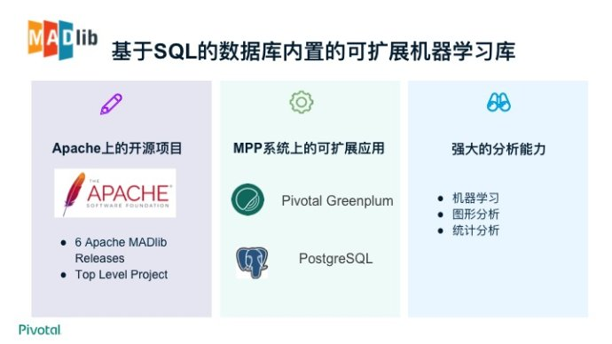
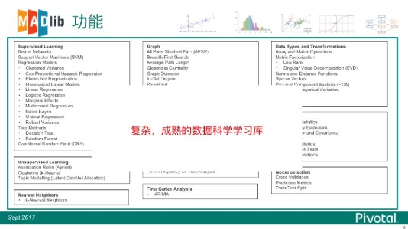
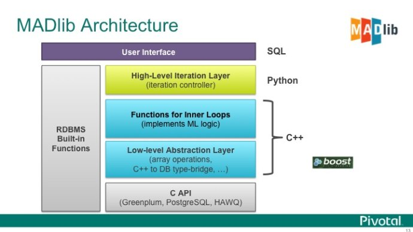
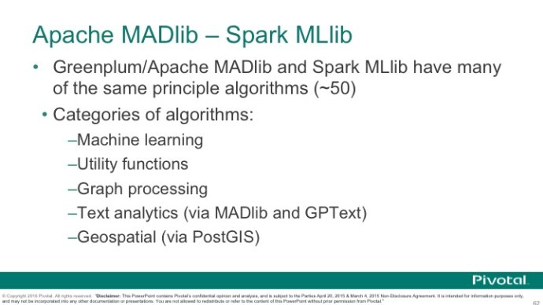
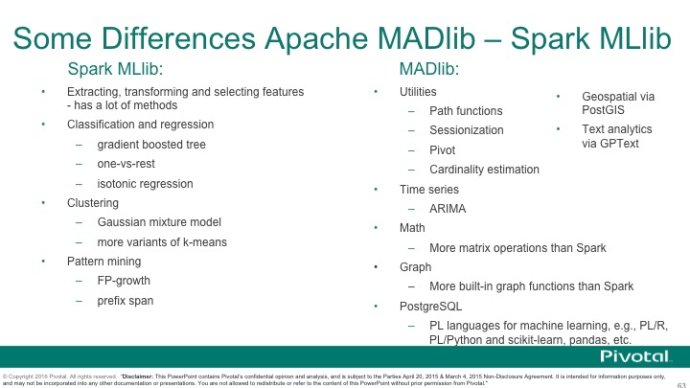

## Greenplum 数据分析应用
-------------------------------------------------------

### I.窗口函数

#### 1.窗口函数的语法

窗口函数的基本结构：

    - function_name ([expression [, expression ... ]]) OVER window_name
    - function_name ([expression [, expression ... ]]) OVER ( window_definition )
    - function_name ( * ) OVER window_name
    - function_name ( * ) OVER ( window_definition )

window_definition 的定义： 

    - [ existing_window_name ]
    - [ PARTITION BY expression [, ...] ]
    - [ ORDER BY expression [ ASC | DESC | USING operator ] [ NULLS { FIRST | LAST } ] [, ...] ]
    - [ frame_clause ]

配置项frame_clause的选择： 

    [ RANGE | ROWS ] frame_start
    [ RANGE | ROWS ] BETWEEN frame_start AND frame_end

窗口起始项 frame_start 和结束项 frame_end的选择：

    UNBOUNDED PRECEDING  
    value PRECEDING
    CURRENT ROW
    value FOLLOWING
    UNBOUNDED FOLLOWING


_Comments:_

- expression代表着任何的值表达式，但是不包含自身的窗口函数调用。
- Window_name代表一个窗口名称，一个完整的窗口是用WINDOW关键字命名并且定义的，也可以使匿名的。
- PARTITION BY 与group by是类似的都是用来分组，但是与group by不同的是PARTITION BY中就只是一个表达式，不像groupby其除了分组字段以外不能再select中显示，除非是聚合函数。如果没有PARTITION BY，那么每一行就是一个分组一个窗口。
- ORDER BY作用是使PARTITION BY分组中的排序方式，支持与通常的排序是一致的可以有ASC，DESC，nulls first or last等等。如果没有指定order by那么就是没有指定排序方式。
- frame_clause就是指窗口的大小，窗口如何移动等。
- frame_start和frame_end就是来确定窗口大小的两个参数或者是窗口的边界。
    frame_start不能使用unbounded following,同样frame_end也不能使用unbounded preceding
- UNBOUNDED PRECEDING 的意思是从第一行开始，但是只能用在frame_start的位置。
- UNBOUNDED FOLLOWING 的意思更好与UNBOUNDED PRECEDING相反指的是到最后一行，其也只能用在frame_end的位置。
- value PRECEDING和 value FOLLOWING都只能使用咋rows模式中不能使用在range模式中，value的值是一个整型的数值也可以使整型表达式，不能为变量，聚合函数，窗口函数等，value不能为空或者是不明确的，但是可以为0，为0的时候表示的就是当前行。
value PRECEDING是指从哪一行开始，value FOLLOWING指的是从哪一行结束。
Value = 1 时 value PRECEDING 指的是当前行的前一行开始，value FOLLOWING则为当前行的前一行为止。随着表中数据的扫描窗口会以这个尺寸一直走下去，执行相关的分析函数。


#### 2.窗口函数示例

2.1.从员工表（emp）中查询每个员工的信息，并且查询整个公司的工资总额。

```SQL
select ename,sal,
sum(sal)over(order by empno range between unbounded preceding and unbounded following)
 from emp;
```

2.2.从员工明细表中查询一个员工在前后三天所得的工资总和。

```SQL
select empno,
        ename,
        sal,
        dept_no,
        sum(sal) over(
 order by empno, time_stamp rows between 1 preceding and 1 following)
 from emp_detail;
```

2.3. 从员工表（emp）中查询每个员工的信息,并且查询每个部门的工资总和。

```SQL
select ename,
        sal,
        sum(sal) over(partition by dept_no
 order by empno range between unbounded preceding and unbounded following)
 from emp;
```

#### 3.分析函数介绍

- row_number()：在一个结果集中，返回当前的行的号码。
- rank()、dense_rank()：在一个结果集中，用来排名，前者是完全差异后者是不完全差异，简言之前者是按阿拉伯数字顺序来，后者则会跳跃。
- lag(value any)、lead(value any)：用来对当前行对于指定的字段与下一行或者前一行的值进行比较。
- first_value(value any)、last_value(value any)：在一个窗口中，返回指定排序的第一个值和最后一个值。
- 其他类似与sum(),agv()，max(),min()也都是能与窗口函数配合使用，当做分析函数。


#### 4.分析函数与窗口函数的混用示例

4.1.从员工表(emp)中按照员工被雇佣的时间大小，查询入职时间的先后顺序。

```SQL
Select row_number() over(
 order by hiredate asc),
          ename,
          empno,
          hiredate
 from emp;
```

4.2.从员工表中查询每个部门的工资排名，并且给工资最高的人加10%的奖金。

```SQL
 update emp
 set comm = comm + sal * 0.01
 where empno in (
                  select *
                  from (
                         select ename,
                                empno,
                                sal,
                                dept_no,
                                dense_rank() over(partition by dept_no
                         order by sal desc) as level_
                         from emp
                       ) t
                  where level_ = 1
       );
```

4.3. 从员工表中查询每个部门的工资排名,并且给每个部门中工资排名在第三名的员工加20%的奖金

```SQL
update emp
 set comm = comm + sal * 0.02
 where empno in (
                  select *
                  from (
                         select ename,
                                empno,
                                sal,
                                dept_no,
                                rank() over(partition by dept_no
                         order by sal desc) as level_
                         from emp
                       ) t
                  where level_ = 1
       );
```

4.4. 从员工表中查询每个部门的员工的工资从大到小排序，并且计算前后两名的工资差值。

```SQL
select ename,
 empno,
 sal,
 dept_no,
 lag(sal)over(partition by dept_no order by sal) as lag_end,
 sal - lag(sal)over(partition by dept_no order by sal)
  from emp order by dept_no,sal asc;
  #查询结果中存在null中，原因是每个分组的第一行没有前一行一次为空值。
  #那么假定第一行的值需要与最后一行来比较，那么应该怎么做：
   select ename,
 empno,
 sal,
 dept_no,
 CASE when lag(sal)over(partition by dept_no order by sal) is null then max(sal)OVER(partition by dept_no order by sal desc)
 else lag(sal)over(partition by dept_no order by sal)
 end lag_end
  from emp order by dept_no,sal asc;
#也可以是这样：
select ename,
 empno,
 sal,
 dept_no,
 CASE when lag(sal)over(partition by dept_no order by sal) is null then first_value(sal)OVER(partition by dept_no order by sal desc)
 else lag(sal)over(partition by dept_no order by sal)
 end lag_end
  from emp order by dept_no,sal asc;
```

4.5. 查询学生表中每一个学生按照科目的分数排序。

```SQL
  select id,stu_name,course,point_,first_value(point_)over(partition by id order by point_ desc ) from (
  with temp as (
  select id,stu_name,chinese,english,math from student
  ),t1 as (select id,stu_name,chinese as point_, '语文'::text as course from temp
  ),t2 as (select id,stu_name,english as point_, '英语'::text as course from temp
  ),t3 as (select id,stu_name,math as point_, '数学'::text as course from temp)
  select * from t1 
  union all (select * from t2)
  union all (select * from t3)
```

### II.Greenplum MADlib机器学习

GP MADlib是基于Greenplum数据库的机器学习组件。与SparkMLlib有相似设计。

考虑测试MADlib机器学习组件 解决 业务问题

1. 内容自动识别分类
2. 用户行为画像分析
3. 文本/图片/视频 自动分析识别 

#### Greenplum MADlib 架构











