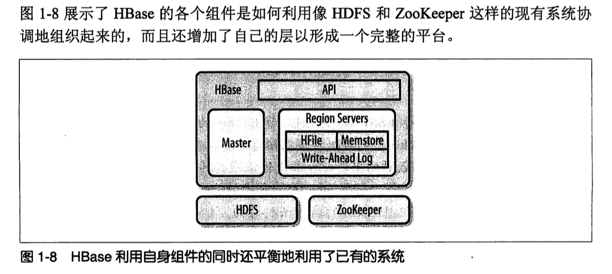
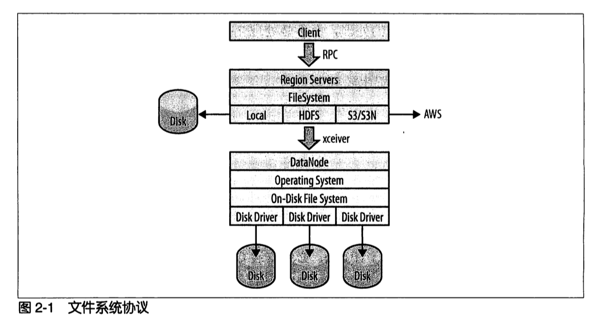
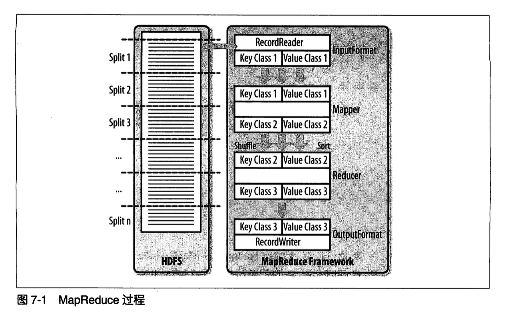
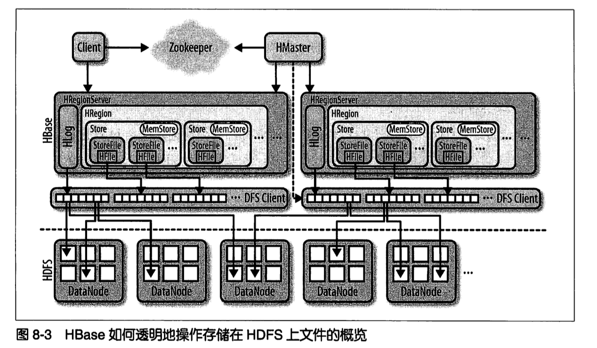

## BigTable & HBase Analysis Note
------------------------------------------------------------


### BigTable原理

BigTable是一个稀疏的、分布的、永久的多维排序图。我们采用行键盘(row key)、 列键(column key)和时间戳(timestamp)对图进行索引

- Rows行键
- Column Families列簇
- Timestamps时间戳

Google SSTable文件格式作为存储BigTable数据的内部格式。一个SSTable提供一个持久化的、排序的、不可变的、从键到值的映射,其中,键和值都是任意的字节字符串。

### HBase Architect

### HBase深度研究

HBase是按照BigTable模型实现的,是一个稀疏的,分布式的,持久化的,多维的映射,由行键,列键和时间戳索引。

Table -> RowKey -> Column Family(Column data/Timestamp/Version) = Value

```java
SortedMap<RowKey,List<SortedMap<Column,List<Value,Timestamp>>>>
```

.

**BigTable和HBase的典型使用场景是webtable,存储从互联网中抓取网页**

行数据的存取操作是原子的(atomic),可以读写任意数目的列。目前为止不支持跨行事务与跨表事务,和绝大多数NoSQL数据库一致


#### 1.HBase自动分区-autosharding

HBase中扩展与负载均衡的基本单元称为region,region本质上是以行键排序的连续存储的区间。HBase中的region等同于数据库分区中用的
范围划分(range partition)。

* Region Server与Region分布 

按照HBase和现在的硬件能力,每台服务器的最佳加载数量差不多还是10-1000,但每个region的最佳大小是1GB-2GB。

#### 2.简单数据模型&存储API

数据存储在存储文件(store file)中,称为HFile,HFile中存储的是经过排序的键值映射结构。文件内部由连续的块组成,块的索引信息存储在文件尾部。
每个HFile都有一个块索引。首先,在内存的块索引进行二分查询(已排序数据结构)。
存储文件通常保存于HDFS,作为HBase的存储层。

每次更新数据时,都会先将数据记录在提交	日志(commit log)中,在HBase中预写日志(write-ahead log-WAL),然后才会将这些数据写入内存中的memstore中。
一旦内存保存的写入数据的累计大小超过一个给定的最大值,系统就会将这些数据移出内存	作为HFile文件FLUSH到磁盘中。

BigTable的locality property:所有文件包含的键/值对都是按行键顺序归类的,并且对块级别的操作做了优化,比如顺序地读取这些键/值对的操作,行键需要特殊指定。

存储的修改依赖于删除标记(delete market)

Read读取数据是由两部分数据合并的结果,一部分是memstore中还没有写入磁盘的数据,另一部分是磁盘上的存储文件。

- 关于memstore数据写入

merge合并多个文件到一个较大的文件,合并有两种类型:minor compaction和major compaction(多路归并),受磁盘IO性能影响。

LSM树将多页块(multipage block)中的数据存储在磁盘中,其存储结构布局类似于B树。在HBase中,数据的更新与合并是轮流进行的,
而在BigTable中,更新是更粗粒度的操作,整个memstore会存储为一个新的存储文件,不会马上合并。HBase的这种架构称为**LSM映射**(Log-StructuredSort-and-Merge-Map).

#### 3.HBase组件

- Client
- Master Server - 利用ZooKeeper为region服务器分配region
- Region Server

.

#### HBase存储结构

.


#### 4.HBase API

4.1.常用API

	- Put类
	- KeyValue类
	- Client write buffer(HTable->flushCommits)
	- Put List
	- Compare-and-set(CAS)
	- Get类
	- Result类
	- Get List
	- 相关数据方式(exists)
	- Delete类
	- Delete List
	- Compare-and-delete(CAS)

4.2.批量处理操作
4.3.行锁row lock
4.4.Scan扫描

	- HTable.getScanner()
	- ResultScanner类

4.5.缓存与批量处理

4.6.Client特性

	HTable应用
	Bytes类
	过滤器(get/scan支持filter)
	CompareFilter:RowFilter/FamilyFilter/QualifierFilter/ValueFilter/DependentColumnFilter
	FilterBase:SingleColumnValueFilter/SingleColumnValueExcludeFilter/PrefixFilter/PageFilter/KeyOnlyFilter
	DecoratingFilter
	FilterList

过滤器是HBase数据查询的重要组件

4.7.计数器

	increment
	单计数器
	多计数器

4.8.协处理器coprocessor

协处理器允许用户在region服务器上运行用户代码,也就是用户执行region级操作<br/>
权限控制也是协处理器的应用场景

协处理器类基础:Coprocessor,CoprocessorEnvironment and CoprocessorHost

	- Coprocessor类
	- RegionObserver类
	- MasterObserver类
	- endpoint

4.9.HTablePool

创建HTable是非常耗时的操作。尝试复用HTable实例

> 多线程环境下重用HTable实例会出现问题.
> HTable类不是线程安全的,本地的写缓存区并不能保证其一致性.即使使用setAutoFlush(true)也没用,必须为每个线程创建一个HTable实例

4.10.HConnection连接管理

	- 共享ZooKeeper连接
	- 缓存通用资源	

#### 5.Client API管理功能

5.1.数据存储模式

5.2.表HTable

5.3.表属性

- 名
- 列族
- 文件大小限制
- 只读
- memstore刷写大小
- 延时日志刷写
- 其他选项

5.4.列族

- 名字
- 最大版本数
- 数据压缩
- 块(Block)大小:默认64K
- BlockCache
- 生存期TTL
- setInMemory(保留在内存中)
- BloomFilter(行键应用/列族应用)
- 复制范围replication:跨集群同步

5.5.HBaseAdmin

表操作
模式操作
集群管理
集群状态信息

#### 6.客户端交互

6.1.REST

	- XML:text/xml
	- JSON:application/json
	- RawBinary:application/octet-stream

6.2.Thrift

跨语言模式定义文件

6.3.Avro

跨语言模式定义文件

6.4.批处理客户端

* MapReduce
* Hive数据仓库
* Pig数据分析
* [Cascading](http://www.cascading.org/):Data Processing API for Hadoop MapReduce
* Shell:HBase Shell是HBase集群的命令行接口

#### 7.MapReduce与HBase

7.1.MapReduce概要

.

InputFormat -> Mapper -> Reducer -> OutputFormat

```java
TableInputFormat -> TableMapper -> TableReducer -> TableOutputFormat
```

7.2.HBase上的MapReduce

- 配置
- 数据流向:MapReduce文件到HBase
- 数据源
- 数据源与数据流向
- 自定义处理


#### 8.架构

8.1.B+树

- 通过主键对记录进行高效插入,查找以及删除。表示为一个动态,多层并有上下界的索引。
- 注意维护每一段(PageTable)所包含的主键数目,分段B+树的效果远好于二叉树的数据划分。
- 在B+树上有两个头指针,一个指向根结点,一个指向关键字最小的叶子结点.
- B+树支持高效的范围Scan功能。得益于它的叶节点相关连接并且按主键有序,扫描时避免了耗时的遍历树操作。

8.2.LSM树

- 输入数据首先被存储在日志文件,这些文件内的数据完全有序。当有日志文件被修改时,对应的更新会被先保存在内存中来加速查询
- Merge:经过许多数据修改后,且内存空间被占满后,LSM树会把有序的'键-记录'对写到磁盘中,同时创建一个新的数据存储文件
- 所有节点都是满的并按页存储.修改数据文件的操作通过滚动Merge完成
- 删除是一种特殊的更改,当删除标记被存储之后,查找会跳过这些删除过的键。当页被重写时,有删除标记的键会被丢弃。删除请求由TTL触发。
- 使用内存存储与日志文件来将随机写转换成顺序写

8.3.存储

.

HBase主要处理两种文件:一种是预写日志WAL,另一种是实际的数据文件。这两种文件主要由HRegionServer管理。

- 写路径
- 文件
	
	根级文件
	表级文件
	region级文件
	region拆分
	合并Merge

- HFile格式:默认64K

	有效地存储HBase的数据,基于Hadoop的TFile类

- KeyValue格式

8.4.WAL

### Ref

- [BigTable]()
- [HBase权威指南]()
- [An In-Depth Look at the HBase Architecture](https://www.mapr.com/blog/in-depth-look-hbase-architecture)