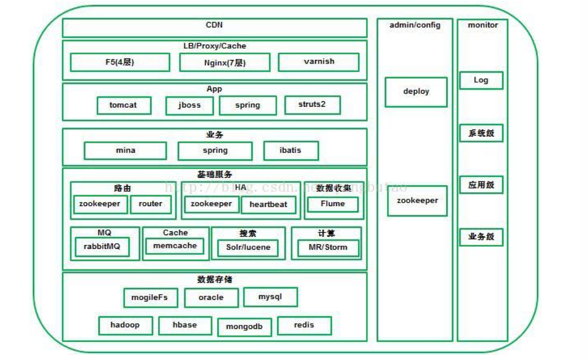
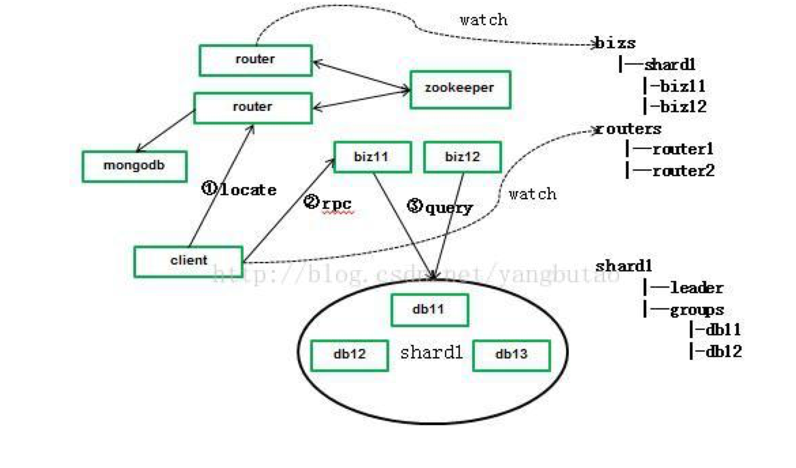
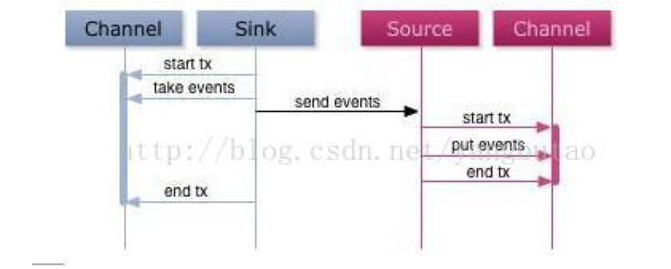
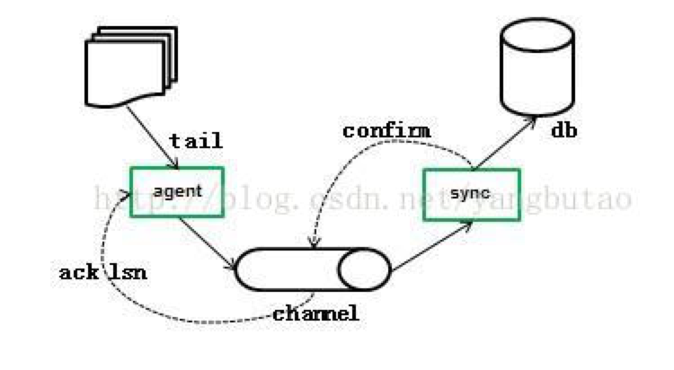
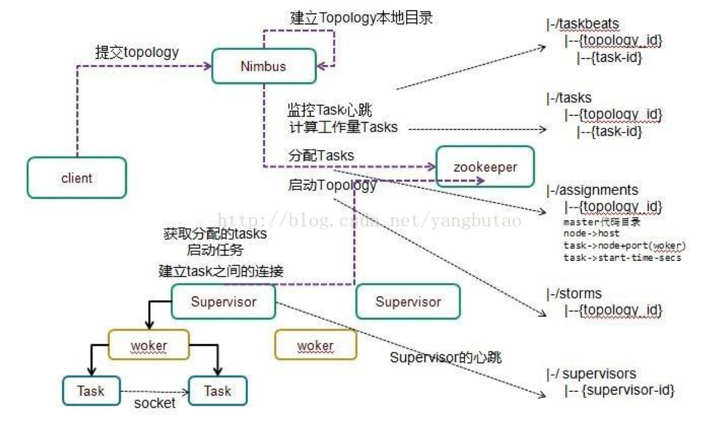
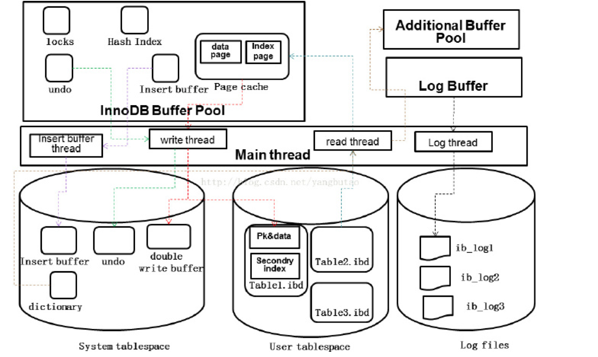
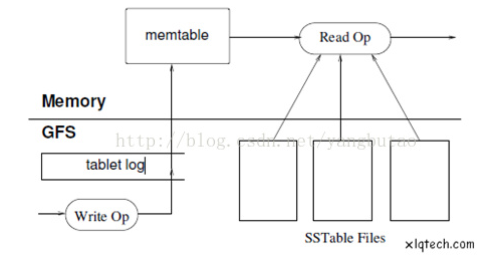
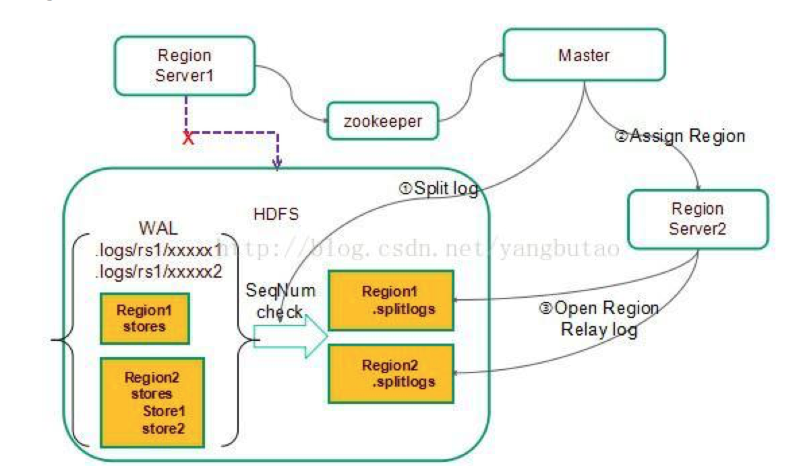
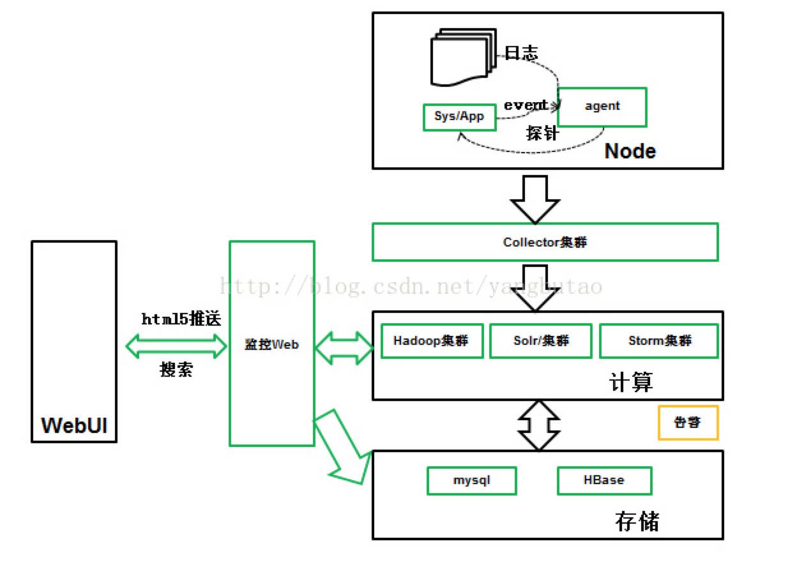

## Scalable Web架构设计Note
------------------------------------------------------------
以下架构设计源于网络资源与个人理解,在工作中应用与调整实践完成

### I. 设计理念
 
#### 1. 空间换时间
 
1.1) 多级缓存,静态化

	- 客户端页面缓存(http header中包含Expires/Cache of Control,last modified(304,server不返回body,客户端可以继续用cache,减少流量),ETag）
	- 反向代理缓存
	- 应用端的缓存(memcache/redis/内存数据库)
	- Buffer、cache机制(数据库,中间件等)

1.2) 索引

哈希、B树/B+树、倒排、bitmap

	- 哈希索引适合综合数组的寻址和链表的插入特性,可以实现数据的快速存取。
	- B树索引适合于查询为主导的场景,避免多次的IO,提高查询的效率。但B树明显影响随机IO写入性能
	- 倒排索引实现单词到文档映射关系的最佳实现方式和最有效的索引结构,广泛用在搜索领域。
	- Bitmap是一种非常简洁快速的数据结构,他能同时使存储空间和速度最优化(而不必空间换时间),适合于海量数据的的计算场景。
 
#### 2. 并行与分布式计算 
 
2.1) 任务切分、分而治之(MapReduce)

在大规模的数据中,数据存在一定的局部性的特征,利用局部性的原理将海量数据计算的问题分而治之。 
MR模型是无共享(Shareding-nothing)的架构,数据集分布至各个节点。处理时,每个节点就近读取本地存储的数据处理(map),将处理后的数据进行合并(combine)、排序(shuffle and sort)后再分发(至reduce节点),避免了大量数据的传输,提高了处理效率。

2.2) 多进程、多线程并行执行(MPP)

并行计算(Parallel Computing)是指同时使用多种计算资源解决计算问题的过程,是提高计算机系统计算速度和处理能力的一种有效手段。 
它的基本思想是用多个处理器/进程/线程来协同求解同一问题,即将被求解的问题分解成若干个部分,各部分均由一个独立的处理机来并行计算。 
和MR的区别在于,它是基于计算分解的,而不是基于数据分解。
 
#### 3. 多维度的可用
 
3.1) 负载均衡、容灾、备份

	- 随着平台并发量的增大,需要扩容节点进行集群,利用负载均衡设备进行请求的分发；
	- 负载均衡设备通常在提供负载均衡的同时,也提供失效检测功能；
	- 同时为了提高可用性,需要有容灾备份,以防止节点宕机失效带来的不可用问题；
	- 备份有在线的和离线备份,可以根据失效性要求的不同,进行选择不同的备份策略。

3.2) 读写分离

	读写分离是对数据库来讲的,随着系统并发量的增大,提高数据访问可用性的一个重要手段就是写数据和读数据进行分离；
	当然在读写分离的同时,需要关注数据的一致性问题；
	对于一致性的问题,在分布式的**系统CAP定量**中,更多的关注于可用性。

3.3) 依赖关系

	平台中各个模块之间的关系尽量是低耦合的,可以通过相关的消息组件进行交互,能异步则异步,分清楚数据流转的主流程和副流程,主副是异步的, 
	比如记录日志可以是异步操作的,增加整个系统的可用性。
	当然在异步处理中,为了确保数据得到接收或者处理,往往需要确认机制(confirm、ack)。
	但是有些场景中,虽然请求已经得到处理,但是因其他原因(比如网络不稳定),确认消息没有返回,那么这种情况下需要进行请求的重发,对请求的处理设计因重发因素需要考虑幂等性。

3.4) 监控

	监控也是提高整个平台可用性的一个重要手段,多平台进行多个维度的监控；模块在运行时候是透明的,以达到运行期白盒化。
 
#### 4. 伸缩性
 
4.1) 拆分

拆分包括对业务的拆分和对数据库的拆分

系统的资源总是有限的,一段比较长的业务执行如果是一竿子执行的方式,在大量并发的操作下,这种阻塞的方式,无法有效的及时释放资源给其他进程执行,这样系统的吞吐量不高。
需要把业务进行逻辑的分段,采用异步非阻塞的方式,提高系统的吞吐量。
随着数据量和并发量的增加,读写分离不能满足系统并发性能的要求,需要对数据进行切分,包括对数据进行分库和分表。这种分库分表的方式,需要增加对数据的路由逻辑支持。

4.2) 无状态

对于系统的伸缩性而言,模块最好是无状态的,通过增加节点就可以提高整个的吞吐量。
 
#### 5. 优化资源利用
 
5.1) 系统容量有限

系统的容量是有限的,承受的并发量也是有限的,在架构设计时,一定需要考虑流量的控制,防止因意外攻击或者瞬时并发量的冲击导致系统崩溃。 
在设计时增加流控的措施,可考虑对请求进行排队,超出预期的范围,可以进行告警或者丢弃。

5.2) 原子操作与并发控制

对于共享资源的访问,为了防止冲突,需要进行并发的控制,同时有些交易需要有事务性来保证交易的一致性,所以在交易系统的设计时,需考虑原子操作和并发控制。 
保证并发控制一些常用高性能手段有,乐观锁、Latch、mutex、写时复制、CAS等; 
**多版本的并发控制MVCC**通常是保证一致性的重要手段,这个在数据库的设计中经常会用到。

5.3) 基于逻辑的不同,采取不一样的策略

平台中业务逻辑存在不同的类型,有计算复杂型的,有消耗IO型的。同时就同一种类型而言,不同的业务逻辑消耗的资源数量也是不一样的,这就需要针对不同的逻辑采取不同的策略。

	针对IO型的,可以采取基于事件驱动的异步非阻塞的方式,单线程方式可以减少线程的切换引起的开销,
	或者在多线程的情况下采取自旋spin的方式,减少对线程的切换(比如Oracle latch设计)；对于计算型的,充分利用多线程进行操作。
	同一类型的调用方式,不同的业务进行合适的资源分配,设置不同的计算节点数量或者线程数量,对业务进行分流,优先执行优先级别高的业务。

5.4) 容错隔离

系统的有些业务模块在出现错误时,为了减少并发下对正常请求的处理的影响,有时候需要考虑对这些异常状态的请求进行单独渠道的处理,甚至暂时自动禁止这些异常的业务模块。 
有些请求的失败可能是偶然的暂时的失败(比如网络不稳定),需要进行请求重试的考虑。

5.5) 资源释放

系统的资源是有限的,在使用资源时,一定要在最后释放资源,无论是请求走的是正常路径还是异常的路径,以便于资源的及时回收,供其他请求使用。 
在设计通信的架构时,往往需要考虑超时的控制。
 
### II. 静态架构蓝图

.

整个架构是分层的分布式的架构,纵向包括CDN,负载均衡/反向代理,web应用,业务层,基础服务层,数据存储层。水平方向包括对整个平台的配置管理部署和监控。
 
 
### III. 剖析架构
 
#### 1. CDN
 
CDN系统能够实时地根据网络流量和各节点的连接、负载状况以及到用户的距离和响应时间等综合信息将用户的请求重新导向离用户最近的服务节点上。 
其目的是使用户可就近取得所需内容,解决 Internet网络拥挤的状况,提高用户访问网站的响应速度。 
对于大规模电子商务平台一般需要建CDN做网络加速,大型平台如淘宝、京东都采用自建CDN,中小型的企业可以采用第三方CDN厂商合作,如蓝汛、网宿、快网等。 
当然在选择CDN厂商时,需要考虑经营时间长短,是否有可扩充的带宽资源、灵活的流量和带宽选择、稳定的节点、性价比。
 
#### 2. 负载均衡、反向代理
 
一个大型的平台包括很多个业务域,不同的业务域有不同的集群,可以用DNS做域名解析的分发或轮询,DNS方式实现简单,但是因存在cache而缺乏灵活性； 
一般基于商用的硬件F5、NetScaler或者开源的软负载LVS在4层做分发,当然会采用做冗余(比如LVS+keepalived)的考虑,采取主备方式。

4层(TransportLayer)分发到业务集群上后,会经过web服务器如nginx或者HAProxy在7层(ApplicationLayer)做负载均衡或者反向代理分发到集群中的应用节点。

选择哪种负载,需要综合考虑各种因素（是否满足高并发高性能,Session保持如何解决,负载均衡的算法如何,支持压缩,缓存的内存消耗);
下面基于几种常用的负载均衡软件做个介绍。

- LVS工作在4层,Linux实现的高性能高并发、可伸缩性、可靠的的负载均衡器,支持多种转发方式(NAT、DR、IP Tunneling),其中DR模式支持通过广域网进行负载均衡。支持双机热备(Keepalived或者Heartbeat)。对网络环境的依赖性比较高。

- Nginx工作在7层,事件驱动的、异步非阻塞的架构、支持多进程的高并发的负载均衡器/反向代理软件。
可以针对域名、目录结构、正则规则针对http做一些分流。通过端口检测到服务器内部的故障,比如根据服务器处理网页返回的状态码、超时等等,并且会把返回错误的请求重新提交到另一个节点,不过其中缺点就是不支持url来检测。对于session sticky,可以基于ip hash的算法来实现,通过基于cookie的扩展nginx-sticky-module支持session sticky。

- HAProxy支持4层和7层做负载均衡,支持session的会话保持,cookie的引导；支持后端url方式的检测；负载均衡的算法比较丰富,有RR、权重等。

- 对于图片,需要有单独的域名,独立或者分布式的图片服务器或者如mogileFS,可以图片服务器之上加varnish做图片缓存。
 
#### 3. App接入
 
应用层(ApplicationLayer)运行在jboss/tomcat/jetty容器中,代表独立的系统,比如前端购物、用户自主服务、后端系统等

HTTP协议接口,JSON数据格式

可以采用servlet3.0,**异步化servlet**,提高整个系统的吞吐量。
http请求经过Nginx,通过负载均衡算法分到到App的某一节点,这一层层扩容起来比较简单。
除了利用cookie保存少量用户部分信息外(cookie一般不能超过4K的大小),对于App接入层,保存有用户相关的session数据,但是有些反向代理或者负载均衡不支持对session sticky支持不是很好或者对接入的可用性要求比较高
(app接入节点宕机,session随之丢失),这就需要考虑session的集中式存储,使得App接入层无状态化,同时系统用户变多的时候,就可以通过增加更多的应用节点来达到水平扩展的目的。

Session的集中式存储,需要满足以下几点要求：

	a、高效的通讯协议
	b、session的分布式缓存,支持节点的伸缩,数据的冗余备份以及数据的迁移
	c、session过期的管理
 
#### 4. 业务服务
 
代表某一领域的业务提供的服务,对于电商而言,领域有用户、商品、订单、红包、支付业务等等,不同的领域提供不同的服务。 
这些不同的领域构成一个个模块,良好的模块划分和接口设计非常重要,一般是参考**高内聚、接口收敛的原则**。 
这样可以提高整个系统的可用性。当然可以根据应用规模的大小,模块可以部署在一起,对于大规模的应用,一般是独立部署的。

* 高并发：

	业务层对外协议以NIO的RPC方式暴露,可以采用比较成熟的NIO通讯框架,如netty、mina

* 高可用:

	为了提高模块服务的可用性,一个模块部署在多个节点做冗余,并自动进行负载转发和失效转移;
	最初可以利用VIP+heartbeat方式,目前系统有一个单独的组件HA,利用zookeeper实现(比原来方案的优点)

* 一致性、事务：

	对于分布式系统的一致性,尽量满足可用性,一致性可以通过校对来达到最终一致的状态。
 

#### 5. 基础服务中间件
 
5.1) 通信组件

通信组件用于业务系统内部服务之间的调用,在大并发的电商平台中,需要满足高并发高吞吐量的要求。

整个通信组件Socket包括客户端和服务端两部分。

客户端和服务器端维护的是长连接,可以减少每次请求建立连接的开销。
在客户端对于每个服务器定义一个连接池,初始化连接后,可以并发连接服务端进行rpc操作,连接池中的长连接需要心跳维护,设置请求超时时间。

对于长连接的维护过程可以分两个阶段,一个是发送请求过程,另外一个是接收响应过程。 
在发送请求过程中,若发生IOException,则把该连接标记失效。接收响应时,服务端返回SocketTimeoutException,如果设置了超时时间,那么就直接返回异常,清除当前连接中那些超时的请求。 
否则继续发送心跳包(因为可能是丢包,超过pingInterval间隔时间就发送ping操作), 
若ping不通(发送IOException),则说明当前连接是有问题的,那么就把当前连接标记成已经失效； 
若ping通,则说明当前连接是可靠的,继续进行读操作。失效的连接会从连接池中清除掉。 
每个连接对于接收响应来说都以单独的线程运行,客户端可以通过同步(wait,notify)方式或者异步进行rpc调用。

序列化采用更高效的hession序列化方式。

服务端采用**事件驱动的NIO的MINA框架**,支撑高并发高吞吐量的请求。

5.2) 路由Router(数据库分库分表)

在大多数的数据库切分解决方案中,为了提高数据库的吞吐量,首先是对不同的表进行垂直切分到不同的数据库中,
然后当数据库中一个表超过一定大小时,需要对该表进行水平切分,这里也是一样,这里以用户表为例；

	对于访问数据库客户端来讲,需要根据用户的ID,定位到需要访问的数据；
	数据切分算法,根据用户的ID做hash操作,一致性Hash,这种方式存在失效数据的迁移问题,迁移时间内服务不可用
	维护路由表,路由表中存储用户和sharding的映射关系,sharding分为leader和replica,分别负责写和读
	这样每个biz客户端都需要保持所有sharding的连接池,这样有个缺点是会产生全连接的问题；

	一种解决方法是sharding的切分提到业务服务层进行,每个业务节点只维护一个shard的连接即可。

见图（router）

路由组件的实现是这样的(高可用、高性能、高并发）

基于性能方面的考虑,采用MongoDB中维护用户id和shard的关系,为了保证可用性,搭建replicatset集群。
biz的sharding和数据库的sharding是一一对应的,只访问一个数据库sharding.
biz业务注册节点到zookeeper上/bizs/shard/下。
router监听zookeeper上/bizs/下节点状态,缓存在线biz在router中。
client请求router获取biz时,router首先从mongodb中获取用户对应的shard,router根据缓存的内容通过RR算法获取biz节点。
为了解决router的可用性和并发吞吐量问题,对router进行冗余,同时client监听zookeeper的/routers节点并缓存在线router节点列表。

5.3) HA

传统实现HA的做法一般是采用虚拟IP漂移,结合Heartbeat、keepalived等实现HA,

Keepalived使用vrrp方式进行数据包的转发,提供4层的负载均衡,通过检测vrrp数据包来切换,做冗余热备更加适合与LVS搭配。
Linux Heartbeat是基于网络或者主机的服务的高可用,HAProxy或者Nginx可以基于7层进行数据包的转发,因此Heatbeat更加适合做HAProxy、Nginx,包括业务的高可用。
在分布式的集群中,可以用zookeeper做分布式的协调,实现集群的列表维护和失效通知,客户端可以选择hash算法或者roudrobin实现负载均衡；对于master-master模式、master-slave模式,可以通过zookeeper分布式锁的机制来支持。

5.4) 消息Message(MQ)

对于平台各个系统之间的异步交互,是通过MQ组件进行的。 
在设计消息服务组件时,需要考虑消息一致性、持久化、可用性、以及完善的监控体系。 

业界开源的消息中间件主要RabbitMQ、Kafka有两种:

* RabbitMQ

遵循AMQP协议,由内在高并发的erlanng语言开发；
RabbitMQ采用的是这种方式实现消息机制:
对消息一致性要求比较高的场合需要有应答确认机制,包括生产消息和消费消息的过程；
不过因网络等原理导致的应答缺失,可能会导致消息的重复,这个可以在业务层次根据幂等性进行判断过滤；

可用性和高吞吐量方面:RabbitMQ解决方案中有普通的集群和可用性更高的mirror queue方式。

* Kafka

Linkedin于2010年12月份开源的消息发布订阅系统,它主要用于处理活跃的流式数据,大数据量的数据处理上。
kafka分布式消息中间件就是这种方式实现消息机制:
消费端从broker拉取消息时带上LSN号,从broker中某个LSN点批量拉取消息,这样无须应答机制。

可用性和高吞吐量方面:kafka采用zookeeper对集群中的broker、consumer进行管理,可以注册topic到zookeeper上;通过zookeeper的协调机制,producer保存对应topic的broker信息,可以随机或者轮询发送到broker上;并且producer可以基于语义指定分片,消息发送到broker的某分片上。

总体来讲,RabbitMQ用在实时的对可靠性要求比较高的消息传递上。kafka主要用于处理活跃的流式数据,大数据量的数据处理上。

5.5) Cache&Buffer

Cache系统

在一些高并发高性能的场景中,使用cache可以减少对后端系统的负载,承担可大部分读的压力,可以大大提高系统的吞吐量,比如通常在数据库存储之前增加cache缓存。 
但是引入cache架构不可避免的带来一些问题:cache命中率的问题, cache失效引起的抖动,cache和存储的一致性。

	- Cache中的数据相对于存储来讲,毕竟是有限的,比较理想的情况是存储系统的热点数据,这里可以用一些常见的算法LRU等等淘汰老的数据;
	- 随着系统规模的增加,单个节点cache不能满足要求,就需要搭建分布式Cache;
	- 为了解决单个节点失效引起的抖动 ,分布式cache一般采用一致性hash的解决方案,大大减少因单个节点失效引起的抖动范围;
	- 对于可用性要求比较高的场景,每个节点都是需要有备份的。数据在cache和存储上都存有同一份备份,必然有一致性的问题,一致性比较强的,在更新数据库的同时,更新数据库cache。
	- 对于一致性要求不高的,可以去设置缓存失效时间的策略。

Memcached作为高速的分布式缓存服务器,协议比较简单,基于libevent的事件处理机制。 
Cache系统在平台中用在router系统的客户端中,热点的数据会缓存在客户端,当数据访问失效时,才去访问router系统。 

当然目前更多的利用内存型的数据库做cache,比如Redis、mongodb; 
redis比memcache有丰富的数据操作的API; 
redis和mongodb都对数据进行了持久化,而memcache没有这个功能,因此memcache更加适合在关系型数据库之上的数据的缓存。 

Buffer系统

用在高速的写操作的场景中,平台中有些数据需要写入数据库,并且数据是分库分表的,但对数据的可靠性不是那么高,为了减少对数据库的写压力,可以采取批量写操作的方式。
开辟一个内存区域,当数据到达区域的一定阀值时如80%时,在内存中做分库梳理工作(内存速度还是比较快的),后分库批量flush。

缓存重建

在数据库前端加上分布式的Cache（比如我们常用的Memcached）,让客户端在访问时先查找Cache,Cache不命中再读数据库并将结构缓存在Cache中。这是目前比较常用的一种分担读压力的方法。但是这个方法存在一个问题,如果前端的Cache挂掉,或者比较极端的整个机房断电了,那么在机器重启后,原来Cache机器在内存中的缓存会全部清空,在客户端访问过程中,会百分之百的不命中,这样数据库会在瞬间接受巨大的读压力。

考虑有效的缓存持久化方案:Redis AOF / MongoDB / 缓存重建加锁

5.6) 搜索

在电子商务平台中搜索是一个非常的重要功能,主要有搜索词类目导航、自动提示和搜索排序功能。
开源的企业级搜索引擎主要有lucene, sphinx,这里不去论述哪种搜索引擎更好一些,不过选择搜索引擎除了基本的功能需要支持外,非功能方面需要考虑以下几点：

	a.搜索引擎是否支持分布式的索引和搜索,来应对海量的数据,支持读写分离,提高可用性
	b.索引的实时性
	c.性能

Solr是基于lucene的高性能的全文搜索服务器,提供了比lucene更为丰富的查询语言,可配置可扩展,对外提供基于http协议的XML/JSON格式的接口。
从Solr4版本开始提供了

	SolrCloud方式来支持分布式的索引,自动进行sharding数据切分；
	通过每个sharding的master-slave(leader、replica)模式提高搜索的性能；
	利用zookeeper对集群进行管理,包括leader选举等等,保障集群的可用性。

Lucene索引的Reader是基于索引的snapshot的,所以必须在索引commit的后,重新打开一个新的snapshot,才能搜索到新添加的内容;
而索引的commit是非常耗性能的,这样达到实时索引搜索效率就比较低下。
对于索引搜索实时性,Solr4的之前解决方案是结合文件全量索引和内存增量索引合并的方式,参见下图。

Solr4提供了**NRT softcommit的解决方案**,softcommit无需进行提交索引操作,就可以搜素到最新对索引的变更。 
不过对索引的变更并没有sync commit到硬盘存储上,若发生意外导致程序非正常结束,未commit的数据会丢失,因此需要定时的进行commit操作。 
平台中对数据的索引和存储操作是异步的,可以大大提高可用性和吞吐量;只对某些属性字段做索引操作,存储数据的标识key,减少索引的大小;

数据是存储在分布式存储Hbase中的,HBase对二级索引搜索支持的不好,然而可以**结合Solr搜索功能进行多维度的检索统计(Kylin是否采用类似方案)**。 
索引数据和HBase数据存储的一致性,也就是如何保障HBase存储的数据都被索引过,可以采用**confirm确认机制**,通过在索引前建立待索引数据队列,在数据存储并索引完成后,从待索引数据队列中删除数据。

5.7) 日志收集

在整个交易过程中,会产生大量的日志,这些日志需要收集到分布式存储系统中存储起来,以便于集中式的查询和分析处理。
日志系统需具备三个基本组件,分别为

	- agent(封装数据源,将数据源中的数据发送给collector)
	- collector(接收多个agent的数据,并进行汇总后导入后端的store中）
	- store(中央存储系统,应该具有可扩展性和可靠性,应该支持当前非常流行的HDFS）

开源的日志收集系统业界使用的比较多的是cloudera的Flume和facebook的Scribe,其中Flume目前的版本FlumeNG对Flume从架构上做了较大的改动。

在设计或者对日志收集系统做技术选型时,通常需要具有以下特征：

	a.应用系统和分析系统之间的桥梁,将他们之间的关系解耦
	b.分布式可扩展,具有高的扩展性,当数据量增加时,可以通过增加节点水平扩展
		日志收集系统是可以伸缩的,在系统的各个层次都可伸缩,对数据的处理不需要带状态,伸缩性方面也比较容易实现。
	c.近实时性
		在一些时效性要求比较高的场景中,需要可以及时的收集日志,进行数据分析；
		一般的日志文件都会定时或者定量的进行rolling,所以实时检测日志文件的生成,及时对日志文件进行类似的tail操作,并支持批量发送提高传输效率；
		批量发送的时机需要满足消息数量和时间间隔的要求。
	d.容错性
		Scribe在容错方面的考虑是,当后端的存储系统crash时,scribe会将数据写到本地磁盘上,当存储系统恢复正常后,scribe将日志重新加载到存储系统中。
		FlumeNG通过Sink Processor实现负载均衡和故障转移。多个Sink可以构成一个Sink Group。一个Sink Processor负责从一个指定的Sink Group中激活一个Sink。
		Sink Processor可以通过组中所有Sink实现负载均衡；也可以在一个Sink失败时转移到另一个。
	e.事务支持
		Scribe没有考虑事务的支持。
		Flume通过应答确认机制实现事务的支持,参见下图,

		通常提取发送消息都是批量操作的,消息的确认是对一批数据的确认,这样可以大大提高数据发送的效率。
	f.可恢复性

		FlumeNG的channel根据可靠性的要求的不同,可以基于内存和文件持久化机制,基于内存的数据传输的销量比较高,但是在节点宕机后,数据丢失,不可恢复；
		而文件持久化宕机是可以恢复的。

	g.数据的定时定量归档
		数据经过日志收集系统归集后,一般存储在分布式文件系统如Hadoop.
		为了便于对数据进行后续的处理分析,需要定时(TimeTrigger)或者定量(SizeTrigger的rolling分布式系统的文件。

5.8) 数据同步(databus)

在交易系统中,通常需要进行异构数据源的同步,通常有数据文件到关系型数据库,数据文件到分布式数据库,关系型数据库到分布式数据库等。

数据在异构源之间的同步一般是基于性能和业务的需求,数据存储在本地文件中一般是基于性能的考虑,文件是顺序存储的,效率还是比较高的； 
数据同步到关系型数据一般是基于查询的需求；而分布式数据库是存储越来越多的海量数据的,而关系型数据库无法满足大数据量的存储和查询请求。 
在数据同步的设计中需要综合考虑吞吐量、容错性、可靠性、一致性的问题

同步有**实时增量数据同步和离线全量数据区分**,下面从这两个维度来介绍一下:

实时增量一般是Tail文件来实时跟踪文件变化,批量或者多线程往数据库导出,这种方式的架构类似于日志收集框架。这种方式需要有确认机制,包括两个方面。

	一个方面是Channel需要给agent确认已经批量收到数据记录了,发送LSN号给agent,这样在agent失效恢复时,可以从这个LSN点开始tail；
	当然对于允许少量的重复记录的问题(发生在channel给agent确认的时,agent宕机并未受到确认消息),需要在业务场景中判断。
	另外一个方面是sync给channel确认已经批量完成写入到数据库的操作,这样channel可以删除这部分已经confirm的消息。
	基于可靠性的要求,channel可以采用文件持久化的方式。

参见下图:

离线全量遵循空间间换取时间,分而治之的原则,尽量的缩短数据同步的时间,提高同步的效率。

需要对源数据比如MySQL进行切分,多线程并发读源数据,多线程并发批量写入分布式数据库比如HBase。 
利用channel作为读写之间的缓冲,实现更好的解耦,channel可以基于文件存储或者内存。

参见下图:

对于源数据的切分,如果是文件可以根据文件名称设置块大小来切分。 
对于关系型数据库,由于一般的需求是只离线同步一段时间的数据(比如凌晨把当天的订单数据同步到HBase)。 
所以需要在数据切分时(按照行数切分),会多线程扫描整个表(及时建索引,也要回表),对于表中包含大量的数据来讲,IO很高,效率非常低；

这里解决的方法是对数据库按照时间字段(按照时间同步的)建立分区,每次按照分区进行导出。

5.9) 数据分析

从传统的基于关系型数据库并行处理集群、用于内存计算近实时的,到目前的基于hadoop的海量数据的分析,数据的分析在大型电子商务网站中应用非常广泛,包括流量统计、推荐引擎、趋势分析、用户行为分析、数据挖掘分类器、分布式索引等等。

- 并行处理集群有商业的EMC Greenplum,Greenplum的架构采用了MPP(大规模并行处理),基于postgresql的大数据量存储的分布式数据库。
- 内存计算方面有SAP的HANA,
- 开源的nosql内存型的数据库mongodb也支持mapreduce进行数据的分析

海量数据的离线分析目前互联网公司大量的使用Hadoop,Hadoop在可伸缩性、健壮性、计算性能和成本上具有无可替代的优势,事实上已成为当前互联网企业主流的大数据分析平台

	Hadoop通过MapReuce的分布式处理框架,用于处理大规模的数据,伸缩性也非常好；
	但是MapReduce最大的不足是不能满足实时性的场景,主要用于离线分析。
	基于MapRduce模型编程做数据的分析,开发上效率不高,位于hadoop之上Hive的出现使得数据的分析可以类似编写sql的方式进行,sql经过语法分析、生成执行计划后最终生成MapReduce任务进行执行,这样大大提高了开发的效率,做到以ad-hoc(计算在query发生时)方式进行的分析。
	基于MapReduce模型的分布式数据的分析都是离线的分析,执行上都是暴力扫描,无法利用类似索引的机制；

- 开源的Cloudera Impala是基于MPP的并行编程模型的,底层是Hadoop存储的高性能的实时分析平台,可以大大降低数据分析的延迟。

目前Hadoop使用的版本是Hadoop1.0,一方面原有的MapReduce框架存在JobTracker单点的问题。 
另外一方面JobTracker在做资源管理的同时又做任务的调度工作,随着数据量的增大和Job任务的增多,明显存在可扩展性、内存消耗、线程模型、可靠性和性能上的缺陷瓶颈； 
Hadoop2.0 yarn对整个框架进行了重构,分离了资源管理和任务调度,从架构设计上解决了这个问题。 

参考Yarn的架构

5.10) 实时计算

在互联网领域,实时计算被广泛实时监控分析、流控、风险控制等领域。 
电商平台系统或者应用对日常产生的大量日志和异常信息,需要经过实时过滤、分析,以判定是否需要预警； 
同时需要对系统做自我保护机制,比如对模块做流量的控制,以防止非预期的对系统压力过大而引起的系统瘫痪,流量过大时,可以采取拒绝或者引流等机制; 
有些业务需要进行风险的控制,比如彩票中有些业务需要根据系统的实时销售情况进行限号与放号。 
原始基于单节点的计算,随着系统信息量爆炸式产生以及计算的复杂度的增加,单个节点的计算已不能满足实时计算的要求,需要进行多节点的分布式的计算,分布式实时计算平台就出现了。

这里所说的实时计算,其实是流式计算,概念前身其实是CEP复杂事件处理,相关的开源产品如Esper,业界分布式的流计算产品Yahoo S4,Twitter storm等,以storm开源产品使用最为广泛。

对于实时计算平台,从架构设计上需要考虑以下几个因素：

	1.伸缩性
		随着业务量的增加,计算量的增加,通过增加节点处理,就可以处理。
	2.高性能、低延迟
		从数据流入计算平台数据,到计算输出结果,需要性能高效且低延迟,保证消息得到快速的处理,做到实时计算。
	3.可靠性
		保证每个数据消息得到一次完整处理。
	4.容错性
		系统可以自动管理节点的宕机失效,对应用来说,是透明的。

Twitter的Storm在以上这几个方面做的比较好,下面简介一下Storm的架构。

	- 整个集群的管理是通过zookeeper来进行的。
	- 客户端提交拓扑到nimbus。
		Nimbus针对该拓扑建立本地的目录根据topology的配置计算task,分配task,在zookeeper上建立assignments节点存储task和supervisor机器节点中woker的对应关系。
		在zookeeper上创建taskbeats节点来监控task的心跳;启动topology。
	- Supervisor去zookeeper上获取分配的tasks,启动多个woker进行,每个woker生成task,一个task一个线程；
		根据topology信息初始化建立task之间的连接;Task和Task之间是通过zeroMQ管理的；之后整个拓扑运行起来。
	- Tuple是流的基本处理单元,也就是一个消息,Tuple在task中流转,Tuple的发送和接收过程如下:
		发送Tuple,Worker提供了一个transfer的功能,用于当前task把tuple发到到其他的task中。以目的taskid和tuple参数,序列化tuple数据并放到transfer queue中。
		在0.8版本之前,这个queue是LinkedBlockingQueue,0.8之后是DisruptorQueue。
		在0.8版本之后,每一个woker绑定一个inbound transfer queue和outbond queue,inbound queue用于接收message,outbond queue用于发送消息。
		发送消息时,由单个线程从transferqueue中拉取数据,把这个tuple通过zeroMQ发送到其他的woker中。
		接收Tuple,每个woker都会监听zeroMQ的tcp端口来接收消息,消息放到DisruptorQueue中后,后从queue中获取message(taskid,tuple)。 根据目的taskid,tuple的值路由到task中执行。每个tuple可以emit到direct steam中,也可以发送到regular stream中,在Reglular方式下,由Stream Group（stream id–>component id –>outbond tasks）功能完成当前tuple将要发送的Tuple的目的地。
	
通过以上分析可以看到,Storm在伸缩性、容错性、高性能方面的从架构设计的角度得以支撑； 
同时在可靠性方面,Storm的ack组件利用异或xor算法在不失性能的同时,保证每一个消息得到完整处理的同时。

5.11) 实时推送

实时推送的应用场景非常多,比如系统的监控动态的实时曲线绘制,手机消息的推送,web实时聊天等。 
实时推送有很多技术可以实现,有Comet方式,有websocket方式等。

Comet基于服务器长连接的“服务器推”技术,包含两种：

	- Long Polling:服务器端在接到请求后挂起,有更新时返回连接即断掉,然后客户端再发起新的连接
	- Stream方式:每次服务端数据传送不会关闭连接,连接只会在通信出现错误时,或是连接重建时关闭（一些防火墙常被设置为丢弃过长的连接, 服务器端可以设置一个超时时间,超时后通知客户端重新建立连接,并关闭原来的连接）。

Websocket:长连接,全双工通信

是HTML5的一种新的协议。它实现了浏览器与服务器的双向通讯。 
webSocket API 中,浏览器和服务器端只需要通过一个握手的动作,便能形成浏览器与客户端之间的快速双向通道,使得数据可以快速的双向传播。 
Socket.io是一个NodeJS websocket库,包括客户端的JS和服务端的的nodejs,用于快速构建实时的web应用。

5.12) 推荐引擎

待补充
 
#### 6. 数据存储
 
数据库存储大体分为以下几类:

	- 有关系型(OLTP)的数据库,以oracle、mysql为代表。
	- 有keyvalue数据库,以redis和memcached db为代表。
	- 有文档型数据库如mongodb,
	- 有列式分布式数据库以HBase,cassandra,dynamo为代表。
	- 还有其他的图形数据库、对象数据 库、xml数据库等。

每种类型的数据库应用的业务领域是不一样的,下面从内存型、关系型、分布式三个维度针对相关的产品做性能可用性等方面的考量分析。

6.1) 内存型数据库

内存型的数据库,以高并发高性能为目标,在事务性方面没那么严格,以开源nosql数据库mongodb、redis为例

* Mongodb

_通信方式_

多线程方式,主线程监听新的连接,连接后,启动新的线程做数据的操作（IO切换）。

_数据结构_

数据库–>collection–>record

	MongoDB在数据存储上按命名空间来划分,一个collection是一个命名空间,一个索引也是一个命名空间。
	同一个命名空间的数据被分成很多个Extent,Extent之间使用双向链表连接。
	在每一个Extent中,保存了具体每一行的数据,这些数据也是通过双向链接连接的。
	每一行数据存储空间不仅包括数据占用空间,还可能包含一部分附加空间,这使得在数据update变大后可以不移动位置。

索引以BTree结构实现:

	如果你开启了jorunaling日志,那么还会有一些文件存储着你所有的操作记录。

_持久化存储_

MMap方式把文件地址映射到内存的地址空间,直接操作内存地址空间就可以操作文件,不用再调用write,read操作,性能比较高。
mongodb调用mmap把磁盘中的数据映射到内存中的,所以必须有一个机制时刻的刷数据到硬盘才能保证可靠性,多久刷一次是与syncdelay参数相关的。
journal（进行恢复用）是Mongodb中的redo log,而Oplog则是负责复制的binlog。如果打开journal,那么即使断电也只会丢失100ms的数据,这对大多数应用来说都可以容忍了。从1.9.2+,mongodb都会默认打开journal功能,以确保数据安全。而且journal的刷新时间是可以改变的,2-300ms的范围,使用 –journalCommitInterval 命令。Oplog和数据刷新到磁盘的时间是60s,对于复制来说,不用等到oplog刷新磁盘,在内存中就可以直接复制到Sencondary节点。

_事务支持_

Mongodb只支持对单行记录的原子操作

_HA集群_

用的比较多的是Replica Sets,采用选举算法,自动进行leader选举,在保证可用性的同时,可以做到强一致性要求。

当然对于大量的数据,mongodb也提供了数据的切分架构Sharding。

* Redis

丰富的数据结构,高速的响应速度,内存操作

_通信方式_

因都在内存操作,所以逻辑的操作非常快,减少了CPU的切换开销,所以为单线程的模式(逻辑处理线程和主线程是一个)。
reactor模式,实现自己的多路复用NIO机制（epoll,select,kqueue等）
单线程处理多任务

_数据结构_

hash+bucket结构,当链表的长度过长时,会采取迁移的措施(扩展原来两倍的hash表,把数据迁移过去,expand+rehash)

_持久化存储_

a、全量持久化RDB（遍历redisDB,读取bucket中的key,value）,save命令阻塞主线程,bgsave开启子进程进行snapshot持久化操作,生成rdb文件。
	在shutdown时,会调用save操作
	数据发生变化,在多少秒内触发一次bgsave
	sync,master接受slave发出来的命令

b、增量持久化（aof类似redolog）,先写到日志buffer,再flush到日志文件中（flush的策略可以配置的,而已单条,也可以批量）,只有flush到文件上的,才真正返回客户端。
	要定时对aof文件和rdb文件做合并操作（在快照过程中,变化的数据先写到aof buf中等子进程完成快照<内存snapshot>后,再进行合并aofbuf变化的部分以及全镜像数据）
	在高并发访问模式下,RDB模式使服务的性能指标出现明显的抖动,aof在性能开销上比RDB好,但是恢复时重新加载到内存的时间和数据量成正比。

_集群HA_

通用的解决方案是主从备份切换,采用HA软件,使得失效的主redis可以快速的切换到从redis上。 
主从数据的同步采用复制机制,该场景可以做读写分离。 
目前在复制方面,存在的一个问题是在遇到网络不稳定的情况下,Slave和Master断开(包括闪断)会导致Master需要将内存中的数据全部重新生成rdb文件(snapshot文件),然后传输给Slave。 
Slave接收完Master传递过来的rdb文件以后会将自身的内存清空,把rdb文件重新加载到内存中。这种方式效率比较低下,在后面的未来版本Redis2.8作者已经实现了部分复制的功能。

6.2) 关系型数据库

关系型数据库在满足并发性能的同时,也需要满足事务性,以mysql数据库为例,讲述架构设计原理,在性能方面的考虑,以及如何满足可用性的需求。

* mysql的架构原理(innodb)

在架构上,mysql分为server层和存储引擎层。 
Server层的架构对于不同的存储引擎来讲都是一样的,包括连接/线程处理、查询处理(parser、optimizer)以及其他系统任务。 
存储引擎层有很多种,mysql提供了存储引擎的插件式结构,支持多种存储引擎,用的最广泛的是innodb和MyIsam； 
inodb主要面向OLTP方面的应用,支持事务处理,myisam不支持事务,表锁,对OLAP操作速度快。 

以下主要针对innodb存储引擎做相关介绍。

在线程处理方面,Mysql是多线程的架构,由一个master线程,一个锁监控线程,一个错误监控线程,和多个IO线程组成。并且对一个连接会开启一个线程进行服务。 
io线程又分为节省随机IO的insert buffer,用于事务控制的类似于oracle的redo log,以及多个write,多个read的硬盘和内存交换的IO线程。

在内存分配方面,包括innodb buffer pool ,以及log buffer。其中innodb buffer pool包括insert buffer、datapage、index page、数据字典、自适应hash。 
Log buffer用于缓存事务日志,提供性能。

在数据结构方面,innodb包括表空间、段、区、页/块,行。 
索引结构是B+tree结构,包括二级索引和主键索引,二级索引的叶子节点是主键PK,根据主键索引的叶子节点指向存储的数据块。 
这种B+树存储结构可以更好的满足随机查询操作IO要求,分为数据页和二级索引页,修改二级索引页面涉及到随机操作。 
为了提高写入时的性能,采用insert buffer做顺序的写入,再由后台线程以一定频率将多个插入合并到二级索引页面。 

为了保证数据库的一致性(内存和硬盘数据文件),以及缩短实例恢复的时间,关系型数据库还有一个checkpoint的功能。 
用于把内存buffer中之前的脏页按照比例(老的LSN)写入磁盘,这样redolog文件的LSN以前的日志就可以被覆盖了,进行循环使用;在失效恢复时,只需要从日志中LSN点进行恢复即可。 

在事务特性支持上,关系型数据库需要满足ACID四个特性,需要根据不同的事务并发和数据可见性要求,定义了不同的事务隔离级别。 
并且离不开对资源争用的锁机制,要避免产生死锁,mysql在Server层和存储引擎层做并发控制,主要体现在读写锁,根据锁粒度不同,有各个级别的锁(表锁、行锁、页锁、MVCC) 基于提高并发性能的考虑,使用多版本并发控制MVCC来支持事务的隔离,并基于undo来实现,在做事务回滚时,也会用到undo段。 
mysql用redolog来保证数据的写入的性能和失效恢复,在修改数据时只需要修改内存,再把修改行为记录到事务日志中(顺序IO),不用每次将数据修改本身持久化到硬盘(随机IO),大大提高性能。 
在可靠性方面,innodb存储引擎提供了两次写机制double writer用于防止在flush页面到存储上出现的错误,解决磁盘half-writern的问题。 
 
* 对于高并发高性能的mysql来讲,可以在多个维度进行性能方面的调优。

a.硬件级别:

	日志和数据的存储,需要分开,日志是顺序的写,需要做raid1+0,并且用buffer-IO；数据是离散的读写,走direct IO即可,避免走文件系统cache带来的开销。
	存储能力,SAS盘raid操作（raid卡缓存,关闭读cache,关闭磁盘cache,关闭预读,只用writeback buffer,不过需要考虑充放电的问题）,当然如果数据规模不大,数据的存储可以用高速的设备,Fusion IO、SSD。
	对于数据的写入,控制脏页刷新的频率,对于数据的读取,控制cache hit率；因此而估算系统需要的IOPS,评估需要的硬盘数量(fusion io上到IOPS 在10w以上,普通的硬盘150)。
	Cpu方面,单实例关闭NUMA,mysql对多核的支持不是太好,可以对多实例进行CPU绑定。

b.操作系统级别:

	内核以及socket的优化,网络优化bond、文件系统、IO调度
	innodb主要用在OLTP类应用,一般都是IO密集型的应用,在提高IO能力的基础上,充分利用cache机制。需要考虑的内容有,
	在保证系统可用内存的基础上,尽可能的扩大innodb buffer pool,一般设置为物理内存的3/4
	文件系统的使用,只在记录事务日志的时候用文件系统的cache；尽量避免mysql用到swap(可以将vm.swappiness=0,内存紧张时,释放文件系统cache)
	IO调度优化,减少不必要的阻塞,降低随机IO访问的延时(CFQ、Deadline、NOOP)

c、server以及存储引擎级别(连接管理、网络管理、table管理、日志)

	包括cache/buffer、Connection、IO

d、应用级别（比如索引的考虑,schema的优化适当冗余;

	优化sql查询导致的CPU问题和内存问题,减少锁的范围,减少回表扫描,覆盖索引）

* 在高可用实践方面:

支持master-master、master-slave模式。
	master-master模式是一个作为主负责读写,另外一个作为standby提供灾备,maser-slave是一个作为主提供写操作,其他几个节点作为读操作,支持读写分离。

对于节点主备失效检测和切换,可以采用HA软件,当然也可以从更细粒度定制的角度,采用zookeeper作为集群的协调服务。

对于分布式的系统来讲,数据库主备切换的一致性始终是一个问题,可以有以下几种方式:

	a.集群方式,如oracle的rack,缺点是比较复杂
	b.共享SAN存储方式,相关的数据文件和日志文件都放在共享存储上,优点是主备切换时数据保持一致,不会丢失,但由于备机有一段时间的拉起,会有短暂的不可用状态
	c.主备进行数据同步的方式,常见的是日志的同步,可以保障热备,实时性好,但是切换时,可能有部分数据没有同步过来,带来了数据的一致性问题。可以在操作主数据库的同时,记录操作日志,切换到备时,会和操作日志做个check,补齐未同步过来的数据；
	d.还有一种做法是备库切换到主库的regolog的存储上,保证数据不丢失。

数据库主从复制的效率在mysql上不是太高,主要原因是事务是严格保持顺序的,索引mysql在复制方面包括日志IO和relog log两个过程都是单线程的串行操作,在数据复制优化方面,尽量减少IO的影响。不过到了Mysql5.6版本,可以支持在不同的库上的并行复制。

* 基于不同业务要求的存取方式

平台业务中,不同的业务有不同的存取要求。 
比如典型的两大业务用户和订单,用户一般来讲总量是可控的,而订单是不断地递增的,对于用户表首先采取分库切分,每个sharding做一主多读,同样对于订单因更多需求的是用户查询自己的订单,也需要按照用户进行切分订单库,并且支持一主多读。

在硬件存储方面,对于事务日志因是顺序写,闪存的优势比硬盘高不了多少,所以采取电池保护的写缓存的raid卡存储; 
对于数据文件,无论是对用户或者订单都会存在大量的随机读写操作,当然加大内存是一个方面,另外可以采用高速的IO设备闪存,比如PCIe卡fusion-io。 
使用闪存也适合在单线程的负载中,比如主从复制,可以对从节点配置fusion-IO卡,降低复制的延迟。 

对于订单业务来讲,量是不断递增的,PCIe卡存储容量比较有限,并且订单业务的热数据只有最近一段时间的(比如近3个月的),对此这里列两种解决方案: 
一种是flashcache方式,采用基于闪存和硬盘存储的开源混合存储方式,在闪存中存储热点的数据。 
另外一种是可以定期把老的数据导出到分布式数据库HBase中,用户在查询订单列表是近期的数据从mysql中获取,老的数据可以从HBase中查询,当然需要HBase良好的rowkey设计以适应查询需求。

6.3) 分布式数据库

对于数据的高并发的访问,传统的关系型数据库提供读写分离的方案,但是带来的确实数据的一致性问题提供的数据切分的方案; 
对于越来越多的海量数据,传统的数据库采用的是分库分表,实现起来比较复杂,后期要不断的进行迁移维护; 
对于高可用和伸缩方面,传统数据采用的是主备、主从、多主的方案,但是本身扩展性比较差,增加节点和宕机需要进行数据的迁移。 

对于以上提出的这些问题,分布式数据库HBase有一套完善的解决方案,适用于高并发海量数据存取的要求。

* HBase

	基于列式的高效存储降低IO性能损耗
	通常的查询不需要一行的全部字段,大多数只需要几个字段
	对与面向行的存储系统,每次查询都会全部数据取出,然后再从中选出需要的字段
	面向列的存储系统可以单独查询某一列,从而大大降低IO
	提高压缩效率
	同列数据具有很高的相似性,会增加压缩效率

Hbase的很多特性,都是由列存储决定的

_强一致的数据访问(MVCC)_

	HBase的一致性数据访问是通过MVCC来实现的。
	HBase在写数据的过程中,需要经过好几个阶段,写HLog,写memstore,更新MVCC;
	只有更新了MVCC,才算真正memstore写成功,其中事务的隔离需要有mvcc的来控制,比如读数据不可以获取别的线程还未提交的数据。

_高可用_

	HBase的数据存储基于HDFS,提供了冗余机制。
	Region节点的宕机,对于内存中的数据还未flush到文件中,提供了可靠的恢复机制。

_可伸缩,自动切分,迁移_

	通过Zookeeper定位目标Region Server,最后定位Region。
	Region Server扩容,通过将自身发布到Master,Master均匀分布。

_可用性_

	存在单点故障,Region Server宕机后,短时间内该server维护的region无法访问,等待failover生效。
	通过Master维护各Region Server健康状况和Region分布。
	多个Master,Master宕机有zookeeper的paxos投票机制选取下一任Master。Master就算全宕机,也不影响Region读写。Master仅充当一个自动运维角色。

HDFS为分布式存储引擎,一备三,高可靠,0数据丢失。 
HDFS的namenode是一个SPOF。 
为避免单个region访问过于频繁,单机压力过大,提供了split机制。 
HBase的写入是LSM-TREE的架构方式,随着数据的append,HFile越来越多,HBase提供了HFile文件进行compact,对过期数据进行清除,提高查询的性能。

_Schema free_

HBase没有像关系型数据库那样的严格的schema,可以自由的增加和删除schema中的字段。
 
HBase分布式数据库,对于二级索引支持的不太好,目前只支持在rowkey上的索引,所以rowkey的设计对于查询的性能来讲非常关键。
 
#### 7. 管理与部署配置
 
统一的配置库
部署平台
 
#### 8. 监控、统计
 
大型分布式系统涉及各种设备,比如网络交换机,普通PC机,各种型号的网卡,硬盘,内存等等,还有应用业务层次的监控,数量非常多的时候,出现错误的概率也会变大,并且有些监控的时效性要求比较高,有些达到秒级别; 
在大量的数据流中需要过滤异常的数据,有时候也对数据会进行上下文相关的复杂计算,进而决定是否需要告警。因此监控平台的性能、吞吐量、已经可用性就比较重要,需要规划统一的一体化的监控平台对系统进行各个层次的监控。

_平台的数据分类_

	应用业务级别：应用事件、业务日志、审计日志、请求日志、异常、请求业务metrics、性能度量
	系统级别：CPU、内存、网络、IO

_时效性要求_

	阀值,告警：
	实时计算：
	近实时分钟计算
	按小时、天的离线分析
	实时查询

_架构_

节点中agent代理可以接收日志、应用的事件以及通过探针的方式采集数据。Agent采集数据的一个原则是和业务应用的流程是异步隔离的,不影响交易流程。 

	- 数据统一通过collector集群进行收集,按照数据的不同类型分发到不同的计算集群进行处理;
	- 有些数据时效性不是那么高,比如按小时进行统计,放入hadoop集群;
	- 有些数据是请求流转的跟踪数据,需要可以查询的,那么就可以放入solr集群进行索引;
	- 有些数据需要进行实时计算的进而告警的,需要放到storm集群中进行处理。
	- 数据经过计算集群处理后,结果存储到Mysql或者HBase中。
	- 监控的web应用可以把监控的实时结果推送到浏览器中,也可以提供API供结果的展现和搜索。

### IV.高可用与可伸缩

#### 1.如何实现高可用

入口层

入口层,通常指Nginx和Apache等层面的东西,负责应用（不管是Web应用还是移动应用）的服务入口。我们通常会将服务定位在一个IP,如果这个IP对应的服务器当机了,那么用户的访问肯定会中断。此时,可以用keepalived来实现入口层的高可用。例如,机器A 的IP是 1.2.3.4,机器 B 的 IP 是 1.2.3.5, 那么再申请一个 IP 1.2.3.6（称为⼼跳IP）, 平时绑定在机器A上,如果A当机,IP会自动绑定在机器B上；如果B当机,IP会自动绑定在机器A上。对于这种形式,我们将DNS绑定到心跳IP上,即可实现入口层的高可用。

但这个方案有一点小问题。第一,它的切换可能会有一到两秒的中断,也就是说,如果不是要求到非常严格的毫秒级就不会有问题。第二,对入口的机器会有些浪费,因为买了两台机器的入口,可能就只有一台机器用上。对一些长连接的应用可能会导致服务中断,这时候就需要客户端做配合做一些重新创建连接的工作。简单来说,对于比较普通的业务来说,这个方案就能解决一部分问题。

这里要注意,keepalived在使用上会有一些限制。

* 两台机器必须在同一个网段,不是在同一个网段,没有办法实现互相抢IP。
* 内网服务也可以做心跳,但需要注意的是,以前为了安全我们会把内网服务绑定在内网IP上,避免出现安全问题。但为了使用keepalived,必须监听在所有IP上（如果监听在心跳IP上,那么机器没有持有该IP时,服务无法启动）,简单的方案是启用 iptables, 避免内网服务被外网访问。
* 服务器利用率下降,这时可以考虑做混合部署来改善这一点。
比较常见的一个错误是,如果有两台机器,两个公网IP,DNS上把域名同时定位到两个IP,就觉得已经做了高可用了。这完全不是高可用,因为如果一台机器当机,那么就有一半左右的用户无法访问。

除了keepalive,lvs也能用来解决入口层的高可用问题。不过,与keepalived相比,lvs会更复杂一些,门槛也会高一些。

业务层

业务层通常是由PHP、Java、Python、Go等写的逻辑代码构成的,需要依赖于后台数据库及一些缓存层面的东西。如何实现业务层的高可用呢？最核心的就是,业务层不要有状态,将状态分散到缓存层和数据库。目前大家通常喜欢将以下几种数据放入业务层。

第一个是session,即用户登录相关的数据,但好的做法是将session放在数据库里,或者一个比较稳定的缓存系统中。

第二个是缓存,在访问数据库时,如果一个查询很慢,就希望将这些结果暂时放到进程里,下次再做查询时就不用再访问数据库了。这种做法带来的问题是,当业务层服务器不只一台时,数据很难做到一致,从缓存拿到的数据就可能是错误的。。

一个简单的原则就是业务层不要有状态。在业务层没有状态时,一台业务层服务器当掉了之后,Nginx/Apache会自动将所有的请求打到另外一台业务层的服务器上。由于没有状态,两台服务器没有任何差异,所以用户完全感受不到。如果把session放在业务层里面的话,那么面临的问题是,这个用户以前是登录在一台机器上的,这个进程死掉后,用户就会被登出了。

友情提醒：有一段时间比较流行cookie session,就是将session中的数据加密之后放在客户的cookie里,然后下发到客户端,这样也能做到与服务端完全无状态。但这里面有很多坑,如果能绕过这些坑就可以这样使用。第一个坑是怎么保证加密的密钥不泄露,一旦泄露就意味着攻击者可以伪造任何人的身份。第二个坑是重放攻击,如何避免别人通过保存 cookie 去不停地尝试的验证码,当然也还有其他一些攻击手段。如果没有好办法解决这两方面的问题,那么cookie session尽量慎用。最好是将session放在一个性能比较好的数据库中。如果数据库性能不行,那么将session放在缓存中也比放在cookie里要好一点。

缓存层

非常简单的架构里是没有缓存这个概念的。但在访问量上来之后,MySQL之类的数据库扛不住了,比如在SATA盘里跑MySQL,QPS到达200、300甚至500时,MySQL的性能会大幅下降,这时就可以考虑用缓存层来挡住绝大部分服务请求,提升系统整体的容量。

缓存层做高可用一个简单的方法就是,将缓存层分得细一点儿。比如说,缓存层就一台机器的话,那么这台机器当了以后,所有应用层的压力就会往数据库里压,数据库扛不住的话,整个网站（或应用）就会随之当掉。而如果缓存层分在四台机器上的话,每台只有四分之一,这台机器当掉了以后,也只有总访问量的四分之一会压在数据库上面,数据库能扛住的话,网站就能很稳定地等到缓存层重新起来。在实践中,四分之一显然是不够的,我们会将它分得更细,以保证单台缓存当机后数据库还能撑得住即可。在中小规模下,缓存层和业务层可以混合部署,这样可以节省机器。

数据库层

在数据库层面实现高可用,通常是在软件层面来做。例如,MySQL有主从模式(Master-Slave),还有主主模式(Master-Master)都能满足需求。MongoDB也有ReplicaSet的概念,基本都能满足大家的需求。

总之,要想实现高可用,需要做到这几点：入口层做心跳,业务层服务器无状态,缓存层减小粒度,数据库做一个主从模式。对于这种模式来讲,我们做的高可用不需要太多服务器,这些东西都可以同时部署在两台服务器上。这时,两台服务器就能满足早期的高可用需求了。任何一台服务器当机用户完全无感知。

#### 2.如何实现可伸缩

入口层

在入口层实现伸缩性,可以通过直接水平扩机器,然后DNS加IP来实现。但需要注意,尽管一个域名解析到几十个IP没有问题,但是很多浏览器客户端只会使用前几个IP,部分域名供应商对此有优化(如每次返回的IP顺序随机),但这个优化效果不稳定。

推荐的做法是使用少量的Nginx机器作为入口,业务服务器隐藏在内网(HTTP类型的业务这种方式居多)。另外,也可以把所有IP下发到客户端,然后在客户端做一些调度(特别是非HTTP型的业务,如游戏、直播)。

业务层

业务层的伸缩性如何实现?与做高可用时的解决方案一样,要实现业务层的伸缩性,保证无状态是很好的手段。此外,加机器继续水平部署即可。

缓存层

比较麻烦的是缓存层的伸缩性,最简单粗暴的方式是什么呢？趁着半夜量比较低的时候,把整个缓存层全部下线,然后上线新的缓存层。新的缓存层启动起来之后,再等这些缓存慢慢预热。当然这里一个要求,你的数据库能抗住低估期的请求量。如果扛不住呢？取决于缓存类型,下面我们先可以将缓存的类型区分一下。

* 强一致性缓存：无法接受从缓存拿到错误的数据 (比如用户余额,或者会被下游继续缓存这种情形)
* 弱一致性缓存：能接受在一段时间内从缓存拿到错误的数据 (比如微博的转发数)。
* 不变型缓存：缓存key对应的value不会变更 (比如从SHA1推出来的密码, 或者其他复杂公式的计算结果)。
那什么缓存类型伸缩性比较好呢？弱一致性和不变型缓存的扩容很方便,用一致性Hash即可；强一致性情况稍微复杂一些,稍后再讲。使用一致性Hash,而不用简单Hash的原因是缓存的失效率。如果缓存从9台扩容到10台,简单Hash 情况下90%的缓存会马上失效,而如果使用一致性Hash情况,只有10%的缓存会失效。

那么,强一致性缓存会有什么问题？第一个问题是,缓存客户端的配置更新时间会有微小的差异,在这个时间窗内有可能会拿到过期的数据。第二个问题是,如果扩容之后再裁撤节点,会拿到脏数据。比如 a 这个key之前在机器1,扩容后在机器2,数据更新了,但裁撤节点后key回到机器1,这时候就会拿到脏数据。

要解决问题2比较简单,要么保持永不减少节点,要么节点调整间隔大于数据的有效时间。问题1可以用如下的步骤来解决：

1. 两套hash配置都更新到客户端,但仍然使用旧配置；
2. 逐个客户端改为只有两套hash结果一致的情况下会使用缓存,其余情况从数据库读,但写入缓存；
3. 逐个客户端通知使用新配置。
Memcache 设计得比较早,导致在伸缩性高可用方面的考虑得不太周到。Redis 在这方面有不少改进,特别是 @ngaut 团队基于 redis 开发了 codis 这个软件,一次性地解决了缓存层的绝大部分问题。推荐大家考察一下。

数据库

在数据库层面实现伸缩,方法很多,文档也很多,此处不做过多赘述。大致方法为：水平拆分、垂直拆分和定期滚动。

总之,我们可以在入口层、业务层面、缓存层和数据库层四个层面,使用刚才介绍的方法和技术实现系统高可用和可伸缩性。具体为：在入口层用心跳来做到高可用,用平行部署来伸缩；在业务层做到服务无状态；在缓存层,可以减小一些粒度,以方便实现高可用,使用一致性Hash将有助于实现缓存层的伸缩性；数据库层的主从模式能解决高可用问题,拆分和滚动能解决可伸缩问题。

