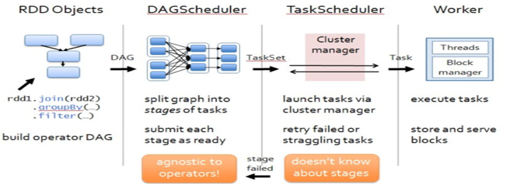
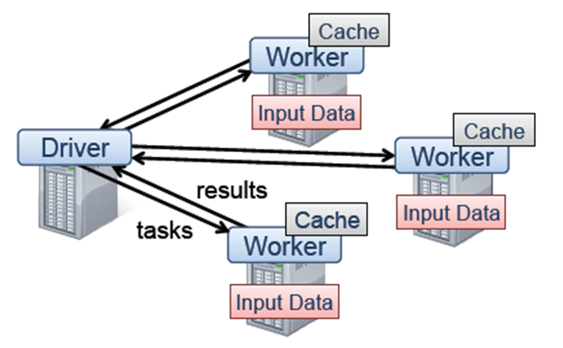
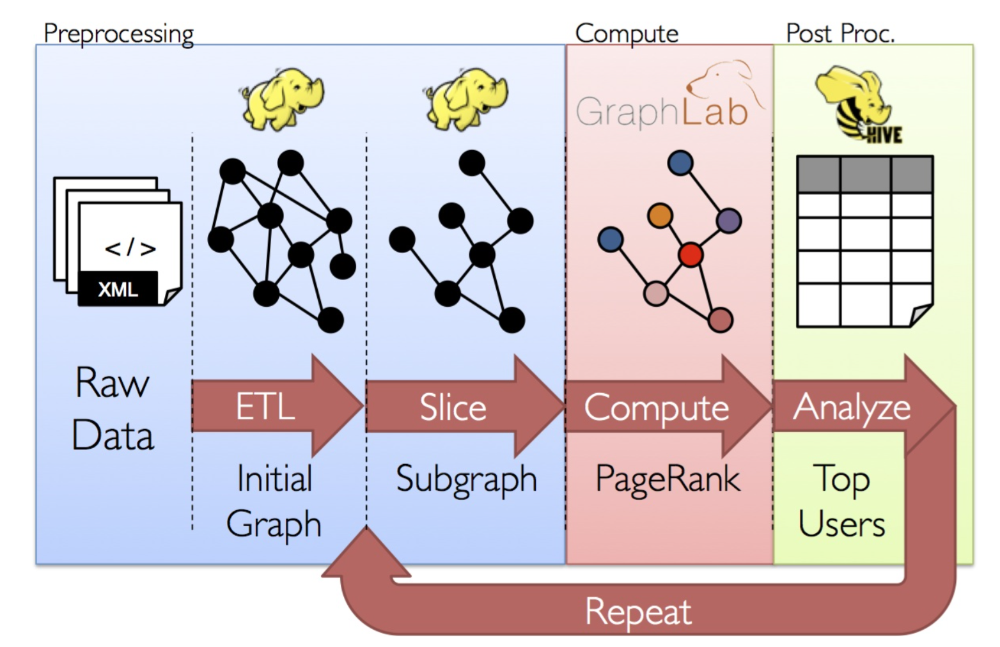

## Spark Bigdata In-Memory Architect Note
------------------------------------------------------------

#### 1.Spark(迭代计算) 

##### 1.1.定义

* RDD(Resilient Distributed Datasets)

Spark常见存储数据的格式是Key-Value
也支持类似Parquet这样的列存格式
Key-Value格式数据一般是原始数据大小的2倍左右，而列存一般是原始数据的1/3到1/4

* Operation

Transformation/Action

RDD的action从RDD中返回值,transformations可以转换成一个新的RDD并返回他的引用。                                                                                                                                                                        
                                                              
##### 1.2.作业提交

- RDD之间的依赖性分析, DAGScheduler
- 根据DAG的分析结果将一个作业分成多个Stage
- DAGScheduler在确定完Stage之后,会向TaskScheduler提交任务集Taskset



Executor Task:ShuffleMapTask,ResultTask

中间结果存储:

	- Checkpoint:计算结果存储在HDFS
	- Cache:数据存储到内存,内存不足时存储在磁盘

##### 1.3.消息传递-ActorModel和Akka

Akka作为Spark集群间通信框架

ActorModel适合用于解决并发编程问题(Erlang语言)。Actor的行为规范定义:

	1)消息接收
	2)消息处理
	3)消息发送

##### 1.4.Memory Store

* CacheManager
* BlockManager
* MemoryStore
* DiskStore
* BlockManagerWorker
* ConnectionManager
* BlockManagerMaster

##### 1.5.Spark集群

- Driver
- Master
- Worker
- Executor



##### 1.6.部署方式

local/local-cluster/standalone cluster/SparkonYARN


#### 2.Spark Streaming

##### 2.1.架构


- Master(Spark/Mesos/YARN集群URL或local[*])
- Worker
- Client

##### 2.2.代码结构

* StreamingContext(由SparkContext创建生成)
* DStream(Discretized Stream)表示从数据源获取持续性的数据流以及经过转换后的数据流,连续的RDD序列

	Basic sources:这些源在StreamingContext API中直接可用
	Advanced sources:这些源包括Kafka,Flume,Kinesis,Twitter等

* Receiver
* DStream transformation
* 缓存或持久化-DStream.persist(默认持久化到内存)
* Checkpointing-dstream.checkpoint
* JobScheduler
* DStreamGraph
* StreamingTab
* BlockRDD

##### 2.3.容错性分析

##### 2.4.SparkStreaming vs Storm

- Akka作为Spark集群间通信框架
- Storm依赖于ZooKeeper来维护整个集群,集群之间的消息通信采用ZeroMQ/Netty作为消息发送组件
- 在JVM进程中各线程之间的消息传递使用DisruptorPattern(高效线程间消息发送机制)
- Storm的TridentTopology与SparkStreaming的DStream


#### 3.SparkSQL(ac-hoc即席查询)

SchemaRDD类似关系型数据库,可以通过存在的RDD,一个Parquet文件,一个JSON数据库或者Hive中使用HiveQL创建的


##### 3.1.SparkSQL应用

* Spark SQL supports two different methods for converting existing RDDs into Datasets. 
* Spark SQL supports automatically converting an RDD of JavaBeans into a DataFrame. 
* Spark SQL also includes a data source that can read data from other databases using JDBC.
* Spark SQL can cache tables using an in-memory columnar format by calling spark.cacheTable("tableName") or dataFrame.cache().

##### 3.2.代码结构

* SQLContext(由SparkContext创建生成)
* SQLContext - SchemaRDD
* 数据源:SchemaRDDs/Parquet/JSON数据集/Hive表/ThriftJDBC&ODBC

	- SchemaRDD生成方式:利用反射推断模式/编程指定模式

* SparkSQL通过调用sqlContext.cacheTable("tableName")来缓存柱状格式表
* 注意schemaRDD.cache()不会用柱状格式表来缓存
* SparkSQL支持用领域特定语言编写查询
* SparkSQL数据类型

##### 3.3.SQL执行顺序

- 语法解析
- 操作绑定
- 优化执行策略
- 交付执行

##### 3.4.SQL On Spark

- SqlParser生成LogicPlan Tree
- Analyzer和Optimizer将各种Rule作用于LogicalPlan Tree
- 最终优化生成的LogicalPlan使用SparkPlan生成Spark RDD
- 最后将生成的RDD交由Spark执行

##### 3.5.SparkPlan转换策略

- CommandStrategy
- TakeOrdered
- PartialAggregation
- LeftSemiJoin (解决exists/in)
- HashJoin
- InMemoryScans
- ParquetOperations
- BasicOperators
- CartesianProduct(笛卡尔积JOIN)
- BroadcastNestedLoopJoin(LeftOuterJoin/RightOuterJoin/FullOuterJoin)

##### 3.6.Spark on Hive

_Hive架构_

- Driver:负责将用户指令翻译转换为相应的MapReduce Job
- Hive MetaStore元数据库:默认使用Derby存储引擎
- 支持CLI,JDBC与WebUI接口

_HiveQLOnMapReduce执行过程_

- Parser
- Semantic Analyser
- LogicalPlan Generating
- QueryPlan Generating
- Optimizer

* HiveContext(由SparkContext创建生成)


##### 3.7.DataFrames & Datasets

- A Dataset is a distributed collection of data. 
- A DataFrame is a Dataset organized into named columns. 
- DataFrames can be constructed from a wide array of sources such as: structured data files, tables in Hive, external databases, or existing RDDs.
- Datasets are similar to RDDs, however, instead of using Java serialization or Kryo they use a specialized Encoder to serialize the objects for processing or transmitting over the network.


_Global Temporary View_

```java
spark.sql("SELECT * FROM global_temp.people").show();
```


#### 4.BlinkDB

A massively parallel, approximate query engine for running interactive SQL queries on large volumes of data


#### 5. SparkMLlib

5.1.线性回归

梯度下降法
拟合函数
岭回归

5.2.分类算法(逻辑回归)


5.3.拟牛顿法


#### 6. GraphX

- 用于图和并行图graph-parallel的计算
- GraphX通过引入Resilient Distributed Property Graph:带有顶点和边属性的有向多重图,来扩展Spark RDD.
- Google图算法引擎Pregel(用来解决网页链接分析、社交数据挖掘等实际应用中涉及的大规模分布式图计算问题)
- GraphX项目的目的是将graph-parallel和data-parallel统一在一个系统中
- 属性图是一个有向多重图,它带有连接到每个顶点和边的用户定义的对象.
- 属性图是不可变的,分布式的,容错的。
- Pregel API
- org.apache.spark.graphx.lib-PageRank算法



