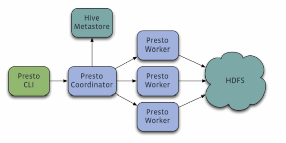
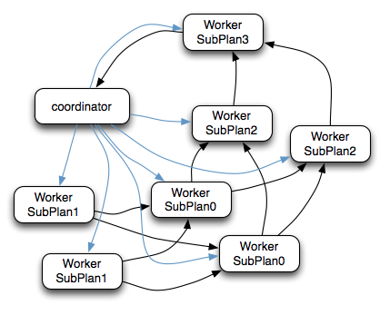

## OLAP引擎-PrestoDB实时OLAP分析
------------------------------------------------------------

#### PrestoDB


PrestoDB特征:

    - MPP-style pipelined in-memory execution 基于内存的并行计算
    - Columnar and vectorized data processing 列式&向量化数据处理
    - Runtime query bytecode compilation LLVM动态编译执行计划(Impala有类似设计)
    - Memory efficient data structures 内存高效数据结构(Slice接口)
    - Multi-threaded multi-core execution 多线程多核执行
    - Optimized readers for columnar format(ORC and Parquet)
    - 支持跨数据源混合查询/SQL-on-Anything
    - 计算与存储分离
    - GC控制


- [Presto Doc](https://prestodb.io/docs/current/)

#### 1.Presto架构




**Presto查询引擎是一个Master-Slave的架构,由下面三部分组成:**

- 1.一个Coordinator节点(Master)

	Coordinator: 负责解析SQL语句,生成执行计划,分发执行任务给Worker节点执行

- 2.一个Discovery Server节点

	Discovery Server: 通常内嵌于Coordinator节点中

- 3.多个Worker节点(Slave)

	- Worker节点: 负责实际执行查询任务,负责与HDFS交互读取数据
	- Worker节点启动后,向Discovery Server服务注册,Coordinator从Discovery Server获得可以正常工作的Worker节点。如果配置了Hive Connector,需要配置一个HiveMetaStore服务为Presto提供Hive元信息

更形象架构图如下:


#### 2.Presto特性分析

**源数据的并行读取**

在上面的执行计划中SubPlan1和SubPlan0都是Source节点，其实它们读取HDFS文件数据的方式就是调用的HDFS InputSplit API,</b>
然后每个InputSplit分配一个Worker节点去执行，每个Worker节点分配的InputSplit数目上限是参数可配置的，Config中的query.max-pending-splits-per-node参数配置，默认是100。

**分布式的Hash聚合**

上面的执行计划在SubPlan0中会进行一次Partial的聚合计算，计算每个Worker节点读取的部分数据的部分聚合结果，</b>
然后SubPlan0的输出会按照group by字段的Hash值分配不同的计算节点，最后SubPlan3合并所有结果并输出


**动态编译执行计划**

Presto会将执行计划中的ScanFilterAndProjectOperator和FilterAndProjectOperator动态编译为Byte Code，</b>
并交给JIT去编译为native代码。Presto也使用了Google Guava提供的LoadingCache缓存生成的Byte Code。

**Slice内存操作和数据结构**

使用Slice接口进行内存操作，Slice使用Unsafe#copyMemory实现了高效的内存拷贝
使用Slice提升ORCFile的写性能

Slice 在 sun.misc.Unsafe 之上封装了一个简单、好用的Java层面可以对内存进行自由操作的接口。你可以通过Slice接口来获取指定地址的Int , Short , Byte , 同样也可以对指定区域的内存的值进行设置。

**类BlinkDB的HyperLogLog近似查询**

为了加快avg、count distinct、percentile等聚合函数的查询速度，Presto团队与BlinkDB作者之一Sameer Agarwal合作</b>
引入了一些近似查询函数approx_avg、approx_distinct、approx_percentile。approx_distinct使用HyperLogLog Counting算法实现。


**GC控制**

Presto团队在使用hotspot java7时发现了一个JIT的BUG，当代码缓存快要达到上限时，JIT可能会停止工作，从而无法将使用频率高的代码动态编译为native代码。
Presto团队使用了一个比较Hack的方法去解决这个问题，增加一个线程在代码缓存达到70%以上时进行显式GC，使得已经加载的Class从perm中移除，避免JIT无法正常工作的BUG。


#### 3.Presto存储插件

- Presto设计了一个简单的数据存储的抽象层,来满足在不同数据存储系统之上都可以使用SQL进行查询。
- 存储插件(连接器connector)只需要提供实现以下操作的接口,包括对元数据(metadata)的提取,获得数据存储的位置,获取数据本身的操作等。
- 除了我们主要使用的Hive/HDFS后台系统之外,我们也开发了一些连接其他系统的Presto连接器,包括HBase,Scribe和定制开发的系统

插件结构图如下:


Plugin API:

- Metadata API(Coordinator)
- Data Location API(Coordinator)
- Data Stream API(Worker)


#### 4.Presto执行过程


**执行过程示意图:**


**Client -> Coordinator -> 3Worker -> FinalWorker -> Client**

* 提交查询:用户使用Presto Cli提交一个查询语句后,Cli使用HTTP协议与Coordinator通信,Coordinator收到查询请求后调用SqlParser解析SQL语句得到Statement对象,并将Statement封装成一个QueryStarter对象放入线程池中等待执行,

如下图:示例SQL如下


```SQL
select c1.rank, count(*) from dim.city c1 join dim.city c2 on c1.id = c2.id where c1.id > 10 group by c1.rank limit 10;
```

逻辑执行过程示意图如下:


* 上图逻辑执行计划图中的虚线就是Presto对逻辑执行计划的切分点,逻辑计划Plan生成的SubPlan分为四个部分,每一个SubPlan都会提交到一个或者多个Worker节点上执行
(可能由于ORDER BY排序任务损耗性能,因此在执行计划中未有采用)


**SubPlan有几个重要的属性**

	- planDistribution
	- outputPartitioning
	- partitionBy属性


整个执行过程的流程图如下：

1. PlanDistribution:表示一个查询阶段的分发方式,上图中的4个SubPlan共有3种不同的PlanDistribution方式

	* Source:表示这个SubPlan是数据源,Source类型的任务会按照数据源大小确定分配多少个节点进行执行
	* Fixed:表示这个SubPlan会分配固定的节点数进行执行（Config配置中的query.initial-hash-partitions参数配置,默认是8）
	* None:表示这个SubPlan只分配到一个节点进行执行
	
2. OutputPartitioning:表示这个SubPlan的输出是否按照partitionBy的key值对数据进行Shuffle(洗牌),只有两个值HASH和NONE



	* 在上图的执行计划中,SubPlan1和SubPlan0 PlanDistribution=Source,这两个SubPlan都是提供数据源的节点,SubPlan1所有节点的读取数据都会发向SubPlan0的每一个节点;
	* SubPlan2分配8个节点执行最终的聚合操作;SubPlan3只负责输出最后计算完成的数据;如下图:


	* SubPlan1和SubPlan0 作为Source节点,它们读取HDFS文件数据的方式就是调用的HDFS InputSplit API,然后每个InputSplit分配一个Worker节点去执行,每个Worker节点分配的InputSplit数目上限是参数可配置的,Config中的query.max-pending-splits-per-node参数配置,默认是100
	* SubPlan1的每个节点读取一个Split的数据并过滤后将数据分发给每个SubPlan0节点进行Join操作和Partial Aggr操作
	* SubPlan0的每个节点计算完成后按GroupBy Key的Hash值将数据分发到不同的SubPlan2节点
	* 所有SubPlan2节点计算完成后将数据分发到SubPlan3节点
	* SubPlan3节点计算完成后通知Coordinator结束查询,并将数据发送给Coordinator


#### 5.Presto CBOptimizer(Coordinator组件之一)

- support for statistics stored in Hive Metastore(Hive Metastore统计优化)
- join reordering based on selectivity estimates and cost(join重排序)
- automatic join type selection(repartitioned重分区 vs broadcast广播)
- automatic left/right side selection for join tables(自动左/右连接)


Presto SQL优化:

	* 使用WITH语句
	* 利用子查询，减少读表的次数，尤其是大数据量的表
	* 只查询需要的字段
	* Join查询优化
	多表Join时，数据越多的表越往后放
	Left join时，条件过滤尽量在ON阶段完成，而少用WHERE
	使用join取代子查询:在数据量比较大时,使用inner join取代exists;使用left join取代not exists性能上可以得到较大的提升
	* 字段名引用
	* ORC格式优化

#### 5.PrestoDB源码分析

presto-cli的main方法入口为

	com.facebook.presto.cli.Presto.java

presto-main的main方法入口为

	com.facebook.presto.server.PrestoServer.java

client端与server端的启动分别从这两个main中启动

#### Ref

- [Presto New Optimizer](https://github.com/prestodb/presto/wiki/New-Optimizer)
- [Introduce to presto CBO](https://www.starburstdata.com/technical-blog/introduction-to-presto-cost-based-optimizer/)


