## 大数据查询引擎研究Note
------------------------------------------------------------

基于大数据场景下的查询引擎SQL on Hadoop Query Engine是未来大数据领域的重要技术。以下是其典型需求

- Interactive Query
- Data Analysis,reporting query
- Data Mining,modeling and large ETL
- Machine Learning

**SQL on Hadoop列表**

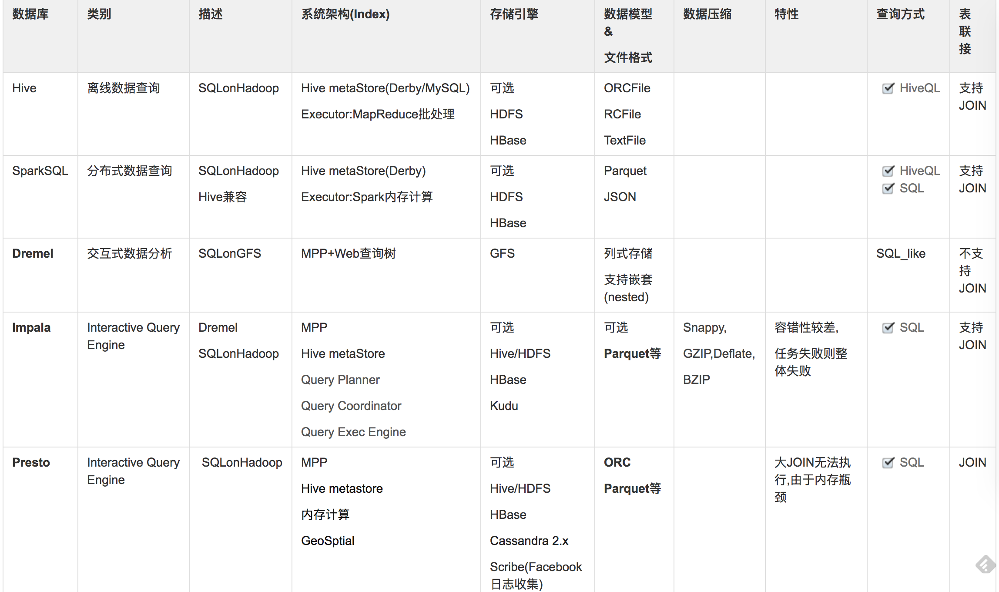

**查询性能比较:**

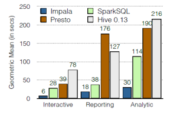

- Impala > SparkSQL > Presto > Hive

### I.Realtime Interactive Query Engine

#### 1.Impala

[Impala-实时查询引擎](2016-12-12-olap-rt-impala-research-note.md)

#### 2.PrestoDB

[Presto](https://prestodb.io/docs/current/)

#### Presto架构


- MPP
- Hive Metadata应用
- 支持内存计算
- 支持跨数据源查询

**Presto查询引擎是一个Master-Slave的架构,由下面三部分组成:**

- 1.一个Coordinator节点(Master)

	Coordinator: 负责解析SQL语句,生成执行计划,分发执行任务给Worker节点执行

- 2.一个Discovery Server节点

	Discovery Server: 通常内嵌于Coordinator节点中

- 3.多个Worker节点(Slave)

	- Worker节点: 负责实际执行查询任务,负责与HDFS交互读取数据
	- Worker节点启动后,向Discovery Server服务注册,Coordinator从Discovery Server获得可以正常工作的Worker节点。如果配置了Hive Connector,需要配置一个HiveMetaStore服务为Presto提供Hive元信息

更形象架构图如下:


#### Presto低延迟原理

- 完全基于内存的并行计算
- Pipeline流水线式计算作业
- 本地化计算
- 动态编译执行计划(Impala有类似设计)
- GC控制

#### Presto存储插件

- Presto设计了一个简单的数据存储的抽象层,来满足在不同数据存储系统之上都可以使用SQL进行查询。
- 存储插件(连接器connector)只需要提供实现以下操作的接口,包括对元数据(metadata)的提取,获得数据存储的位置,获取数据本身的操作等。
- 除了我们主要使用的Hive/HDFS后台系统之外,我们也开发了一些连接其他系统的Presto连接器,包括HBase,Scribe和定制开发的系统

插件结构图如下:


Plugin API:

- Metadata API(Coordinator)
- Data Location API(Coordinator)
- Data Stream API(Worker)


#### Presto执行过程

* 执行过程示意图:


* Client -> Coordinator -> 3Worker -> FinalWorker -> Client

* 提交查询:用户使用Presto Cli提交一个查询语句后,Cli使用HTTP协议与Coordinator通信,Coordinator收到查询请求后调用SqlParser解析SQL语句得到Statement对象,并将Statement封装成一个QueryStarter对象放入线程池中等待执行,如下图:示例SQL如下

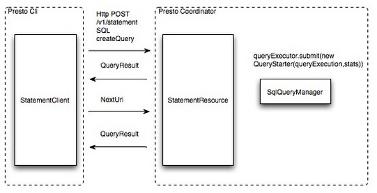

```SQL
select c1.rank, count(*) from dim.city c1 join dim.city c2 on c1.id = c2.id where c1.id > 10 group by c1.rank limit 10;
```

* 逻辑执行过程示意图如下:

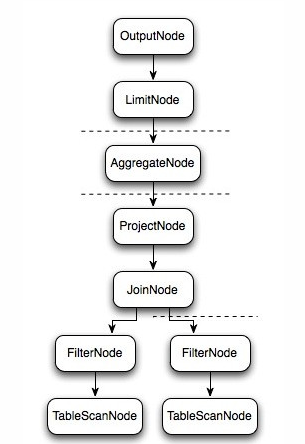

* 上图逻辑执行计划图中的虚线就是Presto对逻辑执行计划的切分点,逻辑计划Plan生成的SubPlan分为四个部分,每一个SubPlan都会提交到一个或者多个Worker节点上执行
(可能由于ORDER BY排序任务损耗性能,因此在执行计划中未有采用)


SubPlan有几个重要的属性**planDistribution**、**outputPartitioning**、**partitionBy**属性整个执行过程的流程图如下：

1.PlanDistribution:表示一个查询阶段的分发方式,上图中的4个SubPlan共有3种不同的PlanDistribution方式

	* Source:表示这个SubPlan是数据源,Source类型的任务会按照数据源大小确定分配多少个节点进行执行
	* Fixed:表示这个SubPlan会分配固定的节点数进行执行（Config配置中的query.initial-hash-partitions参数配置,默认是8）
	* None:表示这个SubPlan只分配到一个节点进行执行
	
2.OutputPartitioning:表示这个SubPlan的输出是否按照partitionBy的key值对数据进行Shuffle(洗牌),只有两个值HASH和NONE


	* 在上图的执行计划中,SubPlan1和SubPlan0 PlanDistribution=Source,这两个SubPlan都是提供数据源的节点,SubPlan1所有节点的读取数据都会发向SubPlan0的每一个节点;
	* SubPlan2分配8个节点执行最终的聚合操作;SubPlan3只负责输出最后计算完成的数据;如下图:

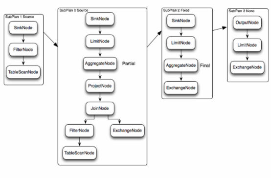

	* SubPlan1和SubPlan0 作为Source节点,它们读取HDFS文件数据的方式就是调用的HDFS InputSplit API,然后每个InputSplit分配一个Worker节点去执行,每个Worker节点分配的InputSplit数目上限是参数可配置的,Config中的query.max-pending-splits-per-node参数配置,默认是100
	* SubPlan1的每个节点读取一个Split的数据并过滤后将数据分发给每个SubPlan0节点进行Join操作和Partial Aggr操作
	* SubPlan0的每个节点计算完成后按GroupBy Key的Hash值将数据分发到不同的SubPlan2节点
	* 所有SubPlan2节点计算完成后将数据分发到SubPlan3节点
	* SubPlan3节点计算完成后通知Coordinator结束查询,并将数据发送给Coordinator

#### Presto引擎对比

* 与hive、SparkSQL对比结果图

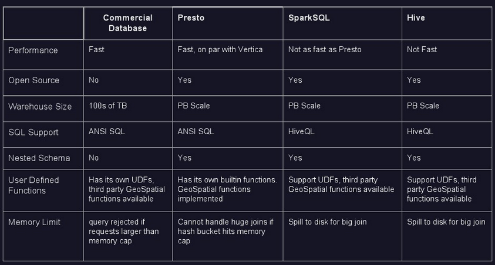


#### 3.SparkSQL

[SparkSQL Programming Guide](http://spark.apache.org/docs/latest/sql-programming-guide.html)

#### 4.Dremel

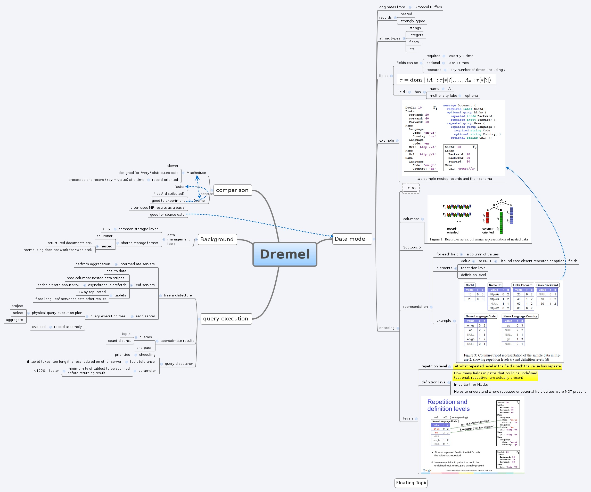

- [Dremel相关](https://blog.csdn.net/happyduoduo1/article/details/51784730)

#### 5.Drill

- 支持多数据源查询
- 成熟度还不是很高的开源方案?
- [DrillArch](http://drill.apache.org/docs/architecture/)


### II.SQLonHadoop架构分析

#### 1.系统架构

_runtime framework v.s. mpp_

在SQL on Hadoop系统中,有两种架构:

	一种是基于某个运行时框架来构建查询引擎,典型案例是Hive;
	另一种是仿照过去关系数据库的MPP架构。前者现有运行时框架,然后套上sql层,后者则是从头打造一个一体化的查询引擎。

有时我们能听到一种声音,说后者的架构优于前者,至少在性能上。那么是否果真如此？

一般来说,对于SQL on Hadoop系统很重要的一个评价指标就是：快。后面提到的所有内容也大多是为了查询速度更快。<br/>
在Hive逐渐普及之后,就逐渐有了所谓交互式查询的需求,因为无论是BI系统,还是ad-hoc,都不能按照离线那种节奏玩。这时候无论是有实力的大公司(比如Facebook),还是专业的供应商(比如Cloudera),都试图去解决这个问题。短期可以靠商业方案或者关系数据库去支撑一下,但是长远的解决方案就是参考过去的MPP数据库架构打造一个专门的系统,于是就有了Impala,Presto等等。从任务执行的角度说,这类引擎的任务执行其实跟DAG模型是类似的,当时也有Spark这个DAG模型的计算框架了,但这终究是别人家的孩子,而且往Spark上套sql又是Hive的那种玩法了。于是在Impala问世之后就强调自己“计算全部在内存中完成”,性能也是各种碾压当时还只有MR作为计算模型的Hive。那么Hive所代表的“基于已有的计算模型”方式是否真的不行？

不可否认,按照这种方式去比较,那么类MPP模式确实有很多优势：

	* DAG v.s. MR：最主要的优势,中间结果不写磁盘(除非内存不够),一气呵成。
	* 流水线计算：上游stage一出结果马上推送或者拉到下一个stage处理,比如多表join时前两个表有结果直接给第三个表,不像MR要等两个表完全join完再给第三个表join。
	* 高效的IO：本地查询没有多余的消耗,充分利用磁盘。这个后面细说。
	* 线程级别的并发：相比之下MR每个task要启动JVM,本身就有很大延迟,占用资源也多。

当然MPP模式也有其劣势,一个是扩展性不是很高,这在关系数据库时代就已经有过结论；<br/>
另一个是容错性差,对于Impala来说一旦运行过程中出点问题,整个查询就挂了(这一点在我项目使用中很常见)。

但是,经过不断的发展,Hive也能跑在DAG框架上了,不仅有Tez,还有Spark。<br/>
上面提到的一些劣势,其实大都也可以在计算模型中解决,只不过考虑到计算模型的通用性和本身的设计目标,不会去专门满足(所以如果从这个角度分类,Impala属于“专用系统”,Spark则属于“通用系统”)。在最近Cloudera做的benchmark中,虽然Impala仍然一路领先,但是基于Spark的Spark SQL完全不逊色于Presto,基于Tez的Hive也不算很差,至少在多用户并发模式下能超过Presto,足见MPP模式并不是绝对占上风的。所以这种架构上的区别在我看来并不是制胜的关键,至少不是唯一的因素,真正要做到快速查询,各个方面的细节都要有所把握。后面说的都是这些细节。

#### 核心组件

不管是上面提到的那种架构,一个SQL on Hadoop系统一般都会有一些通用的核心组件,这些组件根据设计者的考虑放在不同的节点角色中,在物理上节点都按照master/worker的方式去做,如果master压力太大,一些本来适合放在master上的组件可以放到一个辅助master上。

	* UI层负责提供用户输入查询的接口。一般有Web/GUI,命令行,编程方式3类。
	* QL层负责把用户提交的查询解析成可以运行的执行计划QueryPlan(比如MR Job)。这部分在后面会专门提到。
	* 执行层就是运行具体的Job。一般会有一个master负责query的运行管理,比如申请资源,观察进度等等,同时master也负责最终聚合局部结果到全局结果。而每个节点上会有相应的worker做本地计算。
	* IO层提供与存储层交互的接口。对于HDFS来说,需要根据I/O Format把文件转换成K/V,Serde再完成K/V到数据行的映射。对于非HDFS存储来说就需要一些专门的handler/connector。
	* 存储层一般是HDFS,但也有可以查询NoSQL,或者关系数据库的。
	* 系统另外还需要一个元数据管理服务,管理表结构等。


#### 2.执行计划

_编译流程_

从SQL到执行计划,大致分为5步。

	* 第一步将SQL转换成抽象语法树AST。这一步一般都有第三方工具库可以完成,比如antlr。
	* 第二步对AST进行语义分析,比如表是否存在,字段是否存在,SQL语义是否有误(比如select中被判定为聚合的字段在group by中有没有出现)。
	* 第三步生成逻辑执行计划,这是一个由逻辑操作符组成的DAG。比如对于Hive来说扫表会产生TableScanOperator,聚合会产生GroupByOperator。对于类MPP系统来说,情况稍微有点不同。逻辑操作符的种类还是差不多,但是会先生成单机版本,然后生成多机版本。多机版本主要是把aggregate,join,还有top n这几个操作并行化,比如aggregate会分成类似MR那样的本地aggregate,shuffle和全局aggregate三步。
	* 第四步做逻辑执行计划做优化,这步在下面单独介绍。
	* 第五步把逻辑执行计划转换成可以在机器上运行的物理计划。对于Hive来说,就是MR/Tez Job等；对于Impala来说,就是plan fragment。其他类MPP系统也是类似的概念。物理计划中的一个计算单元（或者说Job）,有“输入,处理,输出”三要素组成,而逻辑执行计划中的operator相对粒度更细,一个逻辑操作符一般处于这三要素之一的角色。

下面分别举两个例子,直观的认识下sql、逻辑计划、物理计划之间的关系,具体解释各个operator的话会比较细碎,就不展开了。

_Hive on MR_

```sql
select count(1) from status_updates where ds = '2009-08-01'
```

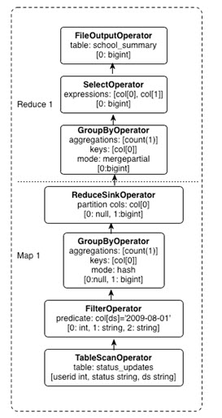

_Presto_

引用自美团技术团队,其中SubPlan就是物理计划的一个计算单元

```sql
select c1.rank, count(*) 
from dim.city c1 join dim.city c2 on c1.id = c2.id 
where c1.id > 10 group by c1.rank limit 10;
```

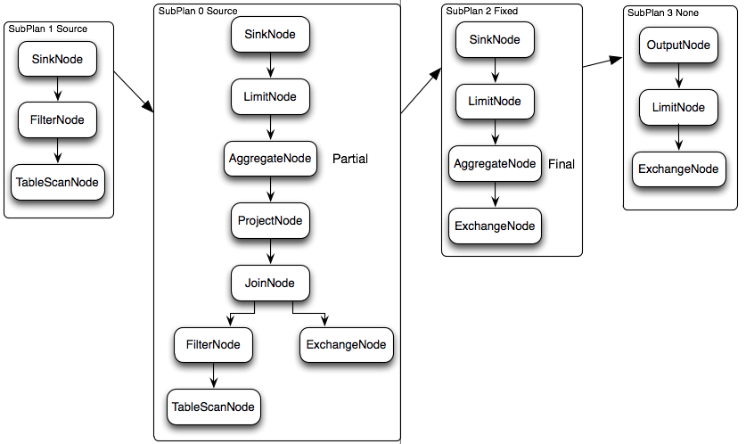

#### 3.查询优化器

关于执行计划的优化,虽然不一定是整个编译流程中最难的部分,但却是最有看点的部分,而且目前还在不断发展中。Spark系之所以放弃Shark另起炉灶做Spark SQL,很大一部分原因是想自己做优化策略,避免受Hive的限制,为此还专门独立出优化器组件*Catalyst优化器*(当然Spark SQL目前还是非常新,其未来发展给人不少想象空间)。总之这部分工作可以不断的创新,优化器越智能,越傻瓜化,用户就越能解放出来解决业务问题。

_SparkSQL Catalyst_

使用一个通用库生成树并使用规则操作这些树.
Catalyst的通用树转换框架分为四个阶段，如下所示：

	1）分析解决引用的逻辑计划
	2）逻辑计划优化
	3）物理计划
	4）代码生成用于编译部分查询生成Java字节码。


_Hive Optimizer_

[Hive SQL Optimizer](2017-06-10-hive-sql-optimizer-note.md)

早期在Hive中只有一些简单的规则优化,比如谓词下推(把过滤条件尽可能的放在table scan之后就完成),操作合并(连续的filter用and合并成一个operator,连续的projection也可以合并)。后来逐渐增加了一些略复杂的规则,比如相同key的join + group by合并为1个MR,还有star schema join。

在Hive 0.12引入的相关性优化(correlation optimizer)算是规则优化的一个高峰,他能够减少数据的重复扫描,具体来说,如果查询的两个部分用到了相同的数据,并且各自做group by / join的时候用到了相同的key,这个时候由于数据源和shuffle的key是一样的,所以可以把原来需要两个job分别处理的地方合成一个job处理。

比如下面这个sql：

```sql
SELECT 
 sum(l_extendedprice) / 7.0 as avg_yearly 
FROM 
     (SELECT l_partkey, l_quantity, l_extendedprice 
      FROM lineitem JOIN part ON (p_partkey=l_partkey) 
      WHERE p_brand='Brand#35' AND p_container = 'MED PKG')touter 
JOIN 
     (SELECT l_partkey as lp, 0.2 * avg(l_quantity) as lq 
      FROM lineitem GROUP BY l_partkey) tinner 
ON (touter.l_partkey = tinnter.lp) 
WHERE touter.l_quantity < tinner.lq
```

这个查询中两次出现lineitem表,group by和两处join用的都是l_partkey,所以本来两个子查询和一个join用到三个job,现在只需要用到一个job就可以完成。


但是,基于规则的优化(RBO)不能解决所有问题。
在关系数据库中早有另一种优化方式,也就是*基于代价的优化CBO*。

CBO通过收集表的数据信息(比如字段的基数,数据分布直方图等等)来对一些问题作出解答,其中最主要的问题就是确定多表join的顺序。CBO通过搜索join顺序的所有解空间(表太多的情况下可以用有限深度的贪婪算法),并且算出对应的代价,可以找到最好的顺序。这些都已经在关系数据库中得到了实践。

目前Hive已经启动专门的项目,也就是Apache Optiq来做这个事情,而其他系统也没有做的很好的CBO,所以这块内容还有很大的进步空间。

#### 4.执行效率

即使有了高效的执行计划,如果在运行过程本身效率较低,那么再好的执行计划也会大打折扣。这里主要关注CPU和IO方面的执行效率。

_CPU_

在具体的计算执行过程中,低效的CPU会导致系统的瓶颈落在CPU上,导致IO无法充分利用。<br/>
在一项针对Impala和Hive的对比时发现,Hive在某些简单查询上(TPC-H Query 1)也比Impala慢主要是因为Hive运行时完全处于CPU-bound(计算密集型)的状态中,磁盘IO只有20%,而Impala的IO至少在85%。

在SQL on Hadoop中出现CPU-bound的主要原因有以下几种：

	- 大量虚函数调用:这个问题在多处出现,比如对于a + 2 * b之类的表达式计算,解释器会构造一个expression tree,解释的过程就是递归调用子节点做evaluation的过程。又比如以DAG形式的operator/task在执行的过程中,上游节点会层层调用下游节点来获取产生的数据。这些都会产生大量的调用。
	- 类型装箱(Auto-boxing):由于表达式解释器需要对不同数据类型的变量做解释,所以在Java中需要把这些本来是primitive的变量包装成Object,累积起来也消耗不少资源。这算是上面一个问题附带出来的。
	- branch instruction:现在的CPU都是有并行流水线的,但是如果出现条件判断会导致无法并行。这种情况可能出现在判断数据的类型（是string还是int）,或者在判断某一列是否因为其他字段的过滤条件导致本行不需要被读取（列存储情况下）。
	- cache miss:每次处理一行数据的方式导致cpu cache命中率不高。(这么说已经暗示了解决方案)

针对上面的问题,目前大多数系统中已经加入了以下两个解决办法中至少一个。

一个方法是动态代码生成(CodeGeneration),也就是不使用解释性的统一代码。比如a + 2 * b这个表达式就会生成对应的执行语言的代码,而且可以直接用primitive type,而不是用固定的解释性代码。

具体实现来说,JVM系的如Spark SQL,Presto可以用反射,C++系的Impala则使用了llvm生成中间码。对于判断数据类型造成的分支判断,动态代码的效果可以消除这些类型判断,还可以展开循环,可以对比下面这段代码,左边是解释性代码,右边是动态生成代码。

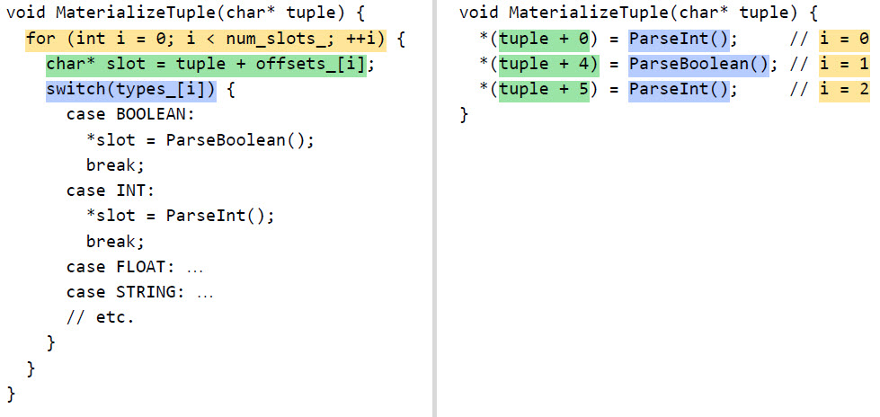

另一个方法是vectorization(向量化),基本思路是放弃每次处理一行的模式,改用每次处理一小批数据(比如1k行),当然前提条件是使用列存储格式。<br/>
这样一来,这一小批连续的数据可以放进cache里面,cpu不仅减少了branch instruction,甚至可以用SIMD加快处理速度。具体的实现参考下面的代码,对一个long型的字段增加一个常量。通过把数据表示成数组,过滤条件也用selVec装进数组,形成了很紧凑的循环：

```java
add(int vecNum, long[] result, long[] col1, int[] col2, int[] selVec) 
{   
  if (selVec == null)   
     for (int i = 0; i < vecNum; i++) 
         result[i] = col1[i] + col2[i];
  else 
     for (int i = 0; i < vecNum; i++) 
     {
         int selIdx = selVec[i];
         result[selIdx] = col1[selIdx] + col2[selIdx];
     }
}
```

_IO_

由于SQL on Hadoop存储数据都是在HDFS上,所以IO层的优化其实大多数都是HDFS的事情,各大查询引擎则提出需求去进行推动。<br/>
要做到高效IO,一方面要低延迟,屏蔽不必要的消耗;另一方面要高吞吐,充分利用每一块磁盘。目前与这方面有关的特性有:

	* short-circuit local reads:当发现读取的数据是本地数据时,不走DataNode(因为要走一次socket连接),而是用DFS Client直接读本地的block replica。HDFS参数是dfs.client.read.shortcircuit和dfs.domain.socket.path
	* zero copy:避免数据在内核buffer和用户buffer之间反复copy,在早期的HDFS中已经有这个默认实现。
	* disk-aware scheduling:通过知道每个block所在磁盘,可以在调度cpu资源时让不同的cpu读不同的磁盘,避免查询内和查询间的IO竞争。HDFS参数是dfs.datanode.hdfs-blocks-metadata.enabled。


#### 4.存储格式

对于分析类型的workload来说,最好的存储格式自然是列存储,这已经在关系数据库时代得到了证明。<br/>
目前hadoop生态中有两大列存储格式,一个是由Hortonworks和Microsoft开发的ORCFile,另一个是由Cloudera和Twitter开发的Parquet。

_ORCFile_

ORCFile顾名思义,是在RCFile的基础之上改造的。RCFile虽然号称列存储,但是只是“按列存储”而已,将数据先划分成row group,然后row group内部按照列进行存储(和HBase的存储结构类似)。这其中没有列存储的一些关键特性,而这些特性在以前的列式数据库中(比如我以前用过的Infobright)早已用到。好在ORCFile已经弥补了这些特性,包括：

	* 块过滤与块统计:每一列按照固定行数或大小进一步切分,对于切分出来的每一个数据单元,预先计算好这些单元的min/max/sum/count/null值,min/max用于在过滤数据的时候直接跳过数据单元,而所有这些统计值则可以在做聚合操作的时候直接采用,而不必解开这个数据单元做进一步的计算。
	* 更高效的编码方式:RCFile中没有标注每一列的类型,事实上当知道数据类型时,可以采取特定的编码方式,本身就能很大程度上进行数据的压缩。常见的针对列存储的编码方式有RLE（大量重复数据）,字典（字符串）,位图（数字且基数不大）,级差（排序过的数据,比如日志中用户访问时间）等等。
	
ORCFile的结构如下图,数据先按照默认256M分为row group,也叫strip。每个strip配一个index,存放每个数据单元（默认10000行）的min/max值用于过滤;数据按照上面提到的编码方式序列化成stream,然后再进行snappy或gz压缩。<br/>
footer提供读取stream的位置信息,以及更多的统计值如sum/count等。尾部的file footer和post script提供全局信息,如每个strip的行数,各列数据类型,压缩参数等。

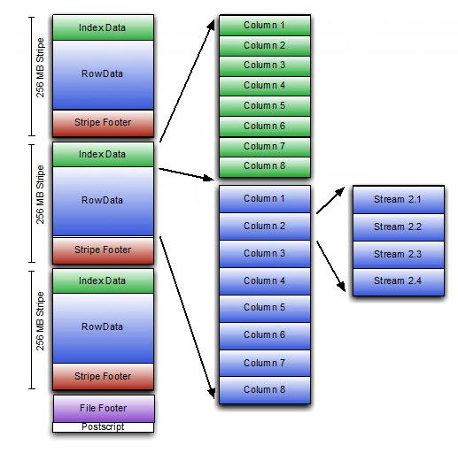


_Parquet_

Parquet的设计原理跟ORC类似,不过它有两个特点：

	* 通用性:相比ORCFile专门给Hive使用而言,Parquet不仅仅是给Impala使用,还可以给其他查询工具使用,如Hive、Pig,进一步还能对接avro/thrift/pb等序列化格式。
	* 基于Dremel思想的嵌套格式存储:关系数据库设计模式中反对存储复杂格式(违反第一范式),但是现在的大数据计算不仅出现了这种需求(半结构化数据),也能够高效的实现存储和查询效率,在语法上也有相应的支持(各种UDF,Hive的lateral view等)。

Google Dremel就在实现层面做出了范例,Parquet则完全仿照了Dremel。<br/>
对嵌套格式做列存储的难点在于,存储时需要标记某个数据对应于哪一个存储结构,或者说是哪条记录,所以需要用数据清楚的进行标记。<br/>
在Dremel中提出用definition level和repetition level来进行标记。definition level指的是,这条记录在嵌套结构中所处于第几层,而repetition level指的是,这条记录相对上一条记录,在第几层重复。

比如下图是一个二级嵌套数组。图中的e跟f在都属于第二层的重复记录（同一个level2）,所以f的r值为2,而c跟d则是不同的level2,但属于同一个level1,所以d的r值为1。对于顶层而言(新的一个嵌套结构),r值就为0。

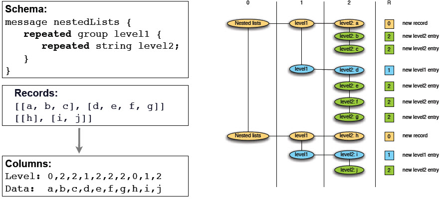

但是仅仅这样还不够。上图说明了r值的作用,但是还没有说明d值的作用,因为按照字面解释,d值对于每一个字段都是可以根据schema得到的,那为什么还要从行记录级别标记？<br/>
这是因为记录中会插入一些null值,这些null值代表着他们“可以存在”但是因为是repeated或者是optional所以没有值的情况,null值是用来占位的（或者说是“想象”出来的）,所以他们的值需要单独计算。null的d值就是说这个结构往上追溯到哪一层（不包括平级）就不是null（不是想象）了。<br/>
在_dremel paper_中有完整的例子,例子中country的第一个null在code = en所在的结构里面,那么language不是null(不考虑code,他跟country平级),他就是第二层;又比如country的第二个null在url = http://B 所在的结构里面,那么name不是null(不考虑url,因为他跟本来就是null的language平级),所以就是第一层。

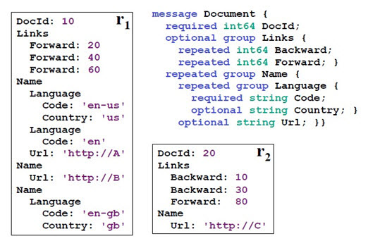

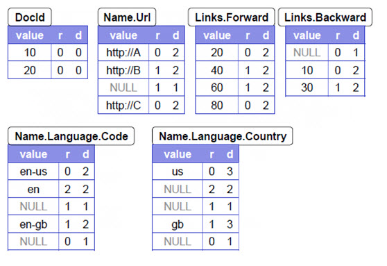


通过这种方式,就对一个树状的嵌套格式完成了存储。在读取的时候可以通过构造一个状态机进行遍历。

有意思的是,虽然parquet支持嵌套格式,但是Impala还没有来得及像Hive那样增加array,map,struct等复杂格式,当然这项功能已经被列入roadmap了,相信不久就会出现。<br/>
在最近我们做的Impala2.0测试中,顺便测试了存储格式的影响。parquet相比sequencefile在压缩比上达到1:5,查询性能也相差5-10倍,足见列存储一项就给查询引擎带来的提升。


#### 5.资源控制

_运行时资源调整_

对于一个MR Job,reduce task的数量一直是需要人为估算的一个麻烦事,基于MR的Hive也只是根据数据源大小粗略的做估计,不考虑具体的Job逻辑。<br/>
但是在之后的框架中考虑到了这个情况,增加了运行时调整资源分配的功能。Tez中引入了vertex manager,可以根据运行时收集到的数据智能的判断reduce动作需要的task。类似的功能在TAJO中也有提到,叫progressive query optimization,而且TAJO不仅能做到动态调整task数量,还能动态调整join顺序。

_资源集成_

在Hadoop已经进入2.x的时代,所有想要得到广泛应用的SQL on Hadoop系统势必要能与YARN进行集成。虽然这是一个有利于资源合理利用的好事,但是由于加入了YARN这一层,却给系统的性能带来了一定的障碍,因为启动AppMaster和申请container也会占用不少时间,尤其是前者,而且container的供应如果时断时续,那么会极大的影响时效性。在Tez和Impala中对这些问题给出了相应的解决办法：

	* AppMaster启动延迟的问题,采取long lived app master,AppMaster启动后长期驻守,而非像是MR那样one AM per Job。具体实现时,可以给fair scheduler或capacity scheduler配置的每个队列配上一个AM池,有一定量的AM为提交给这个队列的任务服务。
	* container供应的问题,在Tez中采取了container复用的方式,有点像jvm复用,即container用完以后不马上释放,等一段时间,实在是没合适的task来接班了再释放,这样不仅减少container断供的可能,而且可以把上一个task留下的结果cache住给下一个task复用,比如做map join；

Impala则采取比较激进的方式,一次性等所有的container分配到位了才开始执行查询,这种方式也能让它的流水线式的计算不至于阻塞。

#### 6.其他

到这里为止,已经从上到下顺了一遍各个层面用到的技术,当然SQL on Hadoop本身就相当复杂,涉及到方方面面,时间精力有限不可能一一去琢磨。比如其他一些具有技术复杂度的功能有：

	- 多数据源查询:Presto支持从mysql,cassandra,甚至kafka中去读取数据,这就大大减少了数据整合时间,不需要放到HDFS里才能查询。Impala和Hive也支持查询hbase。Spark SQL也在1.2版本开始支持External Datasource。国内也有类似的工作,如秒针改造Impala使之能查询postgres(是不是意味着Impala可以查询GP了?)。
	- 近似查询:count distinct(基数估计)一直是sql性能杀手之一,如果能接受一定误差的话可以采用近似算法。Impala中已经实现了近似算法(ndv),Presto则是请blinkDB合作完成。两者都是采用了HyperLogLog Counting(Kylin也采用了该技术)。当然,不仅仅是count distinct可以使用近似算法,其他的如取中位数之类的也可以用。
	

#### 7.进一步

尽管现在相关系统已经很多,也经过了几年的发展,但是目前各家系统仍然在不断的进行完善,比如：

* 增加分析函数,复杂数据类型,SQL语法集的扩展。
* 对于已经成形的技术也在不断的改进,如列存储还可以增加更多的encoding方式。
* 甚至对于像CBO这样的领域,开源界拿出来的东西还算是刚刚起步,相比HAWQ中的[ORCA](_includes/Orca_arch.png)这种商业系统提供的优化器还差的很多。
