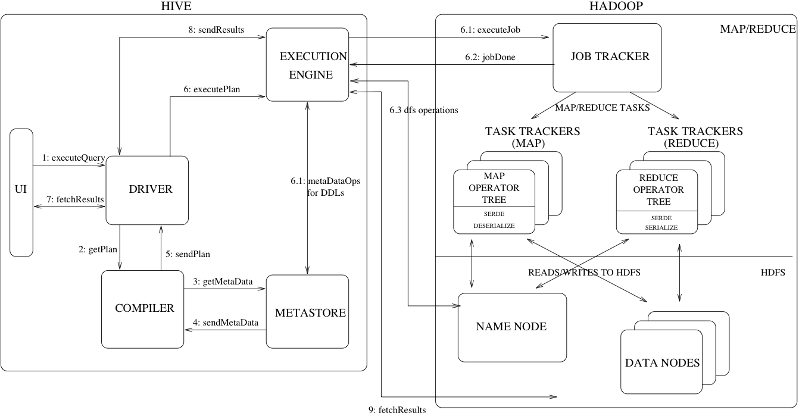
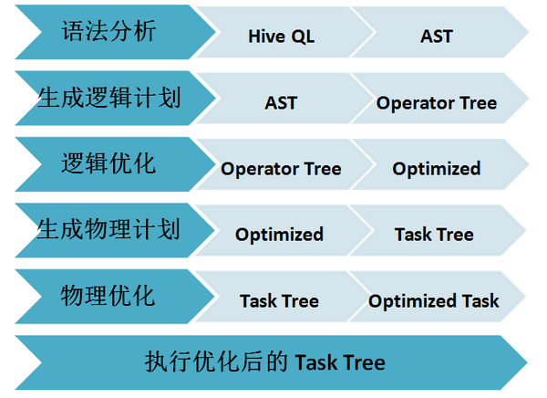

## Hive Programing Design Note
------------------------------------------------------------

### 1.About Hive

Hive is a data warehouse infrastructure built on top of Hadoop. It provides tools to enable easy data ETL, a mechanism to put structures on the data, and the capability to querying and analysis of large data sets stored in hadoop files. Hive defines a simple SQL-like query language, called QL, that enables users familiar with SQL to query the data. At the same time, this language also allows programmers who are familiar with the MapReduce fromwork to be able to plug in their custom mappers and reducers to perform more sophisticated analysis that may not be supported by the built-in capabilities of the language.

### 2.Hive Architect



Figure 1 shows the major components of Hive and its interactions with Hadoop. As shown in that figure, the main components of Hive are:

	- UI – The user interface for users to submit queries and other operations to the system. As of 2011 the system had a command line interface and a web based GUI was being developed.
	- Driver – The component which receives the queries. This component implements the notion of session handles and provides execute and fetch APIs modeled on JDBC/ODBC interfaces.
	- Compiler – The component that parses the query, does semantic analysis on the different query blocks and query expressions and eventually generates an execution plan with the help of the table and partition metadata looked up from the metastore.
	- Metastore – The component that stores all the structure information of the various tables and partitions in the warehouse including column and column type information, the serializers and deserializers necessary to read and write data and the corresponding HDFS files where the data is stored.
	- Execution Engine – The component which executes the execution plan created by the compiler. The plan is a DAG of stages. The execution engine manages the dependencies between these different stages of the plan and executes these stages on the appropriate system components.


#### Hive SQL Executor




### 3.Hive Programing using HiveQL

#### 3.1.HiveQL: Data Definition & Manipulation

Hive offers no support for row-level inserts, updates, and deletes. Hive doesn’t support transactions. Hive adds ex- tensions to provide better performance in the context of Hadoop and to integrate with custom extensions and even external programs.

The database directory is created under a top-level directory specified by the property hive.metastore.warehouse.dir

```sql
hive> CREATE DATABASE financials
	> LOCATION '/my/preferred/directory';
```

Primitive Data Types & Collection Data Types

> Hive supports columns that are structs, maps, and arrays

- Create Table Sample
```sql
CREATE TABLE IF NOT EXISTS mydb.employees (
	name  STRING COMMENT 'Employee name',
	salary  FLOAT COMMENT 'Employee salary',
	subordinates ARRAY<STRING> COMMENT 'Names of subordinates',
	deductions MAP<STRING, FLOAT> COMMENT 'Keys are deductions names, values are percentages', 
	address STRUCT<street:STRING, city:STRING, state:STRING, zip:INT> COMMENT 'Home address')
COMMENT 'Description of the table'
TBLPROPERTIES ('creator'='me', 'created_at'='2012-01-02 10:00:00', ...) LOCATION '/user/hive/warehouse/mydb.db/employees';

CREATE TABLE IF NOT EXISTS mydb.employees2 LIKE mydb.employees;

```

- External Tables
```sql
CREATE EXTERNAL TABLE IF NOT EXISTS stocks (
 exchange
symbol
ymd
price_open
price_high
price_low
price_close
volume
price_adj_close FLOAT)
STRING, STRING, STRING, FLOAT, FLOAT, FLOAT, FLOAT, INT,
ROW FORMAT DELIMITED FIELDS TERMINATED BY ',' LOCATION '/data/stocks';
```

- Partitioned, Managed Tables

```sql
LOAD DATA LOCAL INPATH '${env:HOME}/california-employees' OVERWRITE INTO TABLE employees
PARTITION (country = 'US', state = 'CA');
```

- INSERT 
```sql
hive> set hive.exec.dynamic.partition=true;
hive> set hive.exec.dynamic.partition.mode=nonstrict; hive> set hive.exec.max.dynamic.partitions.pernode=1000;
hive> INSERT OVERWRITE TABLE employees > PARTITION (country, state)
> SELECT ..., se.cty, se.st
> FROM staged_employees se;


INSERT OVERWRITE LOCAL DIRECTORY '/tmp/ca_employees' SELECT name, salary, address
FROM employees
WHERE se.state = 'CA';
``` 

#### 3.2.HiveQL: Queries & Views

##### JOIN Optimizations

A.Hint-/*+ STREAMTABLE(s) */ 
```sql
SELECT /*+ STREAMTABLE(s) */ s.ymd, s.symbol, s.price_close, d.dividend FROM stocks s JOIN dividends d ON s.ymd = d.ymd AND s.symbol = d.symbol WHERE s.symbol = 'AAPL';
```

B.Map-side Joins	

- Inner JOIN
- LEFT OUTER JOIN
- RIGHT OUTER JOIN
- FULL OUTER JOIN
- LEFT SEMI-JOIN

- ORDER BY and SORT BY
- DISTRIBUTE BY with SORT BY


#### 3.3.HiveQL: Indexes

```sql
CREATE TABLE employees (
name STRING,
salary FLOAT,
subordinates ARRAY<STRING>,
deductions MAP<STRING,FLOAT>,
address STRUCT<street:STRING, city:STRING, state:STRING, zip:INT>
)
PARTITIONED BY (country STRING, state STRING);
```
Bitmap Index 
```sql
CREATE INDEX employees_index
ON TABLE employees (country)
AS 'BITMAP'
WITH DEFERRED REBUILD
IDXPROPERTIES ('creator = 'me', 'created_at' = 'some_time') IN TABLE employees_index_table
PARTITIONED BY (country, name)
COMMENT 'Employees indexed by country and name.';
```

#### 3.4.HiveQL: Schema Design

### 4.Hive Best Practice

Hive是将符合SQL语法的字符串解析生成可以在Hadoop上执行的MapReduce的工具。使用Hive尽量按照分布式计算的一些特点来设计sql，和传统关系型数据库有区别，所以需要去掉原有关系型数据库下开发的一些固有思维。

#### 4.1.Hive Tuning

Tuning the Number of Mappers and Reducers

	- set hive.exec.reducers.bytes.per.reducer=<number>
	- set mapred.reduce.tasks=
	- set hive.exec.reducers.max=<number>
	//(Total Cluster Reduce Slots * 1.5) / (avg number of queries running)


#### 4.2.基本原则

1.尽量尽早地过滤数据,减少每个阶段的数据量,对于分区表要加分区,同时只选择需要使用到的字段

```sql
select ... from A join B
	on A.key = B.key
	where A.userid>10 and B.userid<10
        and A.dt='20120417'
        and B.dt='20120417';
```

应该改写为：

```sql
select .... from (select .... from A
    where dt='201200417' and userid>10) a
	join ( select .... from B
       where dt='201200417' and userid < 10   
     ) b
on a.key = b.key;
```

2.对历史库的计算经验(这项是说根据不同的使用目的优化使用方法)

	历史库计算和使用,分区


3.尽量原子化操作，尽量避免一个SQL包含复杂逻辑

	可以使用中间表来完成复杂的逻辑   

4.join操作   

	- 若其中有一个表很小使用map join，否则使用普通的reduce join，注意hive会将join前面的表数据装载内存,所以较小的一个表在较大的表之前,减少内存资源的消耗
	- 小表要注意放在join的左边（目前TCL里面很多都小表放在join的右边).否则会引起磁盘和内存的大量消耗


5.如果union all的部分个数大于2,或者每个union部分数据量大,应该拆成多个insert into语句,实际测试过程中,执行时间能提升50%

```sql
insert overwite table tablename partition (dt= ....)
select ..... from (
       select ... from A
       union all
       select ... from B
       union all
       select ... from C
                   ) R
where ...;
```

可以改写为：

```sql
insert into table tablename partition (dt= ....)
select .... from A
WHERE ...;

insert into table tablename partition (dt= ....)
select .... from B
WHERE ...;

insert into table tablename partition (dt= ....)
select .... from C
WHERE ...; 

``` 

6.HiveQL查询优化

如果有join,group操作的话，要注意是否会有数据倾斜


1) 启动一次job尽可能的多做事情，一个job能完成的事情,不要两个job来做

 通常来说前面的任务启动可以稍带一起做的事情就一起做了,以便后续的多个任务重用,与此紧密相连的是模型设计,好的模型特别重要.

2) 合理设置reduce个数

reduce个数过少没有真正发挥hadoop并行计算的威力，但reduce个数过多，会造成大量小文件问题，数据量、资源情况只有自己最清楚，找到个折衷点,

	- set hive.exec.reducers.bytes.per.reducer=<number>;
	- set hive.exec.reducers.max=300;
	- set mapred.reduce.tasks=300; ---增大Reduce个数

3) 使用hive.exec.parallel参数控制在同一个sql中的不同的job是否可以同时运行，提高作业的并发

	- set hive.exec.parallel=true;  
	- set hive.exec.parallel.thread.number=16;

4) 注意小文件的问题

在hive里有两种比较常见的处理办法

第一是使用Combinefileinputformat，将多个小文件打包作为一个整体的inputsplit，减少map任务数

	- set mapred.max.split.size=256000000;
	- set mapred.min.split.size.per.node=256000000
	- set mapred.min.split.size.per.rack=256000000
	- set hive.input.format=org.apache.hadoop.hive.ql.io.CombineHiveInputFormat

第二是设置hive参数，将额外启动一个MR Job打包小文件

	- set hive.merge.mapredfiles = false 是否合并 Reduce 输出文件，默认为 False 
	- set hive.merge.size.per.task = 256*1000*1000 合并文件的大小 


5) 注意数据倾斜

在hive里比较常用的处理办法

	- set hive.groupby.skewindata=true
	- set hive.map.aggr = true

第一通过hive.groupby.skewindata=true控制生成两个MR Job,第一个MR Job Map的输出结果随机分配到reduce做次预汇总,减少某些key值条数过多某些key条数过小造成的数据倾斜问题

第二通过hive.map.aggr=true(默认为true)在Map端做combiner,假如map各条数据基本上不一样, 聚合没什么意义，做combiner反而画蛇添足,hive里也考虑的比较周到通过参数hive.groupby.mapaggr.checkinterval = 100000 (默认)hive.map.aggr.hash.min.reduction=0.5(默认),预先取100000条数据聚合,如果聚合后的条数/100000>0.5，则不再聚合


如果出现数据倾斜，应当做如下处理：

	- set hive.groupby.mapaggr.checkinterval=100000;--这个是group的键对应的记录条数超过这个值则会进行分拆,值根据具体数据量设置
	- set hive.groupby.skewindata=true; --如果是group by过程出现倾斜 应该设置为true
	- set hive.map.aggr=true;
	- set hive.skewjoin.key=100000; --这个是join的键对应的记录条数超过这个值则会进行分拆,值根据具体数据量设置
	- set hive.optimize.skewjoin=true;--如果是join 过程出现倾斜 应该设置为true
 

6) 善用multi insert,union all

- multi insert:适合基于同一个源表按照不同逻辑不同粒度处理插入不同表的场景,做到只需要扫描源表一次,job个数不变,减少源表扫描次数

- union all:可减少表的扫描次数，减少job的个数,通常预先按不同逻辑不同条件生成的查询union all后，再统一group by计算,不同表的union all相当于multiple inputs,同一个表的union all,相当map一次输出多条

7) 参数设置的调优

集群参数种类繁多,举个例子比如

可针对特定job设置特定参数,比如jvm重用,reduce copy线程数量设置(适合map较快，输出量较大)

如果任务数多且小，比如在一分钟之内完成，减少task数量以减少任务初始化的消耗。可以通过配置JVM重用选项减少task的消耗


#### 4.3.Functions


### 5.From Hive on MapReduce to Hive on Spark

For Hive to work on Spark, you must deploy Spark gateway roles on the same machine that hosts HiveServer2. Otherwise, Hive on Spark cannot read from Spark configurations and cannot submit Spark jobs. For more information about gateway roles, see Managing Roles.

After installation, run the following command in Hive so that Hive will use Spark as the back-end engine for all subsequent queries.

- set hive.execution.engine=spark;


### X.Ref

- [Hive Architect](https://cwiki.apache.org/confluence/display/Hive/Design)
- [CDH Managing Hive](https://www.cloudera.com/documentation/enterprise/5-9-x/topics/admin_hive_configure.html)
- [Programming Hive]()
