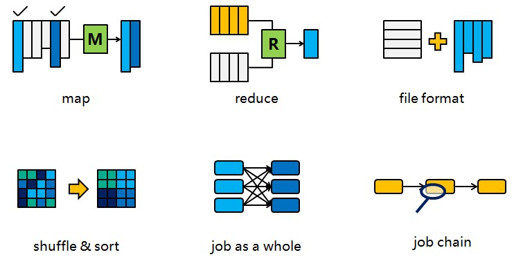
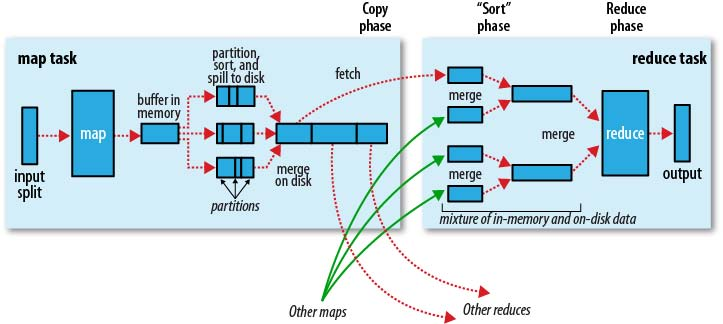
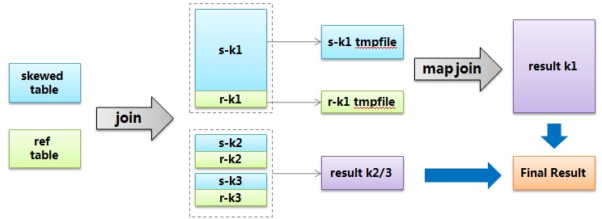

## Hive Programing Design Note3
------------------------------------------------------------

### Hive SQL 性能优化

一个Hive查询生成多个map reduce job，一个map reduce job又有map，reduce，spill，shuffle，sort等多个阶段，所以针对hive查询的优化可以大致分为针对MR中单个步骤的优化（其中又会有细分），针对MR全局的优化，和针对整个查询（多MR job）的优化，下文会分别阐述。



在开始之前，先把MR的流程图帖出来（摘自Hadoop权威指南），方便后面对照。本文写作时，使用hive0.9版本 + hadoop 1.x版本。



Map阶段的优化(map phase)
Map阶段的优化，主要是确定合适的map数。那么首先要了解map数的计算公式：
```
num_map_tasks = max[${mapred.min.split.size},
                min(${dfs.block.size}, ${mapred.max.split.size})]
```

	- mapred.min.split.size指的是数据的最小分割单元大小。
	- mapred.max.split.size指的是数据的最大分割单元大小。
	- dfs.block.size指的是HDFS设置的数据块大小。

一般来说dfs.block.size这个值是一个已经指定好的值，而且这个参数hive是识别不到的：
```
hive> set dfs.block.size;
dfs.block.size is undefined
```
所以实际上只有mapred.min.split.size和mapred.max.split.size这两个参数（本节内容后面就以min和max指代这两个参数）来决定map数量。在hive中min的默认值是1B，max的默认值是256MB：
```
hive> set mapred.min.split.size;
mapred.min.split.size=1
hive> set mapred.max.split.size;
mapred.max.split.size=256000000
```
所以如果不做修改的话，就是1个map task处理256MB数据，我们就以调整max为主。通过调整max可以起到调整map数的作用，减小max可以增加map数，增大max可以减少map数。需要提醒的是，直接调整_mapred.map.tasks_这个参数是没有效果的。

调整大小的时机根据查询的不同而不同，总的来讲可以通过观察map task的完成时间来确定是否需要增加map资源。如果map task的完成时间都是接近1分钟，甚至几分钟了，那么往往增加map数量，使得每个map task处理的数据量减少，能够让map task更快完成；而如果map task的运行时间已经很少了，比如10-20秒，这个时候增加map不太可能让map task更快完成，反而可能因为map需要的初始化时间反而让job总体速度变慢，这个时候反而需要考虑是否可以把map的数量减少，这样可以节省更多资源给其他Job。

#### 2.Reduce阶段的优化(reduce phase)

这里说的reduce阶段，是指前面流程图中的reduce phase(实际的reduce计算)而非图中整个reduce task。Reduce阶段优化的主要工作也是选择合适的reduce task数量，跟上面的map优化类似。
与map优化不同的是，reduce优化时，可以直接设置_mapred.reduce.tasks_参数从而直接指定reduce的个数。当然直接指定reduce个数虽然比较方便，但是不利于自动扩展。Reduce数的设置虽然相较map更灵活，但是也可以像map一样设定一个自动生成规则，这样运行定时job的时候就不用担心原来设置的固定reduce数会由于数据量的变化而不合适。

Hive估算reduce数量的时候，使用的是下面的公式：
```
num_reduce_tasks = min[${hive.exec.reducers.max}, 
                      (${input.size} / ${ hive.exec.reducers.bytes.per.reducer})]
```
_hive.exec.reducers.bytes.per.reducer_默认为1G，也就是每个reduce处理相当于job输入文件中1G大小的对应数据量，而且reduce个数不能超过一个上限参数值，这个参数的默认取值为999。所以我们也可以用调整这个公式的方式调整reduce数量，在灵活性和定制性上取得一个平衡。

设置reduce数同样也是根据运行时间作为参考调整，并且可以根据特定的业务需求、工作负载类型总结出经验，所以不再赘述。

#### 3.Map与Reduce之间的优化(spill, copy, sort phase)

map phase和reduce phase之间主要有3道工序。首先要把map输出的结果进行排序后做成中间文件，其次这个中间文件就能分发到各个reduce，最后reduce端在执行reduce phase之前把收集到的排序子文件合并成一个排序文件。需要强调的是，虽然这个部分可以调的参数挺多，但是大部分在一般情况下都是不要调整的，除非能精准的定位到这个部分有问题。

#### 3.1.Spill 与 Sort

在spill阶段，由于内存不够，数据可能没办法在内存中一次性排序完成，那么就只能把局部排序的文件先保存到磁盘上，这个动作叫spill，然后spill出来的多个文件可以在最后进行merge。如果发生spill，可以通过设置io.sort.mb来增大mapper输出buffer的大小，避免spill的发生。另外合并时可以通过设置io.sort.factor来使得一次性能够合并更多的数据，默认值为10，也就是一次归并10个文件。调试参数的时候，一个要看spill的时间成本，一个要看merge的时间成本，还需要注意不要撑爆内存（io.sort.mb是算在map的内存里面的）。Reduce端的merge也是一样可以用io.sort.factor。一般情况下这两个参数很少需要调整，除非很明确知道这个地方是瓶颈。比如如果map端的输出太大，考虑到map数不一定能很方便的调整，那么这个时候就要考虑调大io.sort.mb（不过即使调大也要注意不能超过jvm heap size）。而map端的输出很大，要么是每个map读入了很大的文件（比如不能split的大gz压缩文件），要么是计算逻辑导致输出膨胀了很多倍，都是比较少见的情况。

#### 3.2.Copy(shuffle)

这里说的copy，一般叫做shuffle更加常见。但是由于一开始的配图以及MR job的web监控页对这个环节都是叫copy phase，指代更加精确，所以这里称为copy。

copy阶段是把文件从map端copy到reduce端。默认情况下在5%的map完成的情况下reduce就开始启动copy，这个有时候是很浪费资源的，因为reduce一旦启动就被占用，一直等到map全部完成，收集到所有数据才可以进行后面的动作，所以我们可以等比较多的map完成之后再启动reduce流程，这个比例可以通过_mapred.reduce.slowstart.completed.maps_去调整，他的默认值就是5%。如果觉得这么做会减慢reduce端copy的进度，可以把copy过程的线程增大。_tasktracker.http.threads_可以决定作为server端的map用于提供数据传输服务的线程，_mapred.reduce.parallel.copies_可以决定作为client端的reduce同时从map端拉取数据的并行度（一次同时从多少个map拉数据），修改参数的时候这两个注意协调一下，server端能处理client端的请求即可。

另外，在shuffle阶段可能会出现的OOM问题，原因比较复杂，一般认为是内存分配不合理，GC无法及时释放内存导致。对于这个问题，可以尝试调低shuffle buffer的控制参数_mapred.job.shuffle.input.buffer.percent_这个比例值，默认值0.7，即shuffle buffer占到reduce task heap size的70%。另外也可以直接尝试增加reduce数量。

#### 4.文件格式的优化

文件格式方面有两个问题，一个是给输入和输出选择合适的文件格式，另一个则是小文件问题。小文件问题在目前的hive环境下已经得到了比较好的解决，hive的默认配置中就可以在小文件输入时自动把多个文件合并给1个map处理，输出时如果文件很小也会进行一轮单独的合并，所以这里就不专门讨论了。相关的参数可以在这里找到。

关于文件格式，Hive0.9版本有3种，textfile，sequencefile和rcfile。总体上来说，rcfile的压缩比例和查询时间稍好一点，所以推荐使用。

关于使用方法，可以在建表结构时可以指定格式，然后指定压缩插入：

```sql
create table rc_file_test( col int ) stored as rcfile;
set hive.exec.compress.output = true;
insert overwrite table rc_file_test
select * from source_table;
```

另外时也可以指定输出格式，也可以通过hive.default.fileformat来设定输出格式，适用于create table as select的情况：
```sql
set hive.default.fileformat = SequenceFile;
set hive.exec.compress.output = true; 
/*对于sequencefile，有record和block两种压缩方式可选，block压缩比更高*/
set mapred.output.compression.type = BLOCK; 
create table seq_file_test
as select * from source_table;
```
上面的文件格式转换，其实是由hive完成的（也就是插入动作）。但是也可以由外部直接导入纯文本（可以按照这里的做法预先压缩），或者是由MapReduce Job生成的数据。

值得注意的是，hive读取sequencefile的时候，是把key忽略的，也就是直接读value并且按照指定分隔符分隔字段。但是如果hive的数据来源是从mr生成的，那么写sequencefile的时候，key和value都是有意义的，key不能被忽略，而是应该当成第一个字段。为了解决这种不匹配的情况，有两种办法。一种是要求凡是结果会给hive用的mr job输出value的时候带上key。但是这样的话对于开发是一个负担，读写数据的时候都要注意这个情况。所以更好的方法是第二种，也就是把这个源自于hive的问题交给hive解决，写一个InputFormat包装一下，把value输出加上key即可。以下是核心代码，修改了RecordReader的next方法：

```java
//注意：这里为了简化，假定了key和value都是Text类型，所以MR的输出的k/v都要是Text类型。
//这个简化还会造成数据为空时，出现org.apache.hadoop.io.BytesWritable cannot be cast to org.apache.hadoop.io.Text的错误，因为默认hive的sequencefile的key是一个空的ByteWritable。
public synchronized boolean next(K key, V value) throws IOException 
{
    Text tKey = (Text) key;
    Text tValue = (Text) value;
    if (!super.next(innerKey, innerValue)) 
        return false;

    Text inner_key = (Text) innerKey; //在构造函数中用createKey()生成
    Text inner_value = (Text) innerValue; //在构造函数中用createValue()生成

    tKey.set(inner_key);
    tValue.set(inner_key.toString() + '\t' + inner_value.toString()); // 分隔符注意自己定义
    return true;
}
```

#### 5.Job整体优化

有一些问题必须从job的整体角度去观察。这里讨论几个问题：Job执行模式（本地执行v.s.分布式执行）、JVM重用、索引、Join算法、数据倾斜、Top N问题。

#### 5.1. Job执行模式

Hadoop的map reduce job可以有3种模式执行，即本地模式，伪分布式，还有真正的分布式。本地模式和伪分布式都是在最初学习hadoop的时候往往被说成是做单机开发的时候用到。但是实际上对于处理数据量非常小的job，直接启动分布式job会消耗大量资源，而真正执行计算的时间反而非常少。这个时候就应该使用本地模式执行mr job，这样执行的时候不会启动分布式job，执行速度就会快很多。比如一般来说启动分布式job，无论多小的数据量，执行时间一般不会少于20s，而使用本地mr模式，10秒左右就能出结果。

设置执行模式的主要参数有三个，一个是hive.exec.mode.local.auto，把他设为true就能够自动开启local mr模式。但是这还不足以启动local mr，输入的文件数量和数据量大小必须要控制，这两个参数分别为hive.exec.mode.local.auto.tasks.max和hive.exec.mode.local.auto.inputbytes.max，默认值分别为4和128MB，即默认情况下，map处理的文件数不超过4个并且总大小小于128MB就启用local mr模式。

另外，如果是简单的select语句，比如select某个列取个10条数据看看sample，那么在hive0.10之后有专门的fetch task优化，使用参数hive.fetch.task.conversion即可。

#### 5.2. JVM重用

正常情况下，MapReduce启动的JVM在完成一个task之后就退出了，但是如果任务花费时间很短，又要多次启动JVM的情况下（比如对很大数据量进行计数操作），JVM的启动时间就会变成一个比较大的overhead。在这种情况下，可以使用jvm重用的参数：

set mapred.job.reuse.jvm.num.tasks = 5;
他的作用是让一个jvm运行多次任务之后再退出。这样一来也能节约不少JVM启动时间。

#### 5.3. 索引

总体上来说，hive的索引目前还是一个不太适合使用的东西，这里只是考虑到叙述完整性，对其进行基本的介绍。

Hive中的索引架构开放了一个接口，允许你根据这个接口去实现自己的索引。目前hive自己有一个参考的索引实现（CompactIndex），后来在0.8版本中又加入位图索引。这里就讲讲CompactIndex。

CompactIndex的实现原理类似一个lookup table，而非传统数据库中的B树。如果你对table A的col1做了索引，索引文件本身就是一个table，这个table会有3列，分别是col1的枚举值，每个值对应的数据文件位置，以及在这个文件位置中的偏移量。通过这种方式，可以减少你查询的数据量（偏移量可以告诉你从哪个位置开始找，自然只需要定位到相应的block），起到减少资源消耗的作用。但是就其性能来说，并没有很大的改善，很可能还不如构建索引需要花的时间。所以在集群资源充足的情况下，没有太大必要考虑索引。

CompactIndex的还有一个缺点就是使用起来不友好，索引建完之后，使用之前还需要根据查询条件做一个同样剪裁才能使用，索引的内部结构完全暴露，而且还要花费额外的时间。具体看看下面的使用方法就了解了：

```sql
/*在index_test_table表的id字段上创建索引*/
create index idx on table index_test_table(id)  
as 'org.apache.hadoop.hive.ql.index.compact.CompactIndexHandler' with deferred rebuild;
alter index idx on index_test_table rebuild;
	
/*索引的剪裁。找到上面建的索引表，根据你最终要用的查询条件剪裁一下。*/
/*如果你想跟RDBMS一样建完索引就用，那是不行的，会直接报错，这也是其麻烦的地方*/
create table my_index
as select _bucketname, `_offsets`
from default__index_test_table_idx__ where id = 10;
	
/*现在可以用索引了，注意最终查询条件跟上面的剪裁条件一致*/
set hive.index.compact.file = /user/hive/warehouse/my_index; 
set hive.input.format = org.apache.hadoop.hive.ql.index.compact.HiveCompactIndexInputFormat;
select count(*) from index_test_table where id = 10;
```

#### 5.4. Join算法

处理分布式join，一般有两种方法:

	- replication join：把其中一个表复制到所有节点，这样另一个表在每个节点上面的分片就可以跟这个完整的表join了；
    - repartition join：把两份数据按照join key进行hash重分布，让每个节点处理hash值相同的join key数据，也就是做局部的join。

这两种方式在M/R Job中分别对应了map side join和reduce side join。在一些MPP数据库中，数据可以按照某列字段预先进行hash分布，这样在跟这个表以这个字段为join key进行join的时候，该表肯定不需要做数据重分布了。这种功能是以HDFS作为底层文件系统的hive所没有的，即使是hive中的bucket也只能到文件级别的hash，而非节点级别的hash。

在默认情况下，hive的join策略是进行reduce side join。当两个表中有一个是小表的时候，就可以考虑用map join了，因为小表复制的代价会好过大表shuffle的代价。使用map join的配置方法有两种，一种直接在sql中写hint，语法是_/*+MAPJOIN (tbl)*/_，其中tbl就是你想要做replication的表。另一种方法是设置_hive.auto.convert.join = true_，这样hive会自动判断当前的join操作是否合适做map join，主要是找join的两个表中有没有小表。至于多大的表算小表，则是由_hive.smalltable.filesize_决定，默认25MB。

但是有的时候，没有一个表足够小到能够放进内存，但是还是想用map join怎么办？这个时候就要用到bucket map join。其方法是两个join表在join key上都做hash bucket，并且把你打算复制的那个（相对）小表的bucket数设置为大表的倍数。这样数据就会按照join key做hash bucket。小表依然复制到所有节点，map join的时候，小表的每一组bucket加载成hashtable，与对应的一个大表bucket做局部join，这样每次只需要加载部分hashtable就可以了。
然后在两个表的join key都具有唯一性的时候（也就是可做主键），还可以进一步做sort merge bucket map join。做法还是两边要做hash bucket，而且每个bucket内部要进行排序。这样一来当两边bucket要做局部join的时候，只需要用类似merge sort算法中的merge操作一样把两个bucket顺序遍历一遍即可完成，这样甚至都不用把一个bucket完整的加载成hashtable，这对性能的提升会有很大帮助。
然后这里以一个完整的实验说明这几种join算法如何操作。
首先建表要带上bucket：
```sql
create table map_join_test(id int)
clustered by (id) sorted by (id) into 32 buckets
stored as textfile;
```
然后插入我们准备好的800万行数据，注意要强制划分成bucket（也就是用reduce划分hash值相同的数据到相同的文件）：
```sql
set hive.enforce.bucketing = true;
insert overwrite table map_join_test
select * from map_join_source_data;
```
这样这个表就有了800万id值（且里面没有重复值，所以可以做sort merge），占用80MB左右。
接下来我们就可以一一尝试map join的算法了。首先是普通的map join：

```sql
select /*+mapjoin(a) */count(*)
from map_join_test a
join map_join_test b on a.id = b.id;
```

然后就会看到分发hash table的过程：

```
2013-08-31 09:08:43     Starting to launch local task to process map join;      maximum memory = 1004929024
2013-08-31 09:08:45     Processing rows:   200000  Hashtable size: 199999  Memory usage:   38823016        rate:   0.039
2013-08-31 09:08:46     Processing rows:   300000  Hashtable size: 299999  Memory usage:   56166968        rate:   0.056
……
2013-08-31 09:12:39     Processing rows:  4900000 Hashtable size: 4899999 Memory usage:   896968104       rate:   0.893
2013-08-31 09:12:47     Processing rows:  5000000 Hashtable size: 4999999 Memory usage:   922733048       rate:   0.918
Execution failed with exit status: 2
Obtaining error information

Task failed!
Task ID:
  Stage-4
```

不幸的是，居然内存不够了，直接做map join失败了。但是80MB的大小为何用1G的heap size都放不下？观察整个过程就会发现，平均一条记录需要用到200字节的存储空间，这个overhead太大了，对于map join的小表size一定要好好评估，如果有几十万记录数就要小心了。虽然不太清楚其中的构造原理，但是在互联网上也能找到其他的例证，比如这里和这里,平均一行500字节左右。这个明显比一般的表一行占用的数据量要大。不过hive也在做这方面的改进，争取缩小hash table，比如HIVE-6430。

所以接下来我们就用bucket map join，之前分的bucket就派上用处了。只需要在上述sql的前面加上如下的设置：
```
set hive.optimize.bucketmapjoin = true;
```
然后还是会看到hash table分发：

```
2013-08-31 09:20:39     Starting to launch local task to process map join;      maximum memory = 1004929024
2013-08-31 09:20:41     Processing rows:   200000  Hashtable size: 199999  Memory usage:   38844832        rate:   0.039
2013-08-31 09:20:42     Processing rows:   275567  Hashtable size: 275567  Memory usage:   51873632        rate:   0.052
2013-08-31 09:20:42     Dump the hashtable into file: file:/tmp/hadoop/hive_2013-08-31_21-20-37_444_1135806892100127714/-local-10003/HashTable-Stage-1/MapJoin-a-10-000000_0.hashtable
2013-08-31 09:20:46     Upload 1 File to: file:/tmp/hadoop/hive_2013-08-31_21-20-37_444_1135806892100127714/-local-10003/HashTable-Stage-1/MapJoin-a-10-000000_0.hashtable File size: 11022975
2013-08-31 09:20:47     Processing rows:   300000  Hashtable size: 24432   Memory usage:   8470976 rate:   0.008
2013-08-31 09:20:47     Processing rows:   400000  Hashtable size: 124432  Memory usage:   25368080        rate:   0.025
2013-08-31 09:20:48     Processing rows:   500000  Hashtable size: 224432  Memory usage:   42968080        rate:   0.043
2013-08-31 09:20:49     Processing rows:   551527  Hashtable size: 275960  Memory usage:   52022488        rate:   0.052
2013-08-31 09:20:49     Dump the hashtable into file: file:/tmp/hadoop/hive_2013-08-31_21-20-37_444_1135806892100127714/-local-10003/HashTable-Stage-1/MapJoin-a-10-000001_0.hashtable
……
```

这次就会看到每次构建完一个hash table（也就是所对应的对应一个bucket），会把这个hash table写入文件，重新构建新的hash table。这样一来由于每个hash table的量比较小，也就不会有内存不足的问题，整个sql也能成功运行。不过光光是这个复制动作就要花去3分半的时间，所以如果整个job本来就花不了多少时间的，那这个时间就不可小视。

最后我们试试sort merge bucket map join(一般简称SMB join)，在bucket map join的基础上加上下面的设置即可：
```
set hive.optimize.bucketmapjoin.sortedmerge = true;
set hive.input.format = org.apache.hadoop.hive.ql.io.BucketizedHiveInputFormat;
```
SMB join是不会产生hash table分发的步骤的，直接开始做实际map端join操作了，每个mapper读取两个表相同的bucket，不需要将小表的bucket加载到内存，而通过merge sort的方式把两个bucket的数据走一遍即可。这个时候遍历数据肯定不会像常规情况下先遍历完第一个bucket，再遍历第二个bucket，那样无法实现merge sort。SMB join最大的优势就在于对于表的大小没有要求的情况下能做map join。

关于join的算法虽然有这么些选择，但是个人觉得，对于日常使用，掌握默认的reduce join和普通的（无bucket）map join已经能解决大多数问题。如果小表不能完全放内存，但是小表相对大表的size量级差别也非常大的时候，或者是必须要做cross join，那也可以试试bucket map join，不过其hash table分发的过程会浪费不少时间，需要评估下是否能够比reduce join更高效。而SMB join虽然性能不错，也能适用于大表之间的join，但是把数据做成bucket本身也需要时间，如果只是临时join一次，还不如直接用reduce join。所以适用SMB join的场景相对比较少见，“用户基本表 join 用户扩展表”以及“用户今天的数据快照 join 用户昨天的数据快照”这类场景可能比较合适。

这里顺便说个题外话，在数据仓库中，小表往往是维度表，而小表map join这件事情其实用udf代替还会更快，因为不用单独启动一轮job，所以这也是一种可选方案。当然前提条件是维度表是固定的自然属性（比如日期），只增加不修改（比如网站的页面编号）的情况也可以考虑。如果维度有更新，要做缓慢变化维的，当然还是维表好维护。至于维表原本的一个主要用途OLAP，以Hive目前的性能是没法实现的，也就不需要多虑了。

#### 5.5. 数据倾斜

这里说的所谓数据倾斜，说的是由于数据分布不均匀，个别值集中占据大部分数据量，加上hadoop的计算模式，导致reduce阶段不同的task分配到的不均匀引起性能下降。由于计算逻辑在不同数据上耗时不同导致的计算倾斜或者是map端读取数据不均匀造成的倾斜不在这里的讨论范围。下图就是一个例子：


倾斜分成group by造成的倾斜和join造成的倾斜，需要分开看。

#### 5.6. GroupBy倾斜

group by造成的倾斜相对来说比较容易解决。hive提供两个参数可以解决，一个是_hive.map.aggr_，默认值已经为true，他的意思是做map aggregation，也就是在mapper里面做聚合。这个方法不同于直接写mapreduce的时候可以实现的combiner，但是却实现了类似combiner的效果。事实上各种基于mr的框架如pig，cascading等等用的都是map aggregation（或者叫partial aggregation）而非combiner的策略，也就是在mapper里面直接做聚合操作而不是输出到buffer给combiner做聚合。对于map aggregation，hive还会做检查，如果aggregation的效果不好，那么hive会自动放弃map aggregation。判断效果的依据就是经过一小批数据的处理之后，检查聚合后的数据量是否减小到一定的比例，默认是0.5，由_hive.map.aggr.hash.min.reduction_这个参数控制。所以如果确认数据里面确实有个别取值倾斜，但是大部分值是比较稀疏的，这个时候可以把比例强制设为1，避免极端情况下map aggr失效。_hive.map.aggr_还有一些相关参数，比如map aggr的内存占用等，具体可以参考这篇文章。另一个参数是_hive.groupby.skewindata_。这个参数的意思是做reduce操作的时候，拿到的key并不是所有相同值给同一个reduce，而是随机分发，然后reduce做聚合，做完之后再做一轮MR，拿前面聚合过的数据再算结果。所以这个参数其实跟hive.map.aggr做的是类似的事情，只是拿到reduce端来做，而且要额外启动一轮job，所以其实不怎么推荐用，效果不明显。

另外需要注意的是count distinct操作往往需要改写SQL，可以按照下面这么做：

```sql
/*改写前*/
select a, count(distinct b) as c from tbl group by a;

/*改写后*/
select a, count(*) as c from (select a, b from tbl group by a, b) group by a;
```

* Join倾斜

join造成的倾斜，常见情况是不能做map join的两个表(能做map join的话基本上可以避免倾斜)，其中一个是行为表，另一个应该是属性表。比如我们有三个表，一个用户属性表users，一个商品属性表items，还有一个用户对商品的操作行为表日志表logs。假设现在需要将行为表关联用户表：

```sql
select * from logs a join users b on a.user_id = b.user_id;
```

其中logs表里面会有一个特殊用户user_id = 0，代表未登录用户，假如这种用户占了相当的比例，那么个别reduce会收到比其他reduce多得多的数据，因为它要接收所有user_id = 0的记录进行处理，使得其处理效果会非常差，其他reduce都跑完很久了它还在运行。

hive给出的解决方案叫skew join，其原理把这种user_id = 0的特殊值先不在reduce端计算掉，而是先写入hdfs，然后启动一轮map join专门做这个特殊值的计算，期望能提高计算这部分值的处理速度。当然你要告诉hive这个join是个skew join，即：
```
set hive.optimize.skewjoin = true;
```
还有要告诉hive如何判断特殊值，根据hive.skewjoin.key设置的数量hive可以知道，比如默认值是100000，那么超过100000条记录的值就是特殊值。总结起来，skew join的流程可以用下图描述：



不过，这种方法还要去考虑阈值之类的情况，其实也不够通用。所以针对join倾斜的问题，一般都是通过改写sql解决。对于上面这个问题，我们已经知道user_id = 0是一个特殊key，那么可以把特殊值隔离开来单独做join，这样特殊值肯定会转化成map join，非特殊值就是没有倾斜的普通join了：

```sql
select *
from (select * from logs where user_id = 0)  a 
join (select * from users where user_id = 0) b 
on a.user_id =  b.user_id
union all
select * 
from logs a join users b
on a.user_id <> 0 and a.user_id = b.user_id;
```

上面这种个别key倾斜的情况只是一种倾斜情况。最常见的倾斜是因为数据分布本身就具有长尾性质，比如我们将日志表和商品表关联：

```sql
select * from logs a join items b on a.item_id = b.item_id;
```

这个时候，分配到热门商品的reducer就会很慢，因为热门商品的行为日志肯定是最多的，而且我们也很难像上面处理特殊user那样去处理item。这个时候就会用到加随机数的方法，也就是在join的时候增加一个随机数，随机数的取值范围n相当于将item给分散到n个reducer：

```sql
select a.*, b.*
from (select *, cast(rand() * 10 as int) as r_id from logs)a
join (select *, r_id from items 
lateral view explode(range_list(1,10)) rl as r_id)b
on a.item_id = b.item_id and a.r_id = b.r_id
```

上面的写法里，对行为表的每条记录生成一个1-10的随机整数，对于item属性表，每个item生成10条记录，随机key分别也是1-10，这样就能保证行为表关联上属性表。其中range_list(1,10)代表用udf实现的一个返回1-10整数序列的方法。这个做法是一个解决join倾斜比较根本性的通用思路，就是如何用随机数将key进行分散。当然，可以根据具体的业务场景做实现上的简化或变化。

除了上面两类情况，还有一类情况是因为业务设计导致的问题，也就是说即使行为日志里面join key的数据分布本身并不明显倾斜，但是业务设计导致其倾斜。比如对于商品item_id的编码，除了本身的id序列，还人为的把item的类型也作为编码放在最后两位，这样如果类型1（电子产品）的编码是00，类型2（家居产品）的编码是01，并且类型1是主要商品类，将会造成以00为结尾的商品整体倾斜。这时，如果reduce的数量恰好是100的整数倍，会造成partitioner把00结尾的item_id都hash到同一个reducer，引爆问题。这种特殊情况可以简单的设置合适的reduce值来解决，但是这种坑对于不了解业务的情况下就会比较隐蔽。

* Top N问题

有时候我们需要在一大堆数据中取top n，比如说取访问日志里面时间最早的10条记录。基于sql实现这个需求就是使用order by col limit n。hive默认的order by实现只会用1个reduce做全局排序，这在数据量大的时候job运行效率非常低。hive在0.12版本引入了parallel order by，也就是通过sampling的方式实现并行（即基于_TotalOrderPartitioner_）。具体开关参数是hive.optimize.sampling.orderby。但是如果使用这个参数还是很可能碰到问题的：

	- 首先如果order by字段本身取值范围过少，会造成Split points are out of order错误。这是因为，假设job中reduce数量为r的话，那么TotalOrderPartitioner需要order by字段的取值至少要有r - 1个。那么这样一来还需要关心reduce数量，增加了开发负担，而且如果把reduce数量设的很小，优化的效果就不太明显了。
	- 其次，设置这个参数还可能造成聚会函数出错，这个问题只在比较新的hive版本中解决了。

实际上，如果只是取top n而非全局排序，只需要使用_sort by col limit n_的写法就能达到很好的效果。sort by语法本身保证每个reduce内数据有序，这样就等于是做并行排序。而limit n则保证两件事：一方面是使得并行排序时每个reduce的输出记录数只是n，也就是先在每个reduce内部做top n（可以explain一下看看执行计划更加清楚）；另外一方面，等局部top n完成之后，再起一轮job，用1个reduce做全局top n，这个时候虽然不是并行排序，但是处理的数据量也已经大大减少，不会造成效率问题了。当然，如果自己实现mapreduce，可以在mapper任务内维护最小最大堆，直接在map端实现并行的top n，再输出给1个reducer做全局top n，只需要一轮job即可完成。不过如果n的大小没有限制很可能会撑爆内存，而且即使没有内存问题，实现也比较复杂，所以hive中没有实现这样的Operator，而是用上面描述的方式解决。毕竟在reduce端做top n，排序问题就已经在MR框架层面解决了，只需要考虑limit即可。

除了对全部数据取top n，分组top n也是常见场景，比如学生成绩表取每个学科前三名，用户点击流数据取每个用户最早的几个点击等等。如果每个分组需要排序的数据量不大，那么可以用窗口函数解决，或者在不支持窗口函数的比较老的hive版本自己实现udf。但是如果每个分组本身很大，还是会很慢。如果追求性能的话，同样可以借鉴sort by limit的写法，在分组个数不多且固定的情况下直接将分组写死。比如“取每个性别访问次数最多的10人”类似这样的情景，就可以拆解为“男性访问次数最多的10人 + 女性访问次数最多的10人”。

#### 6.SQL整体优化

前面对于单个job如何做优化已经做过详细讨论，但是hive查询会生成多个job，针对多个job，有什么地方需要优化？

#### 6.1. Job间并行

首先，在hive生成的多个job中，在有些情况下job之间是可以并行的，典型的就是子查询。当需要执行多个子查询union all或者join操作的时候，job间并行就可以使用了。比如下面的代码就是一个可以并行的场景示意：

```sql
select * from 
(
   select count(*) from logs 
   where log_date = 20130801 and item_id = 1
   union all 
   select count(*) from logs 
   where log_date = 20130802 and item_id = 2
   union all 
   select count(*) from logs 
   where log_date = 20130803 and item_id = 3
)t
```

设置job间并行的参数是hive.exec.parallel，将其设为true即可。默认的并行度为8，也就是最多允许sql中8个job并行。
```
set hive.exec.parallel=true
```
如果想要更高的并行度，可以通过hive.exec.parallel.thread.number参数进行设置，但要避免设置过大而占用过多资源。

#### 6.2. 减少Job数  

另外在实际开发过程中也发现，一些实现思路会导致生成多余的job而显得不够高效。比如这个需求：查询某网站日志中同时访问过页面a和页面b的用户数量。低效的思路是面向明细的，先取出看过页面a的用户，再取出看过页面b的用户，然后取交集，代码如下：

```sql
select count(*) 
from (select user_id from logs where page_name = 'a' group by user_id) a 
join (select user_id from logs where blog_owner = 'b' group by user_id) b 
on a.user_id = b.user_id;
```

这样一来，就要产生2个求子查询的job，一个用于关联的job，还有一个计数的job，一共有4个job。
但是我们直接用面向统计的方法去计算的话（也就是用group by替代join），则会更加符合M/R的模式，只需要用两个job就能跑完：

```sql
select count (*) from (
select user_id 
from logs group by user_id
having (count(case when page_name = 'a' then 1 end) *
        count(case when page_name = 'b' then 1 end) > 0)
)t;
```

第一种查询方法符合思考问题的直觉，是工程师和分析师在实际查数据中最先想到的写法，但是如果在目前hive的query planner不是那么智能的情况下，想要更加快速的跑出结果，懂一点工具的内部机理也是必须的。

当然了，也有同学有其它的思路，只是没有上面那么高效：

```sql
select count(*) from
(
    select user_id,
    count(case when blog_owner = 'a' then 1 end) as visit_z,
    count(case when blog_owner = 'b' then 1 end) as visit_l
    from cnblogs_visit_20130801 group by user_id
) t
where visit_z > 0 and visit_l > 0;
```

这种实现方式转换成job就只会有2个：内层的子查询和外层的统计，所以对 SQL 和原理都比较熟悉才能在 HIVE 中游刃有余~ 
