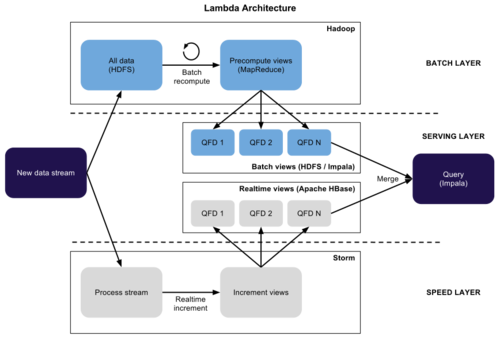
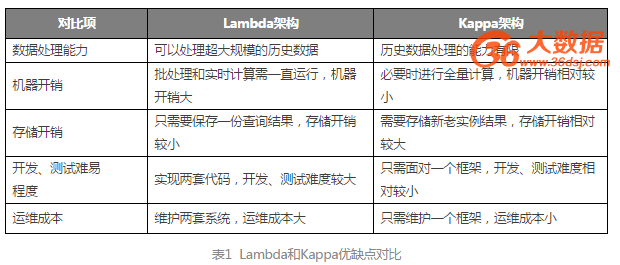

## 大数据研究-数据处理-实时处理架构
-----------------------------------------------------------

### 实时计算输出

- 数据库+离线计算结果=全量数据查询(Lambda/Kappa)
- Kafka消息队列+流式计算引擎(Flink)


#### I.Lambda Architect

The Lambda architecture: principles for architecting realtime Big Data systems.

|DataLoad | MixComputer 	  | DataStorage 			 | QueryType |
|:--------|:------------------|:-------------------------|:----------|
|Kafka    | Hadoop/MapReduce  | HDFS/Impala              | Impala    |
|Kafka    | Storm             | HBase                    | Impala    |

```java
query = function(all data)
```

Book “Big Data - Principles and best practices of scalable realtime data systems" by Nathan Marz and James Warren.

The book describes the Lambda architecture as a clear set of principles for architecting Big Data systems. I like the concepts of building immutability and recomputation into a system, and it is the first architecture to really define how batch and stream processing can work together to solve a myriad of use cases. With the general emphasis moving more towards realtime, I see this book being a must read for all Big Data developers and architects alike.

The premise behind the Lambda architecture is you should be able to run ad-hoc queries against all of your data to get results, but doing so is unreasonably expensive in terms of resource. Technically it is now feasible to run ad-hoc queries against your Big Data (Cloudera Impala), but querying a petabyte dataset everytime you want to compute the number of pageviews for a URL may not always be the most efficient approach. So the idea is to precompute the results as a set of views, and you query the views. I tend to call these **Question Focused Datasets** (e.g. pageviews QFD).

#### 1.The Lambda architecture

The Lambda architecture is split into three layers, the batch layer, the serving layer, and the speed layer.



- Batch Layer,HDFS+Spark Core,实时增量数据加载到HDFS中,使用SparkCore批量处理全量数据
- Speed Layer,SparkStreaming处理实时的增量数据,以较低的时延生成实时数据
- Serving Layer,HDFS+SparkSQL/Impala,存储Batch Layer和Speed Layer整合完的数据视图,提供低时延的即席查询功能


#### 2.Batch layer(Apache Hadoop + HDFS/Impala)

The batch layer is responsible for two things. The first is to store the immutable, constantly growing master dataset (HDFS), and the second is to compute arbitrary views from this dataset (MapReduce). Computing the views is a continuous operation, so when new data arrives it will be aggregated into the views when they are recomputed during the next MapReduce iteration.

The views should be computed from the entire dataset and therefore the batch layer is not expected to update the views frequently. Depending on the size of your dataset and cluster, each iteration could take hours.

#### 3.Serving layer(Impala)

The output from the batch layer is a set of flat files containing the precomputed views. The serving layer is responsible for indexing and exposing the views so that they can be queried for end users.

As the batch views are static, the serving layer only needs to provide batch updates and random reads, and for this I would use Cloudera Impala. To expose the views using Impala all the serving layer would have to do is create a table in the Hive Metastore that points to the files in the HDFS. Users would then be able to use Impala to query the views immediately.

Hadoop and Impala are perfect tools for the batch and serving layers. Hadoop can store and process petabytes of data, and Impala can query this data quickly and interactively. Although, the batch and serving layers alone do not satisfy any realtime requirement because MapReduce (by design) is high latency and it could take a few hours for new data to be represented in the views and propagated to the serving layer. This is why we need the speed layer.

	Just a note about the use of the term ‘realtime’. When I say realtime, I actually mean near-realtime (NRT) and the time delay 
	between the occurrence of an event and the availability of any processed data from that event. 
	In the Lambda architecture, realtime is the ability to process the delta of data that has been captured 
	after the start of the batch layers current iteration and now.

#### 4.Speed layer(Storm + Apache HBase)

In essence the speed layer is the same as the batch layer in that it computes views from the data it receives. The speed layer is needed to compensate for the high latency of the batch layer and it does this by computing realtime views in Storm. The realtime views contain only the delta results to supplement the batch views.

Whilst the batch layer is designed to continuously recompute the batch views from scratch/Kafka, the speed layer uses an incremental model whereby the realtime views are incremented as and when new data is received. Whats clever about the speed layer is the realtime views are intended to be transient and as soon as the data propagates through the batch and serving layers the corresponding results in the realtime views can be discarded. This is referred to as “complexity isolation” in the book, meaning that the most complex part of the architecture is pushed into the layer whose results are only temporary.


_storm-hbase connector_

As a precursor to this post I’ve been working on a HBase connector for Storm. The connector provides a number of Storm Bolt and Trident state implementations for creating realtime views in a Lambda architecture. Please check it out on my [GitHub page](https://github.com/jrkinley/storm-hbase).

#### 5.Query merge in memory

The final piece of the puzzle is exposing the realtime views so that they can be queried and merged with the batch views to get the complete results. As the realtime views are incremental, the speed layer requires both random reads and writes, and for this I would use Apache HBase. HBase provides the ability for Storm to continuously increment the realtime views and at the same time can be queried by Impala for merging with the batch views. Impala’s ability to query both the batch views stored in the HDFS and the realtime views stored in HBase make it the perfect tool for the job(Impala could query both HDFS and HBase).The aggregate query merge calculation in memory is very important key for the final result.

#### 6.Thoughts

The book describes some great architectural principles that can be applied to any Big Data architecture, specifically immutability and recomputation. Hadoop gives you a platform for storing all of your data and you don’t need a complex system for finding and updating individual records at scale, you can simply append new immutable records to your master dataset. An immutable record is a version of a record at a point in time. Newer versions of a record can be added, but a particular version can never be overridden, meaning that you can always revert to a previous state. In the Lambda architecture this means that if you accidentally added some bad records, they can simply be deleted and the views recomputed to fix the problem. If the data was mutable then its much more difficult - and sometimes impossible - to revert to a previous state. The book describes this as having “human fault-tolerance”.

The book also emphasises that the batch views should be recomputed from scratch from the entire master dataset. You may think that this is a bad idea (as I did) and surely its more performant to implement incremental MapReduce algorithms to increase the frequency of the batch views. Although by doing this you will trade performance for human fault-tolerance, because when using an incremental algorithm it is much more difficult to fix any problems in the views. For example, lets say that you accidentally deployed an algorithm that incremented a counter by 2 instead of 1. If you were computing incremental results it would be difficult to go back and recompute each increment, whereas recomputing the results from scratch is simple and all you would have to do is fix the algorithm and the views would be fixed during the next batch iteration.

When talking about the Lambda architecture one question always comes up: can you achieve the same results using the Hadoop ecosystem alone?

I think the reasons for implementing this architecture lie in your perception and requirements for realtime, and whether you think human fault-tolerance is an important factor in your system. It is feasible to implement a low latency system in Hadoop. For example, you could use Apache Flume to create an ingest pipeline into HDFS or HBase and use Impala to query the data. The latest version of Flume (1.2.0) also introduces the concept of Interceptors which can be used to modify the streaming data. Although Flume by design is not a streaming analytics platform like Storm and therefore I think it would be difficult to compute your realtime views in Flume (but not impossible). Storm on the other hand is a purpose built, scalable stream processing system that typically works at much lower latency.

What I’ve learnt the most from the Big Data book (or at least the first 6 chapters of it) is the architectural principles. <br/>
The importance of immutability and human fault-tolerance, and the benefits of precomputation and recomputation. If you’re considering implementing the Lambda architecture in its entirety, ask yourself one question: how realtime do I need to be? If your answer is in the tens of seconds then the complete Lambda architecture maybe overkill, but if your answer is milliseconds then I think the Lambda architecture is your answer.


#### x.Links

- [http://www.cloudera.com/content/cloudera/en/products/cdh.html](http://www.cloudera.com/content/cloudera/en/products/cdh.html)
- [https://github.com/nathanmarz/storm](https://github.com/nathanmarz/storm)
- [http://www.manning.com/marz/](http://www.manning.com/marz/)
- [http://www.slideshare.net/nathanmarz/runaway-complexity-in-big-data-and-a-plan-to-stop-it](http://www.slideshare.net/nathanmarz/runaway-complexity-in-big-data-and-a-plan-to-stop-it)


#### II.Kappa Architect

Lambda架构一个最明显的问题：它需要维护两套分别跑在批处理和实时计算系统上面的代码。


Kappa架构的核心思想包括以下三点：

- 用Kafka或者类似的分布式队列系统保存数据，你需要几天的数据量就保存几天。
- 当需要全量重新计算时，重新起一个流计算实例，从头开始读取数据进行处理，并输出到一个新的结果存储中。
- 当新的实例做完后，停止老的流计算实例，并把老的一些结果删除。

Kappa架构适合非超大量数据的实时计算,可以使用一个代码架构同时实现实时与离线数据处理架构

|DataLoad | MixComputer 	  | DataStorage      | QueryOLAP  |
|:--------|:------------------|:-----------------|:-----------|
|Kafka    | Spark/SparkSQL    | HDFS             | Presto     |
|Kafka    | SparkStreaming    | Cassandra        | Presto     |


* lambda&kappa架构比较




#### III.Kafka+SparkStreaming

Spark Streaming是将实时数据流按时间段分段后,当作小的批处理数据去计算


