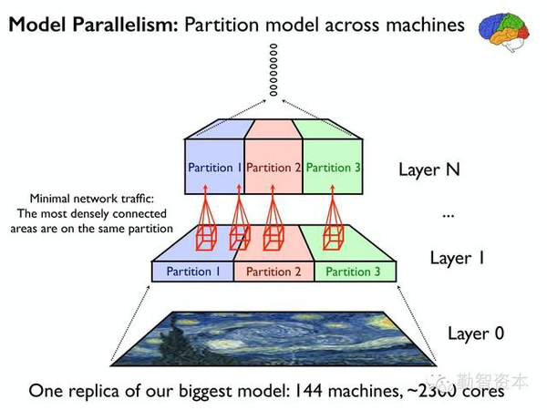
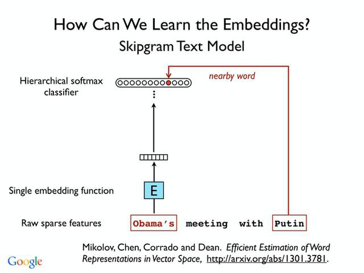

## 机器学习&Python数据分析
-------------------------------------------------------

### I.Python数据分析

- [Python3 Guide](http://www.runoob.com/manual/pythontutorial3/docs/html/)

#### 1.1.数据特征分析

1.基础分析
	- 分布分析
	- 定性数据的分布分析
	- 对比分析
3.统计量分析
4.周期性分析
5.贡献度分析-帕累托分析
6.相关性分析
7.数据质量验证

#### 1.2.数据探索Library

Python 对于数据科学家来说几乎是一项必备技能。正如你看到的那样，很多数据科学家的岗位要求具备 Python 编程的能力。这篇文章将会针对数据科学介绍几种常用的 Python 包。在与数据挖掘、机器学习以及数据分析相关的项目中，这些 Python 包通常会得到广泛应用。

** 数据挖掘组件 **

* 1. NumPy - 数组及函数计算

Numpy是用 Pyhton进行科学计算时的基础包，为Python 提供了出色的数学功能。提供了多维数组功能

* 2. SciPy - 矩阵计算

SciPy 是一个基于 Python 的开源软件生态系统，主要用于数学、科学和工程学等领域，给数据科学家提供了大量的算法和数学工具。
功能包括最优化,线性代数,积分,插值,拟合,特殊函数,快速傅里叶变换,信号处理和图像处理

 > 先安装Numpy 

* 3. Matplotlib - 数据可视化

matplotlib 是 python 的平面绘图库，能以硬拷贝格式和跨平台交互环境的多种形式输出高质量的图形，对于任何数据科学家或数据分析师来说都是必备的。

* 4. Pandas - 数据分析与探索工具

Pandas是一个用于处理具有类表格结构数据的库,通常与强大的数据框对象一起使用。DataFrame是高效处理数据的多维数组对象，类似Numpy的narray ，同时也有些附加的功能。

	支持类似于SQL的数据增,删,改,查,及数据处理函数。
	统计特征函数-均值,方差,	标准差,分位数,相关系数和协方差
	Dataframe.sum()

* 5. Statsmodels

用户可以通过 Statsmodels 这个 Python 模块去挖掘数据、搭建预测统计模型和进行统计检验。它是个可扩展的列表，用来描述数据、统计检验、绘图以及为不同类型的数据和每一种预测提供统计结果。

* 6. Gensim - 文本挖掘

genism 是最稳健、高效和省事的软件之一，通过纯文本实现无监督的语义建模，可以很容易地训练主题模型。如果想要在文本数据中应用主题模型，那你应该去试试 genism。

* 7. SymPy

SymPy 是进行符号数学计算的 Python 库，拥有大量的特征，包括微积分、代数、几何学、离散数学，甚至还有量子物理学。同时在 LaTeX 的支持下具备基础绘图和输出功能。

* 8. PyMC

PyMC 的核心是贝叶斯统计和模型拟合的大量算法（包括Markov Chain Monte Carlo, MCMC）。

* 9. nltk

Natural Language Toolkit (NLTK) 是使用人类语言数据搭建 Python 项目的领先平台。如果你在从事 NLP 相关的项目，那么 NLTK 是个必备工具。

* 10. Pillow - 图片处理

* 11. OpenCV - 视频处理

** 其他相关组件 **

* 1. IPython

IPython 是一个命令行shell，相对于自带的 Python 解释器，具有很多有用的增强功能。

IPython Notebooks  对于科学计算来说是个不错的环境：不仅仅可以执行代码，同时也能通过 Markdown 、 HTML 、 LaTeX 、内置图片、内置数据图表（例如 matplotlib 等）增加信息化文件，还能为并行计算提供高性能的工具。

* 2. Requests

Requests 是 Python 中为人们搭建的优雅而简单的 HTTP 库。作为一名数据科学家，你或许需要从网上采集数据，而Requests 则为你提供了强大的工具。

* 3. Scrapy

Scrapy是从互联网上采集数据的开源和协同框架，使用了快速、简单并且可扩展的方式。

* 4. BeautifulSoup

如果想要提取些数据出来，那么 BeautifulSoup 正是你所需要的，可以用它在网页中提取内容。

* 5. sqlite3

这个工具能帮助你轻而易举地存储数据。它为 Python 连接 SQLite 数据库提供了接口。搭建开源的 SQL 数据库引擎对于小团队来说是个理想的选择，因为它是独立的本地存储数据库文件（最多140Tb），不像SQL那样，它不需要任何服务器基本结构。

### II.Python机器学习

#### 2.1.Python图像识别

- [OpenCV Tutorials](https://docs.opencv.org/3.2.0/d6/d00/tutorial_py_root.html)

pip3 install opencv-contrib-python

Pillow

- [Python图片识别算法](2018-05-05-python-image-recognition-note.md)

#### 2.2.机器学习

- 基于已标记范例的学习:有监督的学习
- 发现某些模式:非监督的学习
- 正确或错误的反馈:增强式学习 

* Scikit-Learn - 机器学习

Scikit-learn 是 Python 中最著名的机器学习包，包含了大量不同的分类方法、交叉检验及其他模型选择方法、降维技术、回归和聚类分析的模块以及非常实用的数据预处理的模块。

	> 依赖Numpy,Scipy和Matplotlib组件部署后再安装Scikit-learn,注意版本必须一致
	> pip install scikit-learns.whl

- [scikit-learn](http://scikit-learn.org/stable/tutorial/basic/tutorial.html)

- [梯度提升决策树算法](2017-12-25-gbdt-ml-note.md)

### III.Python深度学习

Deeplearning: 同时兼容有监督的学习、非监督的学习和增强式学习

* DNN:深度神经网络

Convolutions ->(块+Depth)-> Classifier

只有把图片映射到不同类的信息保留

我们如何更迅速的训练一个大规模的神经网络？

	-开拓更多的并行结构
	-并行结构的模型
	-并行的数据结构

- 深度神经网络如何尽可能的去处理那些零散的信息？（如单个词语或语句，文段的语义）
- 答案是：词向量算法(Embedings)
- 词向量模型是一种机器学习与自然语言处理结合的算法，其作用是建立词与词之间的关系

* RNN:循环神经网络 

* CNN:卷积神经网络 

#### 3.1.Keras - 深度学习API 

使用Python编写的深度学习框架 - 高层神经网络API

	- 简易和快速的原型设计（keras具有高度模块化，极简，和可扩充特性）
	- 支持CNN和RNN，或二者的结合
	- 无缝CPU和GPU切换

Keras的预测函数与Scikit-Learn有所差别,Keras用model.predict()方法给出概率,model.prodict_classes()方法给出分类结果

Keras默认使用TensorFlow作为后端来进行张量操作

[keras](http://keras-cn.readthedocs.io/en/latest/)

** TensorFlow - 深度学习引擎 *

可以作为Keras的后端实现

谷歌机器学习库

** Theano - 深度学习引擎 *

可以作为Keras的后端实现

如果从事深度学习项目，通常会需要 theano 。你可以用它这个 Python 库去定义、优化、高效评估包括多维数组在内的数学表达式。

#### 3.2.ML-PyTorch

It’s a Python based scientific computing package targeted at two sets of audiences:

	- A replacement for NumPy to use the power of GPUs
	- A deep learning research platform that provides maximum flexibility and speed

[PyTorch Tutorials](http://pytorch.org/tutorials/)

[SourceCode](https://github.com/pytorch/pytorch)

#### 3.3.Tensorflow

TensorFlow则更适合大规模的调度，尤其当考虑到跨平台和嵌入式调度操作时。

分类或预测是机器学习的基石

逻辑回归分类器

wx+b=y -> softmax(y) -> D(S,L)交叉熵
多项式逻辑回归分类法

最小化交叉熵

用梯度下降法(计算偏导数) 训练-线性逻辑回归

通过线性逻辑回归的训练集 泛化能力

Kaggle

过拟合导致泛化能力下降

交叉验证用于验证深度学习中的过拟合问题

Rule 30
> 30000 Examples
Changes > 0.1% in accuracy 

### IV.行为数据挖掘案例

#### 4.1.海量数据筛选

借助神经网络实现非监督的深度学习模型

#### 4.2.域名自动分类识别

	- 基于K-means聚类的域名异常检测
	- 基于历史域名分类数据预测域名分类检测识别
http://bobao.360.cn/learning/detail/418.html

#### 4.3.路由内容数据识别

- 图片自动识别
- 广告自动识别
- 视频信息自动识别

#### 4.4.路由Mac用户行为画像

