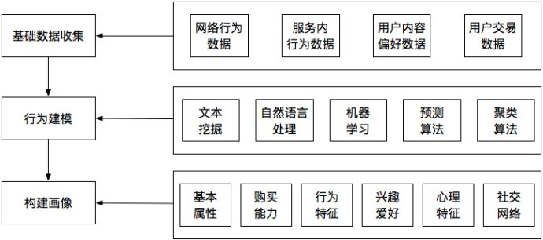

## 数据应用-用户标签特征与画像
-------------------------------------------------

### I.用户画像

用户画像其实就是设计好很多人口特征的维度，也会根据我们的数据源去找到可以潜在推测的维度，那么这些维度就可能构成人物的画像，例如影响力，消费能力，兴趣能力，品牌标签等等，又结合应用领域的不一样，标签往往要从细分领域提取，所以就提到要去抓取垂直网站的语料，然后抽取训练，最后给用户打标签，或者给用户聚类分类。

### II.用户画像开发算法

1. 用户唯一标识选择

	Mac / Phone / IDFA / IMEI / AndroidId / 社交账号 / 邮箱

2. 用户行为统计
3. 人口属性
4. 地理位置-IP库
5. 设备属性
6. 标签属性/社交关系

#### a.行为建模

**用户属性标签开发**

	- 不同的用户属性标签的开发方式各有不同
	- 人口属性是最常见的用户属性标签,也是最难判读的
	- 性别/年龄/地域/收入/婚否/有房无房/收入水平/教育程度
	- 在未获得用户交易的情况下如何做收入消费标签
	- 设备与地域属性标签的提取方式有哪些?
	- 特定族群的属性标签的设计方式
	- 用户属性标签矛盾处理

**用户画像算法开发**

	- 用户行为偏好<->行为分类与特征关联<->用户特征属性可信度
	- 用户行为偏好+关联度=可信度
	- 用户特征与标签规则的关联度获取
	- 用户与属性标签的可信度矩阵
	- 如何验证用户标签画像准确率
	- 准确用户标签样本数据的作用

XGBoost

#### b.数据标签开发

- 网络行为数据标签

	用户地理位置
	设备类型
	装机量
	活跃人数UV
	访问/启动次数PV
	页面浏览量
	访问时长
	激活率
	渗透率
	外部触点
	TGI

- 内容数据标签

	用户生活形态偏好
	用户品牌偏好
	特定用户内容偏好

- 电商交易数据标签

	贡献率
	客单件/客单价
	连带率
	回头率
	流失率
	促销活动转化率
	唤醒率

- 服务内行为数据标签

	唯一页面浏览次数
	页面停留时间
	直接跳出访问数
	访问深度
	进入或离开页面
	浏览路径
	评论次数与内容

#### c.算法应用

### III.用户行为画像

1. 数据来源

	行为数据:网络用户画像算法

2. 标签算法

基础属性标签
- 设备
- 地域

3. 优化方案

#### 内容数据标签设计

1. 数据来源 - 内容行为数据

#### 行业画像-电商用户画像

交易数据:电商用户画像算法

1. 数据来源

	用户交易数据（交易类服务）：贡献率、客单价、连带率、回头率、流失率等

2. 标签算法

3. 优化方案

#### 行业画像-银行用户画像

### X.Ref

-[用户画像-实战案例](https://zhuanlan.zhihu.com/p/36395328?utm_source=ZHShareTargetIDMore&utm_medium=social&utm_oi=39187600375808)

