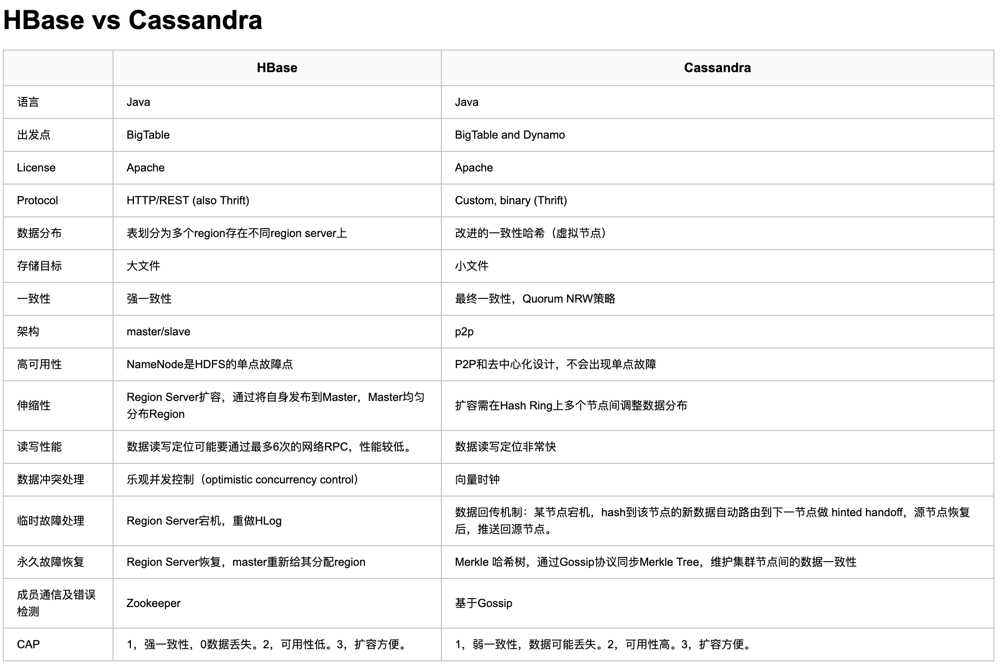

## 大数据研究-Google大数据解决方案
---------------------------------------------------

### I.Google大数据

#### BigTable - HBase - Cassandra

HBase

	1.强一致性的读写：HBase不是一个最终一致性的存储。
	2.自动sharding：HBase的table在集群种被分布在各个region，region可以做自动切分。
	3.regionserver的failover；
	4.Hadoop/HDFS的集成；
	5.MapReduce：支持大数据的并行处理；
	6.JAVA Client 以及Thrift/RESR API 访问；
	7.Block Cache 以及Bloom filter；
	8.操作管理

Cassandra

#### Google BigQuery(Dremel) - OLAP

Dremel多层次查询树架构

#### F1 Query - OLTP/OLAP/ETL

#### Spanner - Cosmos - MaxCompute

Spanner有一种负责专门管理数据的spanserver，spanserver也是基于bigtable的tablet结构.

Cloud Spanner是一款具备强一致性的全球分布式企业级数据库服务

### II.Apache Beam

Apache Beam主要由Beam SDK和Beam Runner组成，Beam SDK定义了开发分布式数据处理任务业务逻辑的API接口，生成的的分布式数据处理任务Pipeline交给具体的Beam Runner执行引擎。Apache Beam目前支持的API接口是由Java语言实现的，Python版本的API正在开发之中。Apache Beam支持的底层执行引擎包括Apache Flink，Apache Spark以及Google Cloud Platform，此外Apache Storm，Apache Hadoop，Apache Gearpump等执行引擎的支持也在讨论或开发当中。其基本架构如下图所示

[ApacheBeam架构图](_includes/Kafka拓扑图.jpg)

需要注意的是，虽然Apache Beam社区非常希望所有的Beam执行引擎都能够支持Beam SDK定义的功能全集，但是在实际实现中可能并不一定。例如，基于MapReduce的Runner显然很难实现和流处理相关的功能特性。目前Google DataFlow Cloud是对Beam SDK功能集支持最全面的执行引擎，在开源执行引擎中，支持最全面的则是Apache Flink。

- [Beam Note](https://beam.apache.org/)

### III.核心数据模型设计

Bigtable的Key-Value数据结构

Dremel嵌套列数据模型

Spanner数据目录结构 - 虚拟桶

### IV.分布式文件存储

### X.Ref

- [Bigtable: A Distributed Storage System for Structured Data]
- [Dynamo: Amazon’s Highly Available Key-value Store]
- [Dremel: Interactive Analysis of Web-Scale Datasets]
- [F1: A Distributed SQL Database That Scales]
- [Online, Asynchronous Schema Change in F1]
- [F1 Query: Declarative Querying at Scale]
- [Spanner: Google’s Globally-Distributed Database]
- [Spanner: Becoming a SQL System]
- [GOOGLE分布式数据库技术演进研究--从Bigtable、Dremel到Spanner](https://blog.csdn.net/x802796/article/details/18802733)

