## 数据库研究 - TiDB(HTAP数据库)
--------------------------------------------------------

### 分布式数据库TiDB是如何结合OLTP和OLAP的

**NewSQL 混合事务分析、MySQL 兼容、水平可扩展数据库的架构和用例**

TiDB 是一款开源、云原生、MySQL 兼容的分布式数据库，可以处理混合事务和分析处理（HTAP）工作负载。它是"NEWSQL"关系数据库的一员，被设计为方便大规模部署。也许有人想知道，“Ti”代表了钛。

PingCAP 在三年半前才开始搭建 TiDB，但是这个产品已经拥有了 15000 次 GitHub 点赞，200 名贡献者，7200 次提交，2000 个分支以及 300 名生产用户。最近 TiDB 获得了 InfoWorld Bossie Award 2018 数据存储和分析领域最佳开源项目奖。

在这篇文章中，我将介绍 TiDB 设计的核心功能和架构，覆盖数据库的三个主要用例，并预览了 PingCAP 即将推出的多云 TiDB 即服务和 TiDB 学术版。

#### TiDB 功能

TiDB 的核心功能包括弹性的水平可扩展性，有 ACID 保证的分布式事务，高可用性以及实时交易数据额分析。让我们来看一下这些功能背后隐藏的平台架构。TiDB 平台有以下这些组件：

- TiDB：无状态 SQL 层，可以兼容 MySQL，用 Go 语言开发。
- TiKV：分布式事务键值存储，用 Rust 语言开发。（TiKV 最近成为了云原生计算基金会项目）
- TiSpark：Apache Spark 插件，连接到 TiKV 或者专门的柱状存储引擎。
- Placement Driver（PD）：Etcd 提供的元数据集群，管理并调度 TiKV。

TiKV 是基础层。这是所有数据持久化的地方，自动分成小的块（我们称为“区域”），并通过执行 Raft 一致性协议自动复制并保持强一致。和 Placement Driver（PD）一起，TiKV 可以复制节点、数据中心和地理位置的数据。它还可以动态地去除形成的热点，并拆分或合并区域，以提升性能和存储使用率。我们在 TiKV 中实现了基于范围的切片，而不是基于哈希的切片，因为从一开始，我们的目标就是支持全功能的关系型数据库。因此 TiKV 也支持不同类型的扫描操作：表扫描、索引扫描等等。

TiDB 中的无状态 SQL 层用来负责所有的的在线交易处理（OLTP）工作和 80% 的常规在线分析处理（OLAP）。这样的设计提升了常规性能(参考我们最新的 [TPC-H 基准测试](https://github.com/pingcap/docs/blob/master/benchmark/tpch-v2.md)) ，这个无状态 SQL 层使用 TiKV 的分布式设计，通过协处理器层将部分查询下放到不同 TiKV 节点进行并行处理。

对于更复杂的 OLAP 工作，比如说训练机器学习模型的迭代分析或实时业务智能采集，是由第二个无状态 SQL 层 TiSpark 负责的，也是直接从 TiKV 获得数据。TiDB 兼容 MySQL，而 TiSpark 兼容 Spark SQL。

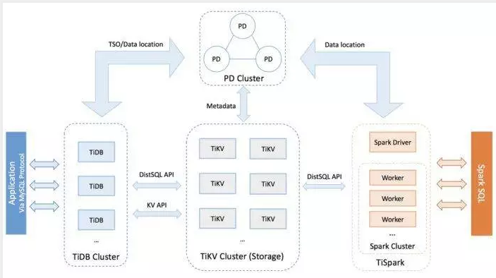

#### TiDB 平台架构

**TiDB 架构**

你可能已经注意到，整个 TiDB 平台是模块化的，所有的组件都有单独的代码库，并且是松耦合的。你可以将整个 TiDB 平台部署为一个完整的包（大多数用户都是这么做的）或是根据你的需要部署其中的一部分。这样的模块化的架构给用户提供了最大的灵活度，并符合云原生架构标准。根据 CNCF 的官方定义，云原生技术是“有弹性的、可管理的和可观察的松耦合系统”。

作为 TiDB 的用户，你可以扩展你的无状态 SQL 服务器或 TiSpark 层（也就是你的计算资源），或者是单独扩展 TiKV（也就是你的存储容量），允许你充分利用消耗的大部分资源，更好地满足你的工作负载。你几乎可以将 TiDB 无状态 SQL 服务认为是在 TiKV 之上的微服务，它是持久化数据的有状态应用程序。这个设计有利于隔离缺陷，更快地滚动升级和维护，而破坏性更小。

TiDB 这些优势的代价是额外的部署和监视复杂性，有更多需要追踪的部分。然而，随着 Kubernetes 的兴起以及 CoreOS 推动的 Operator 模式，部署和管理 TiDB 是简单、直接并且日益自动化的。开源的[TiDB Operator for Kubernetes](https://www.infoworld.com/article/3297700/kubernetes/introducing-the-kubernetes-operator-for-tidb.html) 可以帮助你在任何云环境下（公有、私有或混合）部署、扩展、升级和维护 TiDB。TiDB 默认安装 Prometheus 和 Grafana，所以可以立即进行监视。(查看[TiDB Operator 教程](https://www.infoworld.com/article/3297700/kubernetes/introducing-the-kubernetes-operator-for-tidb.html))

灵活的技术资产扩展性是业务成功与否的最终关键。这就是你会成为下一个 Facebook 还是下一个 Friendster 的区别。TiDB 模块化和 Kubernetes 的加入可以给你的数据库服务带来灵活的扩展性。

#### TiDB 主要用例

最后，让我们来看一下 TiDB 的三个主要用例：MySQL 扩展性、HTAP 实时分析和统一数据存储。

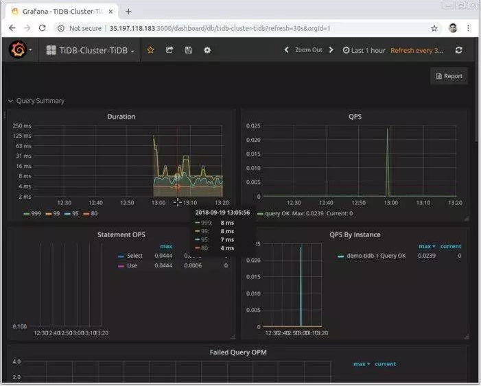

示例 Grafana 仪表板监视 TiDB 部署

**TiDB 用例：MySQL 扩展性**

由于 TiDB 兼容 MySQL，它同时兼容 MySQL 连接协议和 MySQL 生态系统工具，比如 MyDumper 和 MyLoader，对于 MySQL 用户来说，这是解决问题的自然选择。我们需要清楚，TiDB 并非要取代 MySQL，相反，它是 MySQL 的补充。MySQL 仍然是很好的单实例数据库选择，所以如果你的数据大小或工作负载不大，那请继续使用 MySQL。但如果你还在头疼这些问题：

- 考虑如何复制、迁移或扩展数据库得到更多容量
- 寻找优化现有存储容量的方法
- 查询性能慢
- 研究中间件扩展解决方案或实施手动分片策略

TiDB 分布式 SQL 数据库可以帮你解决以上的问题。MySQL 分片的缺陷让世界最大的单车共享平台之一 Mobike(2018年被美团收购后改名美团单车) 选择使用 TiDB（阅读 [Mobike 案例]( https://www.pingcap.com/success-stories/tidb-in-mobike/)） 。Mobike 在 200 个城市拥有 9 百万单车，服务于 2 亿名用户，因此不难想象团队使用 MySQL 时候会遇到的扩展瓶颈。Mobike 通过在 MySQL 之外部署 TiDB，以及 PingCAP 的企业级工具套件，包括可以自动将 MySQL 主机和 TiDB 集群同步的 Syncer，解决了弹性扩展需求。

TiDB 和其他 MySQL 兼容数据库之间最主要的区别在于 TiDB 的分布式架构。MySQL 技术已经存在了 23 年了，它从来没有打算涉足于分布式领域。比如说，不像 TiDB，MySQL 不能产生查询计划，将部分查询下放到多台机器中同时进行并行处理。TiDB 的 SQL 解析器、基于成本的优化器和协处理器层从头开始构建的，利用了分布式数据库的计算资源和并行性，因此 MySQL 用户可以从中获得更多功能。

**TiDB 用例：HTAP 实时分析**

HTAP（混合事务和分析处理）是 Gartner 在 2014 年提出的一个术语，描述打破事务和分析数据工作之间隔阂的数据库架构。目标是给企业实时分析，这样就可以作出实时决策。其他行业分析公司有描述这个架构的专门术语：451 Research 的 HOAP（混合操作分析处理），Forrester 的 Translytical 以及 IDC 的 ATP（分析事务处理）。

TiDB 通过解耦计算层和存储层，并使用不同的无状态 SQL 引擎（TiDB 和 TiSpark）来做不同的分析任务，打破了 OLTP(TiDB) 和 OLAP(TiSpark) 之间的隔阂。这两个引擎都连接到同一个持久数据存储（TiKV），让系统自然拥有实时分析和决策的能力。复杂的 ETL 过程被简单化，”t+1”延迟不复存在，TiDB 中存储的数据可以更有创造力地进行使用。

服务于 5 百万用户的大型生鲜产品运送平台 Yiguo.com 在 TiDB 之上运行 Apache Spark（阅读 [Yiguo.com 案例](https://www.datanami.com/2018/02/22/hybrid-database-capturing-perishable-insights-yiguo/)） 来加速复杂的查询。通过从 SQL Server 升级其基础设施，并通过部署 TiDB 到其现有的 MySQL，Yiguo.com 可以高性能地在中国最大的在线购物节双 11 运行复杂的连接运算，进行实时决策。

**TiDB 用例：统一数据存储**

分布式、模块化、HTAP 数据库 TiDB 被设计为可以水平地扩展计算和存储容量，灵活地适应不同的工作负载，同时还是“唯一可信来源”。通过在键值存储之上提供可扩展的 SQL 服务，TiDB 旨在动态地降低基础设施栈中维护数据管理层的人力和技术成本。

对于世界上最大的食物配送平台之一 Ele.me 来说，想要统一数据存储是采用 TiDB 和 TiKV 的关键原因之一（阅读 [Ele.me 的案例](https://www.pingcap.com/success-stories/tidb-in-eleme/)） 。之前，Ele.me 的数据分散在不同的数据库中，包括 MongoDB、MySQL、Cassandra 和 Redis。最终，这个临时堆栈不再可用，因为操作和维护成本不断增加。现在 Ele.me 2 亿 6 千万用户的 80% 操作在单个 TiKV 部署下服务。这个 TiKV 集群跨越了 4 个数据中心，每个都有 100 多个节点，存储了十几个 TB 的数据，这些数据总是存在，一直可用。

多云 TiDB 即服务和 TiDB Academy

现在，超过 300 家公司都在使用 TiDB 满足他们的 OLTP/OLAP、数据库扩展性、实时分析和统一存储的需求。然而，TiDB 的路线图上还有许多目标。

其中一个是全面管理的多云 TiDB 即服务，可以在各种云设置下使用，包括公有、私有和混合。PingCAP 正在开发企业级、全托管、基于 Kubernetes 的 TiDB，并将在今年年底发布第一个版本。如果你想要更早地使用，请在这里注册。

PingCAP 开发的另一个项目是 TiDB Academy，这是自己制定进度的[实践课程](https://pingcap.com/tidb-cloud/)，帮助数据库管理员、devops 以及系统架构师理解 TiDB 的架构、设计选择、长处和短板。

### HTAP数据库的价值

**Hybrid Transaction/Analytical Processing Database**

#### 为什么我们需要 HTAP 数据库？

在互联网浪潮出现之前，企业的数据量普遍不大，特别是核心的业务数据，通常一个单机的数据库就可以保存。那时候的存储并不需要复杂的架构，所有的线上请求(OLTP, Online Transactional Processing) 和后台分析 (OLAP, Online Analytical Processing) 都跑在同一个数据库实例上。后来渐渐的业务越来越复杂，数据量越来越大，DBA 们再也优化不动 SQL 了。其中一个显著问题是：单机数据库支持线上的 TP 请求已经非常吃力，没办法再跑比较重的 AP 分析型任务。跑起来要么 OOM，要么影响线上业务，要么做了主从分离、分库分表之后很难实现业务需求。

在这样的背景下，以 Hadoop 为代表的大数据技术开始蓬勃发展，它用许多相对廉价的 x86 机器构建了一个数据分析平台，用并行的能力破解大数据集的计算问题。所以从某种程度上说，大数据技术可以算是传统关系型数据库技术发展过程的一个分支。当然在过程中大数据领域也发展出了属于自己的全新场景，诞生了许多新的技术，这个不深入提了。

由此，架构师把存储划分成线上业务和数据分析两个模块。如下图所示，业务库的数据通过 ETL 工具抽取出来，导入专用的分析平台。业务数据库专注提供 TP 能力，分析平台提供 AP 能力，各施其职，看起来已经很完美了。但其实这个架构也有自己的不足。

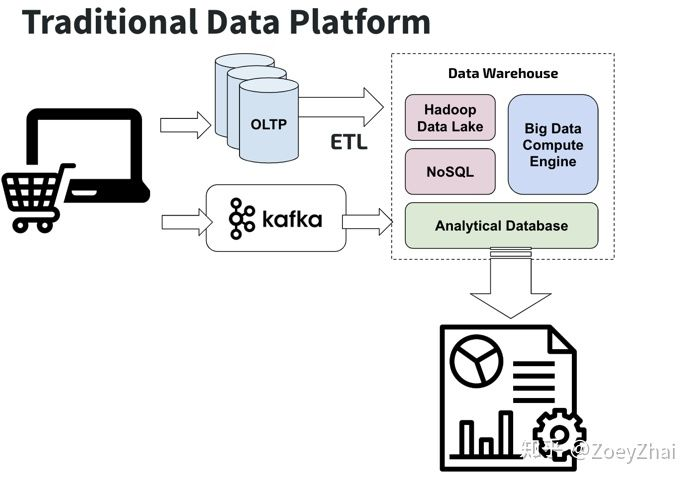
图 1 Tranditional Data Platform

首先是复杂性问题。本身 ETL 过程就是一个很繁琐的过程，一个例证是 ETL 做的好，可以成为一个商业模式。因为是两个系统，必然带来更高的学习成本、维护成本和整合成本。如果你使用的是开源的大数据工具搭建的分析平台，那么肯定会遇到各种工具之间的磨合的问题，还有由于各种工具良莠不齐所导致的质量问题。

其次是实时性问题。通常我们认为越接近实时的数据，它的价值越大。很多业务场景，对实时性有很高的要求，比如风控系统，它需要对数据不停的分析，并且在险情出现之后尽快响应。而通常的 ETL 是一个周期性的操作，比如一天或者一个小时导一次数据，数据实时性是没有办法保证的。 最后是一致性问题。一致性在数据库里面是很重要的概念，数据库的事务就是用来保证一致性的。如果把数据分表存储在两个不同的系统内，那么很难保证一致性，即 AP 系统的查询结果没有办法与线上业务正确对应。那么这两个系统的联动效应就会受到限制，比如用户没办法在一个事务里面，同时访问两个系统的数据。

由于现有的数据平台存在的以上局限性，我们认为开发一个HTAP（Hybrid Transactional/Analytical Processing）融合型数据库产品可以缓解大家在 TP or AP 抉择上的焦虑，或者说，让数据库的使用者不用考虑过度复杂的架构，在一套数据库中既能满足 OLTP 类需求，也能满足 OLAP 类需求。这也是 TiDB 最初设计时的初衷。

#### TiFlash 是什么？-AP的存储节点

TiDB 定位为一款 HTAP 数据库，希望同时解决 TP 和 AP 问题。我们知道 TiDB 可以当作可线性扩展的 MySQL 来用，本身设计是可以满足 TP 的需求的。在 17 年我们发布了 TiSpark，它可以直接读取 TiKV 的数据，利用 Spark 强大的计算能力来加强 AP 端的能力。然而由于 TiKV 毕竟是为 TP 场景设计的存储层，对于大批量数据的提取、分析能力有限，所以我们为 TiDB 引入了以新的 TiFlash 组件，它的使命是进一步增强 TiDB 的 AP 能力，使之成为一款真正意义上的 HTAP 数据库。

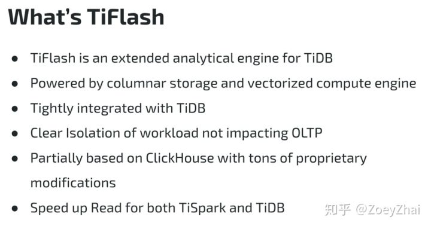
图 2 What is TiFlash

TiFlash 是 TiDB 的一个 AP 扩展。在定位上，它是与 TiKV 相对应的存储节点，与 TiKV 分开部署。它既可以存储数据，也可以下推一部分的计算逻辑。数据是通过 Raft Learner 协议，从 TiKV 同步过来的。TiFlash 与 TiKV 最大的区别，一是原生的向量化模型，二是列式存储。 这是都是专门为 AP 场景做的优化。TiFlash 项目借助了 Clickhouse 的向量化引擎，因此计算上继承了它高性能的优点。

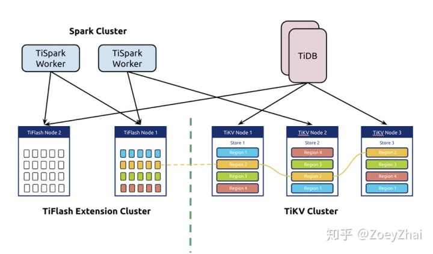
图 3 TiFlash Architecture

由于 TiFlash 节点和 TiKV 节点是分开部署的，所以即使我们跑很重的计算任务，也不会对线上业务产生影响。

上层的计算节点，包括 TiSpark 和 TiDB，他们都可以访问 TiKV 和 TiFlash。后面会介绍我们是如何利用这个架构的优势，在一个系统内同时服务 TP 和 AP 这两个场景，并且产生 1+1>2 的效果。

#### TiFlash 技术内幕

对于一个数据库系统，TP 和 AP 是有系统设计上的冲突的。TP 场景我们关注的是事务正确性，性能指标是 QPS、延迟，它通常是点写、点查的场景；而 AP 更关心的吞吐量，是大批量数据的处理能力，处理成本。比如很多情况下 AP 的分析查询是需要扫描几百上千万条数据，join 十几张表，这种场景下系统的设计哲学和 TP 完全不同。TP 通常使用**行式存储**，例如 InnoDB，RocksDB 等；而 AP 系统通常使用**列式存储**。将这两个需求放在同一个系统里面实现，从设计上很难取舍，再加上 AP 的查询业务通常属于资源消耗型，隔离性做不好，很容易影响TP 业务。所以做一个 HTAP 系统是一件难度非常高的事情，很考验系统的工程设计能力。

_1. 列式存储_

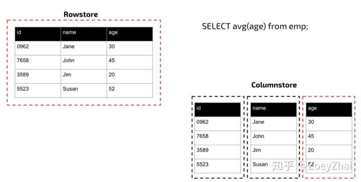
图 4 Row Based vs Column Based

一般来说，AP 系统基本上都是使用列式存储，TiFlash 也不例外。列式存储天然可以做列过滤，并且压缩率很高，适合大数据的 Scan 场景。另外列式存储更适合做向量化加速，适合下推的聚合类算子也更多。TiFlash 相对于 TiKV，在 Scan 场景下性能有数量级的提升。

而行式存储显然更适合 TP 场景，因为它很适合点查，只读少量数据，IO 次数、粒度都更小。在绝大多数走索引的查询中，可以实现高 QPS 和低延迟。

由于我们把 TiFlash 和 TiKV 整合在了 TiDB 内部，用户可以灵活选择使用哪种存储方式。数据写入了 TiKV 之后，用户可以根据需选择是否同步到 TiFlash，以供 AP 加速。目前可选的同步粒度是表或者库。

_2. 低成本数据复制_

数据复制永远是分布式系统的最重要的问题之一。TiFlash 作为 TiDB 的另外一个存储层，需要实时同步 TiKV 的数据。我们采用的方案也很自然：既然 TiKV 节点内部使用 Raft 协议同步，那自然 TiKV 到 TiFlash 也是可以用 Raft 协议同步数据的。TiFlash 会把自己伪装成一个 TiKV 节点，加入 Raft Group。比较不一样的是，TiFlash 只会作为 Raft Learner，并不会成为 Raft Leader / Follower。原因是目前 TiFlash 还不支持来自 SQL 端（TiDB/ TiSpark）的直接写入，我们将在稍后支持这一特性。

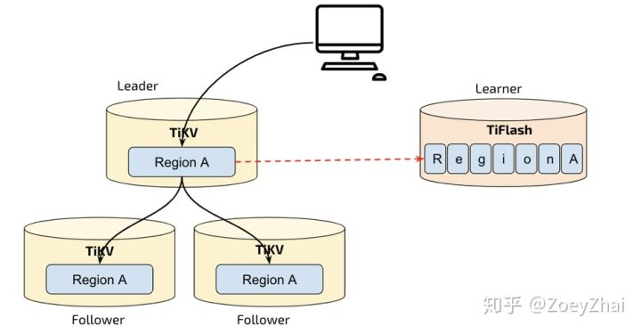
图 5 Raft Learner Replication

大家知道，Raft 协议为了提高数据复制效率，Raft Log 从 Leader 到 Follower / Learner 的复制通常会优化成异步复制，只要记录被复制到了 Leader + Follower 的 “多数” 节点，就认为已经 commit 了。并且 Learner 是排除在 “多数” 之外的，也就是说更新不需要等待 Learner 确认。这样的实现方式，缺点是 Learner 上的数据可能有一定延迟，优点是大大减少了引入 TiFlash 造成的额外数据复制开销。当然如果复制延迟太大，说明节点之间的网络或者机器的写入性能出现了问题，这时候我们会有报警提示做进一步的处理。

_3. 强一致性_

那既然是异步复制，如何保证读一致性呢？通常来说，因为在 Leader 节点一定可以拿到最新的数据，所以我们只会去 Leader 节点读数据。但是 TiFlash 只有 Learner，不可能这样读数据。我们使用 Raft Follower / Learner Read 机制来实现直接在 TiFlash 节点读数据。原理是利用了 Raft Log 的偏移量 + 全局时间戳的特性。首先在请求发起的时候获取一个 read ts，那么对于所有的 Region（Region 是 TiDB 内部数据切割单位，也是 Raft Group 单位），只要确定本地 Region 副本已经同步到足够新的 Raft Log，那么直接读这个 Region 副本就是安全的。可以利用 MVCC 的特性，对于每一条 unique key，过滤出 commit ts<= read ts 的所有版本，其中 commit ts 最大的版本就是我们应该读取的版本。

这里的问题是，Learner 如何知道当前 Region 副本足够新呢？实时上 Learner 在读数据之前，会带上 read ts 向 Leader 发起一次请求，从而获得确保 Region 足够新的 Raft Log 的偏移量。TiFlash 目前的实现是在本地 Region 副本同步到足够新之前，会等待直到超时。未来我们会加上其他策略，比如主动要求同步数据（如图 6 和图 7 所示）。

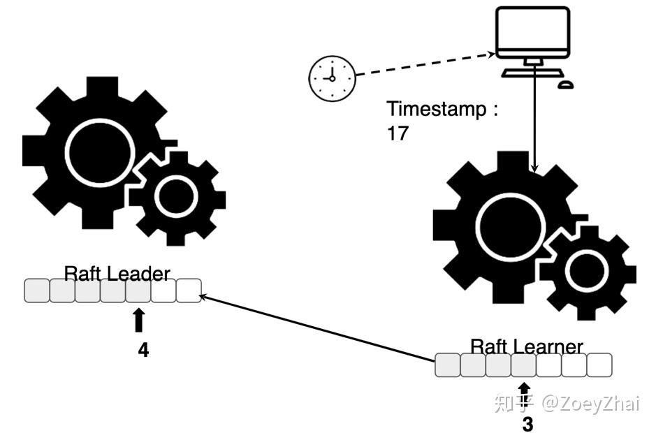
图 6 Learner Read (1⁄2)

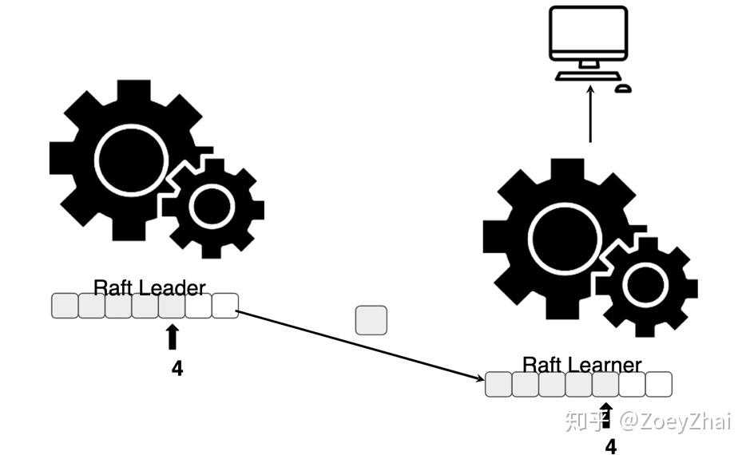
图 7 Learner Read (2⁄2)

_4.更新支持_

TiFlash 会同步 TiKV 上的表的所有变更，是两个异构的系统之间同步数据，会遇到一些很困难的问题。其中比较有代表性的是如何让 TiFlash 能实时复制 TiKV 的更新，并且是实时、事务性的更新。通常我们认为列式存储的更新相对困难，因为列存往往使用块压缩，并且块相对于行存更大，容易增加写放大。而分列存储也更容易引起更多的小 IO。另外由于 AP 的业务特点，需要大量 Scan 操作，如何在高速更新的同时保证 Scan 性能，也是很大的问题。

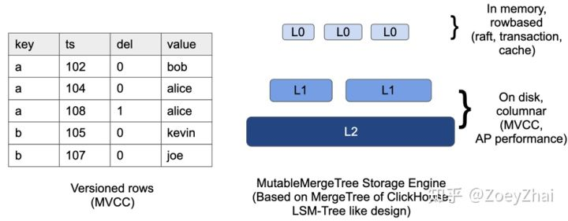
图 8 Update Support

目前 TiFlash 的方案是，存储引擎使用类 LSM-Tree 的存储架构，并且使用 MVCC 来实现和 TiDB 一致的 SI 隔离级别。LSM-Tree 架构可以很好的处理 TP 类型的高频小 IO 写入；同时又有的一定的局部有序性，有利于做 Scan 优化。

#### TiFlash 带来的想象空间

在新的业务纬度上让 TiDB 更加 Scalable。通过引入全新的 TiFlash AP 扩展，让 TiDB 拥有了真正的 AP 能力，即为 AP 专门优化的存储和计算。我们可以通过增减相对应的节点，动态的增减 TiDB 系统的 TP 或者 AP 端的能力。数据不再需要在两个独立的系统之间手动同步，并且可以保证实时性、事务性。

AP 与 TP 业务的隔离性，让 TiDB 的 AP 业务对线上的 TP 影响降到最低。因为 TiFlash 是独立节点，通常和 TiKV 分开部署，所以可以做到硬件级别的资源隔离。我们在 TiDB 系统中使用标签来管理不同类型的存储节点。

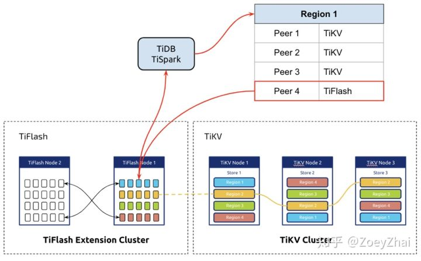
图 9 AP 与 TP 业务隔离

从 TiDB 的视角，TiFlash 和 TiKV 从层次上是一致的，都是存储节点。区别在于它们在启动时候给 PD （PD 为 TiDB 集群的 Coordinator）上报的节点标签。TiDB 就可以利用这些信息，把不同类型的请求路由到相应的节点。比如我们可以根据一些启发试算法，以及统计信息，了解到一条 SQL 需要 Scan 大量的数据并且做聚合运算，那么显然这条 SQL 的 Scan 算子去 TiFlash 节点请求数据会更合理。而这些繁重的 IO 和计算并不会影响 TiKV 侧的 TP 业务。

TiFlash 带来了全新的融合体验。TiFlash 节点并不只是单纯的从 TiKV 节点同步数据，它们其实可以有进一步的配合，带来 1+1>2 的效果。上层的计算层，TiDB 或者 TiSpark，是可以同时从 TiFlash 和 TiKV 读取数据的。

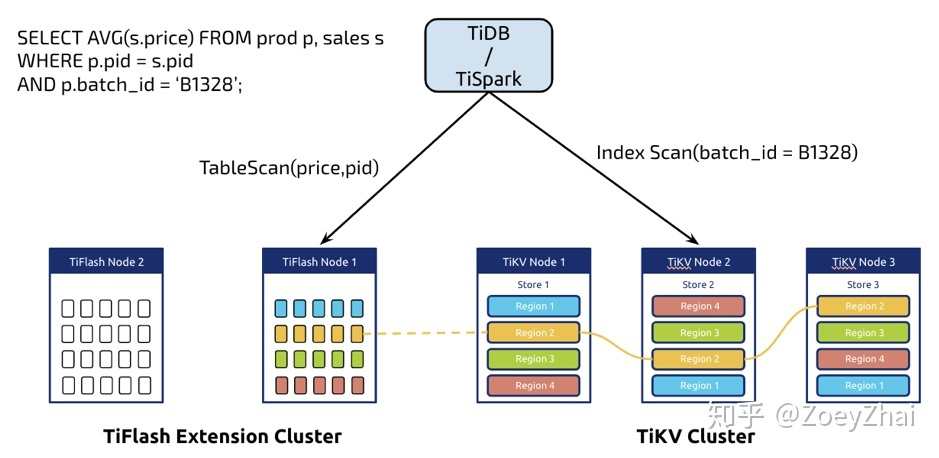
图 10 Combination of TiFlash and TiKV

如图 10 所示，比如我们遇到一条 SQL，它需要 join 两份数据，其中一份数据需要全表扫描，另外一份则可以走索引，那么很显然可以同时利用 TiFlash 强大的 Scan 和 TiKV 的点查。值得一提的是，用户通常会配置 3 或 5 份副本在 TiKV，为了节约成本，可能只部署 1 份副本到 TiFlash。那么当一个 TiFlash 节点挂掉之后，我们就需要重新从 TiKV 同步节点。

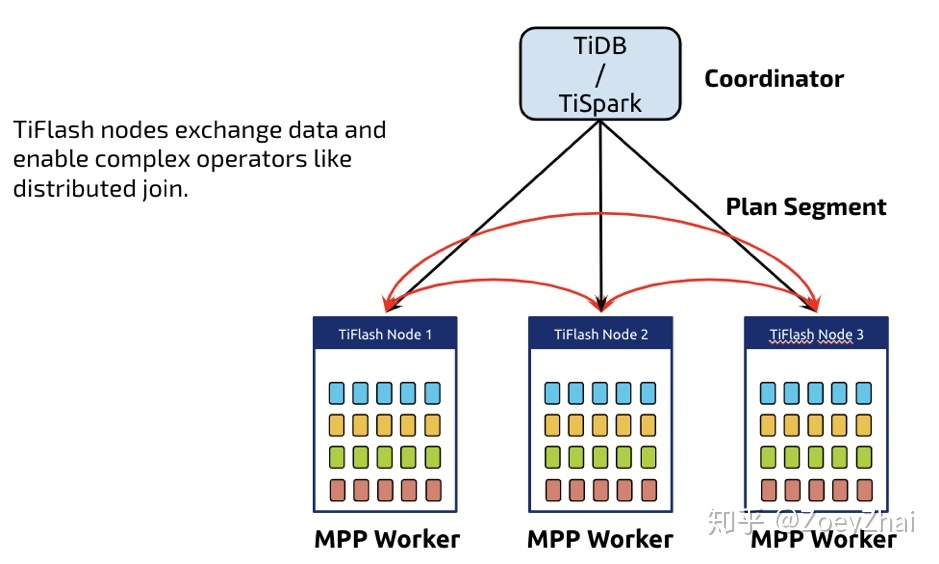
图 11 SQL MPP Push Down

我们接下来计划让 TiFlash 节点成为 MPP 集群。即 TiDB 或者 TiSpark 接收到 SQL 之后，可以选择把计算完全下推。MPP 主要是为了进一步提升 AP 的计算效率。

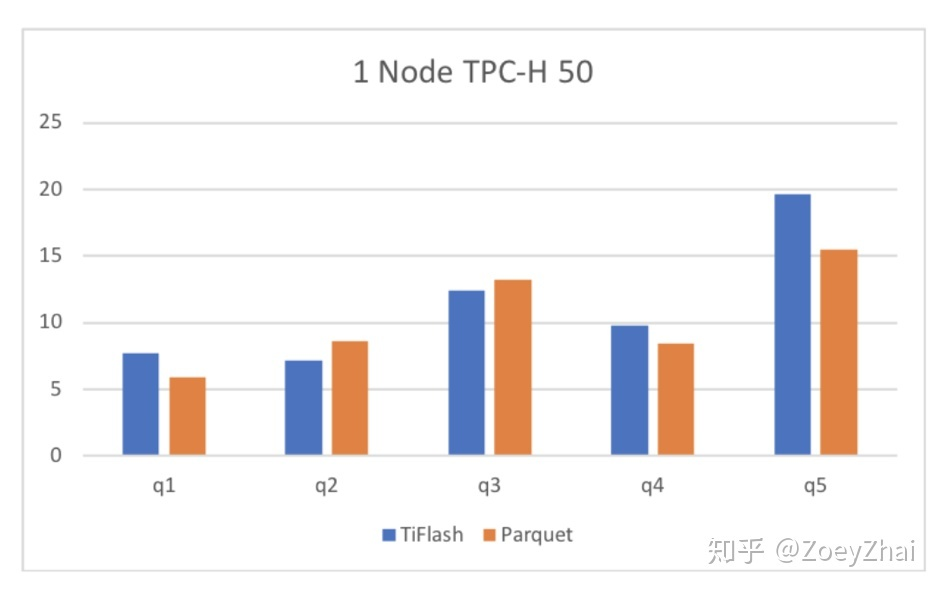
图 12 性能数据

上图是 TiFlash 某一个版本的性能数据，我们使用 TiSpark + TiFlash 来对比 Spark + Parquet。可以看到 TiFlash 在支持了实时 update 和事务一致性的情况下，仍然达到了基本一致的性能。TiFlash 目前还在快速迭代之中，最新版本相对于这里其实已经有很大幅度的提升。另外我们目前正在研发一款专门为 TiFlash 全新设计的存储引擎，至少带来 2 倍的性能提升。可以期待一下之后出来的性能。

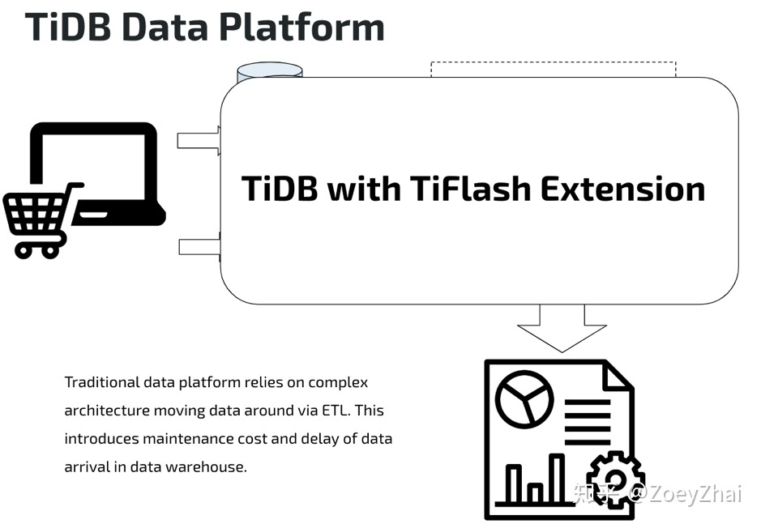
图 13 TiDB Data Platform

简单就是生产力。传统的数据平台由于技术的限制，企业需要做非常繁重的建设工作。需要把许多技术整合在一起才能实现业务需求，而系统之间使用复杂繁琐的 ETL 过程同步数据，导致数据链条很长，效果也不一定好。TiDB 希望把系统的复杂性留在工具层面，从而大幅度简化用户的应用架构。